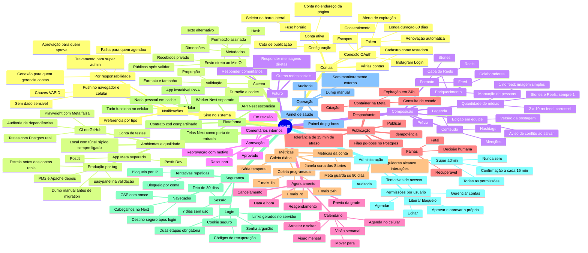
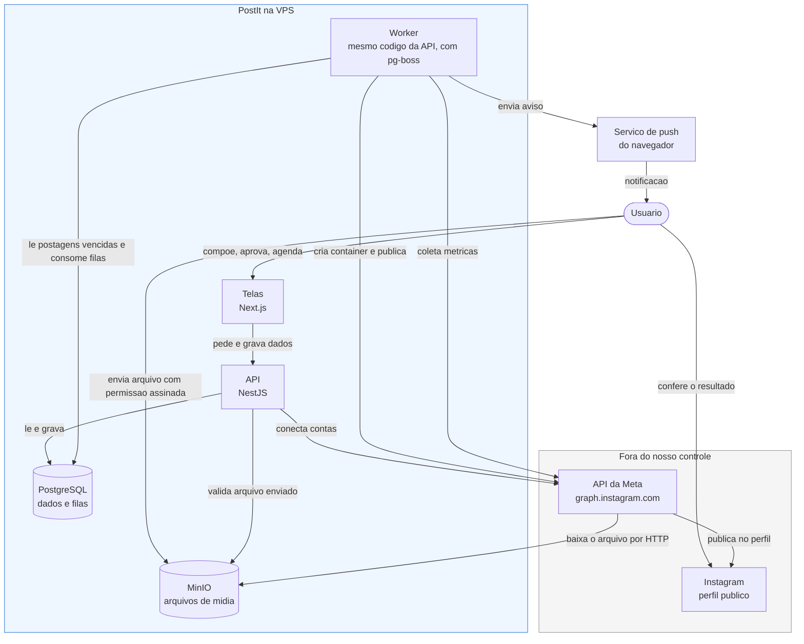

# 03 — Mapa Mental

Visão panorâmica do sistema. Este documento não define comportamento — ele mostra o território
e aponta onde cada assunto está detalhado.

## Mapa mental do domínio

O ramo **Futuro** não faz parte do MVP. Ele está no mapa porque algumas decisões de hoje já o levam
em conta. Ver [ADR 0009](adr/0009-preparacao-multi-rede.md).

## Contexto do sistema

Quem conversa com quem. As setas mostram a direção da iniciativa, não do dado.

Cinco detalhes que esse desenho revela e que costumam surpreender:

1. **O usuário só fala com as telas — e com o armazenamento, para enviar arquivo.** A API não aparece
   para a internet: o Next conversa com ela por dentro do servidor. Ver
   [ADR 0010](adr/0010-monorepo-next-nest-bff.md).
2. **O arquivo vai direto do navegador para o MinIO**, com permissão assinada pela API, e só fica
   público depois de a API validar. Ver [ADR 0012](adr/0012-upload-direto-minio.md).
3. **A Meta baixa o arquivo, nós não enviamos.** A seta `META → MINIO` é o motivo de o MinIO
   precisar ser público. Não passamos o arquivo na requisição: passamos uma URL, e os servidores da
   Meta vão buscar. Se a URL não responder naquele instante, a publicação falha. Ver
   [ADR 0005](adr/0005-minio-midia-publica.md).
4. **Quem publica é só o worker.** Nem as telas nem a API publicam, mesmo no "publicar agora" — a
   postagem só é gravada como agendada. A API fala com a Meta apenas para conectar contas. Isso
   garante que todo caminho de publicação tenha o mesmo tratamento de erro, retentativa e
   idempotência. Ver [09](09-motor-agendamento.md).
5. **Tudo mora no Postgres, inclusive as filas.** Não há Redis. O pg-boss guarda as tarefas no
   mesmo banco das postagens, então mudar o status e criar a tarefa acontecem juntos, e um só backup
   cobre tudo. Ver [ADR 0008](adr/0008-pg-boss-em-vez-de-bullmq.md).

## Onde cada assunto está documentado

| Área do mapa                                   | Documento                                                                         |
| ----------------------------------------------- | --------------------------------------------------------------------------------- |
| Contas, token, escopos, OAuth                   | [08 — Integração Instagram](08-integracao-instagram.md)                         |
| Acervo, validação, especificações de mídia | [08](08-integracao-instagram.md) e [02 — Módulo B](02-requisitos.md)              |
| Composição e formatos                         | [02 — Módulo C](02-requisitos.md), [04 — Jornadas](04-jornada-usuario.md)        |
| Aprovação                                     | [02 — Módulo E](02-requisitos.md), [05 — Máquina de estados](05-arquitetura.md) |
| Agendamento e calendário                       | [02 — Módulo D](02-requisitos.md)                                                |
| Publicação, filas, retentativa                | [09 — Motor de agendamento](09-motor-agendamento.md)                              |
| Métricas                                       | [02 — Módulo G](02-requisitos.md), [08](08-integracao-instagram.md)               |
| Operação, backup, deploy                      | [10 — Infra e deploy](10-infra-deploy.md)                                         |
| Métricas da conta                              | [02 — RF-G06 e RF-G07](02-requisitos.md), [08 — Métricas da conta](08-integracao-instagram.md#métricas-da-conta), [09](09-motor-agendamento.md) |
| Notificações, push, app instalável            | [02 — Módulo J](02-requisitos.md), [ADR 0017](adr/0017-pwa-e-notificacoes-push.md), [04 — Jornada 11](04-jornada-usuario.md) |
| Telas, navegação, uso no celular              | [13 — Telas e Navegação](13-telas-e-navegacao.md)                                 |
| Ambientes, túnel, apps da Meta, estreia       | [14 — Ambientes e Desenvolvimento](14-ambientes-e-desenvolvimento.md), [ADR 0018](adr/0018-ambientes-e-apps-meta-separados.md), [ADR 0019](adr/0019-sem-homologacao.md) |
| Git, CI, testes, versionamento                | [15 — Qualidade e Fluxo de Trabalho](15-qualidade-e-fluxo-de-trabalho.md)         |
| Edição simultânea                             | [05 — Edição simultânea](05-arquitetura.md#8-edição-simultânea)                   |
| Nome do produto                               | [ADR 0016](adr/0016-nome-do-produto.md)                                           |
| Entidades e relacionamentos                     | [07 — Modelo de dados](07-modelo-dados.md)                                        |
| Plataforma: Next, Nest, worker                  | [05 — Arquitetura](05-arquitetura.md), [06 — Stack](06-stack.md) |
| Administração: super admin, permissões, auditoria | [ADR 0015](adr/0015-super-admin-e-permissoes.md), [04 — Jornada 10](04-jornada-usuario.md), [11 — Autorização](11-seguranca.md#autorização) |
| Segurança: login, sessão, CSP, cabeçalhos       | [11 — Segurança](11-seguranca.md), [ADR 0013](adr/0013-autenticacao-com-duas-etapas.md), [ADR 0014](adr/0014-csp-e-cabecalhos-de-seguranca.md) |
| Futuro: outras redes, comentários, mensagens    | [ADR 0009](adr/0009-preparacao-multi-rede.md), [08](08-integracao-instagram.md)   |
