# 04 — Jornada do Usuário

Onze jornadas ponta a ponta. Cada uma descreve o que o usuário faz, o que o sistema faz por baixo
e quais estados de interface existem — incluindo os estados feios, que são os que costumam ficar
sem projeto.

A jornada 9, de entrada no sistema, vem depois das outras só para não renumerar as demais: na prática, é a
primeira que qualquer pessoa percorre.

**Todas as jornadas valem no celular e no computador.** O que muda de uma tela para a outra está em
[13 — Telas e navegação](13-telas-e-navegacao.md).

Índice:

1. [Conectar uma conta do Instagram](#1--conectar-uma-conta-do-instagram)
2. [Agendar uma imagem de feed com marcações](#2--agendar-uma-imagem-de-feed-com-marcações)
3. [Agendar um Reels](#3--agendar-um-reels)
4. [Agendar um Story](#4--agendar-um-story)
5. [Ciclo de aprovação](#5--ciclo-de-aprovação)
6. [Publicação automática no horário](#6--publicação-automática-no-horário)
7. [Falha e recuperação](#7--falha-e-recuperação)
8. [Leitura de métricas](#8--leitura-de-métricas)
9. [Entrar no sistema](#9--entrar-no-sistema)
10. [Administrar usuários e permissões](#10--administrar-usuários-e-permissões)
11. [Receber e ler notificações](#11--receber-e-ler-notificações)

---

## 1 — Conectar uma conta do Instagram

**Quem:** administrador. **Quando:** uma vez por conta. **Requisitos:** RF-A01, RF-A02, RF-A06, RF-A08.

O MVP aceita várias contas. Esta jornada se repete para cada uma.

### Antes de conectar: cadastrar a conta no aplicativo Meta

Como o PostIt não passa pela revisão da Meta, só consegue se conectar a contas cadastradas no
aplicativo. Esse passo acontece **fora** do PostIt, e a interface precisa explicá-lo antes de o
usuário clicar em conectar.

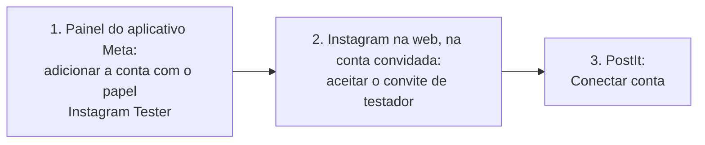

Passo a passo detalhado, com fontes e ressalvas, em
[08 — Cada conta precisa ser cadastrada no aplicativo](08-integracao-instagram.md#cada-conta-precisa-ser-cadastrada-no-aplicativo).

### Conectando

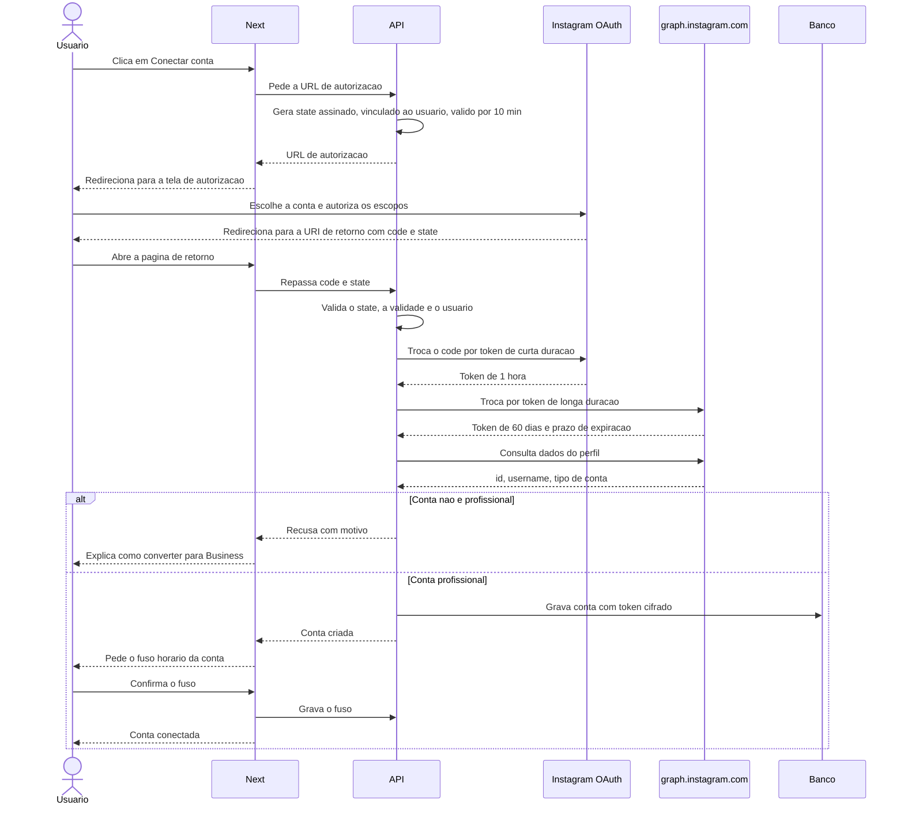

O Next só **repassa** o retorno do Instagram. Quem valida o `state`, troca tokens e grava é a API — o
Next nunca vê o segredo do aplicativo nem o token da conta.

**Estados de interface:**

| Estado | O que o usuário vê |
|---|---|
| Inicial | Botão "Conectar conta do Instagram", o aviso de que a conta precisa ser Business ou Creator, e a lista de verificação dos passos 1 e 2 acima |
| Conta não cadastrada no aplicativo | A autorização falha na Meta. Ao voltar, o PostIt explica que a conta precisa ser adicionada como Instagram Tester e o convite aceito, com o passo a passo |
| Redirecionando | Tela de espera enquanto sai para o Instagram |
| Retornando | "Finalizando conexão" — a troca de tokens leva alguns segundos |
| Conta pessoal | Recusa com instruções: como converter a conta nas configurações do Instagram |
| `state` inválido ou expirado | "A conexão demorou demais ou o link foi adulterado. Comece de novo" |
| Usuário negou | "Você cancelou a autorização. Nada foi salvo" |
| Sucesso | Conta na lista, com foto, arroba e prazo de validade do token |

**Detalhe que não pode escapar:** o `state` carrega assinatura HMAC com validade curta e o usuário que
iniciou a conexão. Sem isso, o retorno aceita requisição forjada. É o mesmo padrão já usado em
`openreply/lib/meta/oauth.ts`.

---

## 2 — Agendar uma imagem de feed com marcações

**Quem:** editor. **Requisitos:** RF-B01, RF-B02, RF-C01, RF-C03, RF-C05, RF-C10, RF-D01.

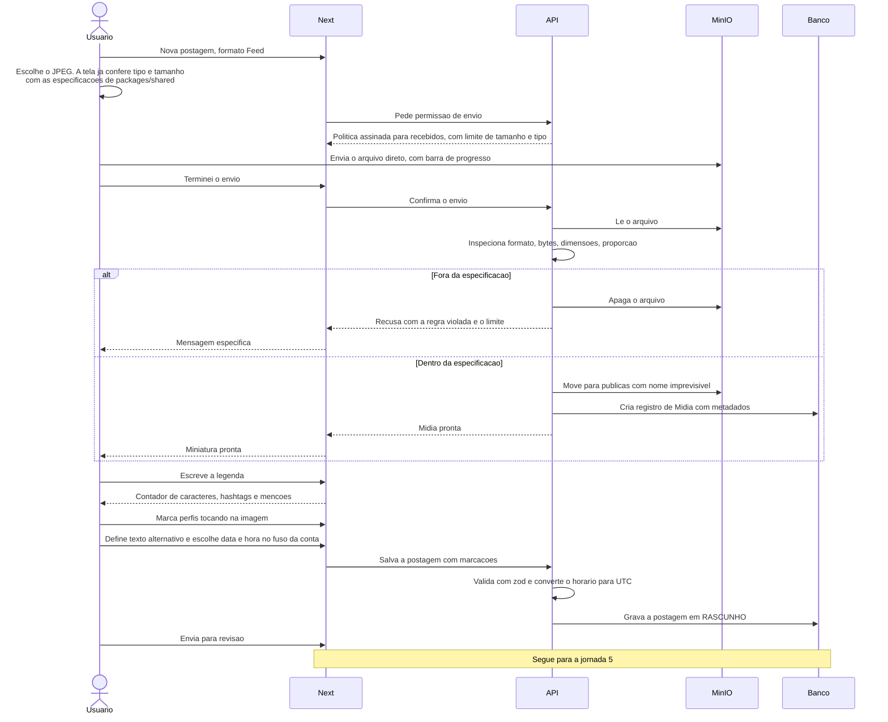

O arquivo vai **direto do navegador para o MinIO**, sem atravessar o Next nem a API. A validação
continua acontecendo no envio — só que logo depois de o arquivo chegar, e na API. Arquivo recusado é
apagado e nunca fica público. Ver [ADR 0012](adr/0012-upload-direto-minio.md).

**Estados de interface:**

| Estado | O que o usuário vê |
|---|---|
| Arquivo escolhido fora do básico | A tela recusa antes de enviar: tipo ou tamanho já visivelmente fora das especificações |
| Arquivo aceito | A imagem escolhida aparece **em tamanho grande**, com as medidas ao lado. **Nada sobe até "Usar esta imagem"**; "Escolher outra" volta ao seletor. Antes de 21/09/2026 o arquivo partia sem nenhuma tela, e quem pegou a foto errada só descobria depois |
| Envio em andamento | Barra de progresso real, do navegador direto ao armazenamento |
| Validando | "Conferindo o arquivo" — a API está inspecionando dimensões e, se vídeo, codecs e duração |
| Mídia recusada | Mensagem específica: "JPEG de até 8 MB. Este arquivo tem 12 MB" — nunca "arquivo inválido" |
| Proporção fora do feed | **Não é recusa**: a tela diz para que formatos a imagem serve e oferece duas saídas — "enviar como está" ou "recortar para o feed", com prévia do corte e a faixa de 4:5 a 1.91:1. Uma arte 9:16 é válida para Stories, e recortá-la à força destruiria o formato pretendido. **É a mesma tela do estado acima**, e a imagem aparece nela: decidir sobre proporção sem ver a foto era pedir confiança na memória |
| Legenda no limite | Contador vira alerta ao passar de 2200 caracteres, 30 hashtags ou 20 menções |
| Marcando pessoas | Sobreposição da imagem com os pontos arrastáveis |
| Horário no passado | Campo recusa e explica |
| Salvo | Postagem em `RASCUNHO`, botão para enviar à revisão |
| Outra pessoa salvou antes | "Esta postagem foi alterada por Fulano às 14h32." O que foi digitado **continua na tela**, com as opções "ver a versão atual" e "descartar minhas alterações" (RF-C12) |

**Por que a validação é no envio:** cada erro descoberto só na hora de publicar é uma postagem
perdida e uma tentativa de cota desperdiçada. Vale gastar processamento no envio para não
descobrir problema às 8h da manhã do dia da campanha.

---

## 3 — Agendar um Reels

**Quem:** editor. **Requisitos:** RF-B03, RF-C07, RF-C08, RF-F10.

O Reels é a jornada mais pesada: arquivo grande, validação de codec, capa e o processamento
assíncrono do lado da Meta.

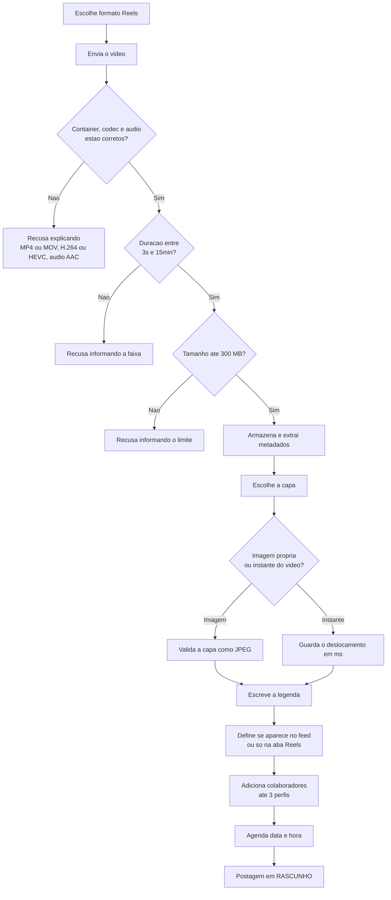

**Estados de interface:**

| Estado | O que o usuário vê |
|---|---|
| Envio de arquivo grande | Progresso real em porcentagem; o envio pode levar minutos |
| Codec incompatível | "O vídeo precisa ser MP4 ou MOV com vídeo H.264 e áudio AAC" |
| Átomo `moov` no fim do arquivo | Aviso de que o vídeo pode falhar na Meta e sugestão de reexportar |
| Escolhendo capa | Linha do tempo do vídeo com o quadro selecionado, mais opção de subir imagem |
| Colaboradores | Campo limitado a 3, com aviso de que o convite precisa ser aceito |

**Aviso obrigatório na tela:** Reels não entram em carrossel, e a marcação de música só funciona
com áudio original. Melhor dizer antes do que depois.

---

## 4 — Agendar um Story

**Quem:** editor. **Requisitos:** RF-B03, RF-C05, RF-C11.

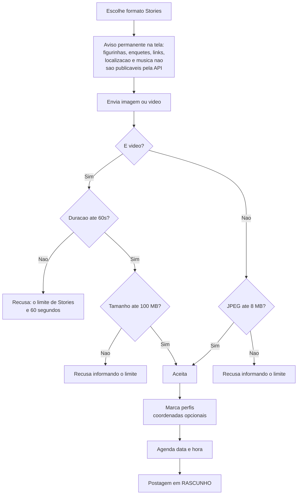

**Diferenças que a interface precisa deixar claras:**

| Aspecto | Story | Feed |
|---|---|---|
| Legenda | Não existe | Até 2200 caracteres |
| Colaboradores | Não suportado | Até 3 |
| Coordenadas da marcação | Opcionais | Obrigatórias em imagem |
| Duração de vídeo | 3s a 60s | 3s a 15min |
| Tamanho de vídeo | Até 100 MB | Até 300 MB |
| Tempo de vida | Some em 24h | Permanente |
| Janela de métricas | 24h e acabou | Sem prazo |

A última linha é a mais importante para o projeto do sistema: a coleta de métricas de Story tem
prazo de validade. Ver [09](09-motor-agendamento.md).

---

## 5 — Ciclo de aprovação

**Quem:** quem tem `POSTAGEM_EDITAR` escreve e envia para revisão; quem tem `POSTAGEM_APROVAR` aprova ou
reprova; quem tem `POSTAGEM_AGENDAR` agenda. **Requisitos:** RF-E01 a RF-E06, RF-D01, RF-I04.

**Aprovar a própria postagem** exige também `POSTAGEM_APROVAR_PROPRIA`. Sem ela, o botão "Aprovar" não
aparece nas postagens do próprio usuário — e a API recusa se alguém tentar mesmo assim. Ver
[ADR 0015](adr/0015-super-admin-e-permissoes.md).

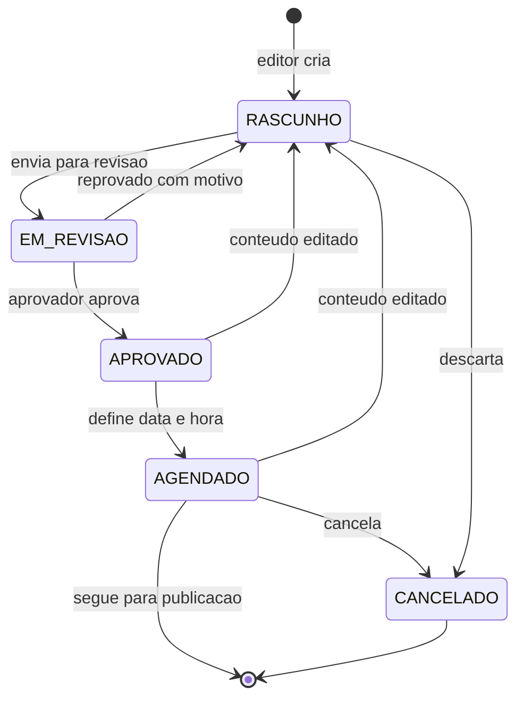

**A regra que evita o pior acidente do fluxo:** editar o conteúdo de uma postagem já aprovada ou
agendada devolve ela para `RASCUNHO`. Sem isso, alguém aprova uma legenda, outra pessoa troca o
texto, e o que vai ao ar não é o que foi aprovado. O custo é ter que reaprovar depois de um ajuste
de vírgula — e vale a pena.

**Estados de interface:**

| Estado | O que o usuário vê |
|---|---|
| Fila de pendências | Lista do que aguarda revisão, mais urgente primeiro pelo horário previsto |
| Em revisão | Postagem em modo leitura, com prévia fiel e o painel de comentários ao lado |
| Reprovando | Comentário obrigatório: não dá para reprovar em silêncio |
| Aprovada | Selo com quem aprovou e quando; libera o botão de agendar |
| Editada após aprovação | Aviso explícito: "esta postagem voltou para rascunho porque o conteúdo mudou" |

---

## 6 — Publicação automática no horário

**Quem:** ninguém — é o sistema, no processo worker. **Requisitos:** RF-F01 a RF-F04, RF-D09.

Tudo abaixo roda no `postit-worker`. Nem o Next nem o processo HTTP da API participam.

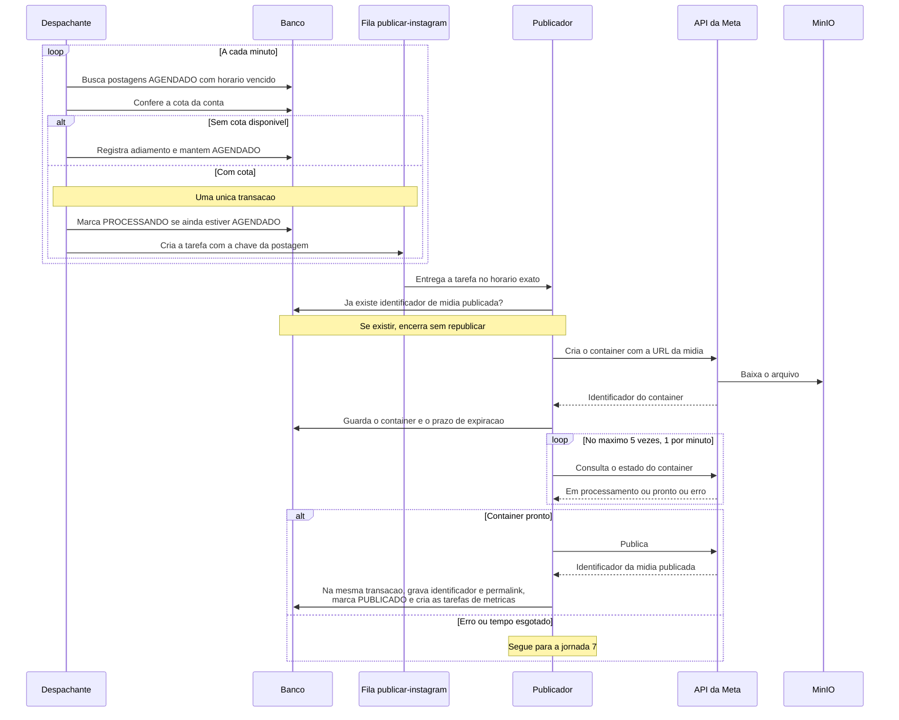

**O que o usuário vê:** no calendário, a postagem muda de cor ao entrar em `PROCESSANDO` — o que
pode acontecer até um minuto antes do horário, com o aviso "saindo em instantes" — e ganha o link do
post ao virar `PUBLICADO`. Nenhuma ação é pedida — o caminho feliz é silencioso.

**Se o sistema estava fora do ar no horário:** uma postagem só começa a ser publicada até 15 minutos
depois do horário marcado. Passou disso, ela vai para `FALHOU` com a causa "o sistema estava
indisponível" e segue a jornada 7. Detalhes em
[09 — Atraso por indisponibilidade](09-motor-agendamento.md#atraso-por-indisponibilidade).

---

## 7 — Falha e recuperação

**Quem:** o sistema tenta, o humano decide. **Requisitos:** RF-F05 a RF-F09, RF-H03.

Esta é a jornada mais importante do documento. É o que separa uma ferramenta confiável de uma
ferramenta que dá medo.

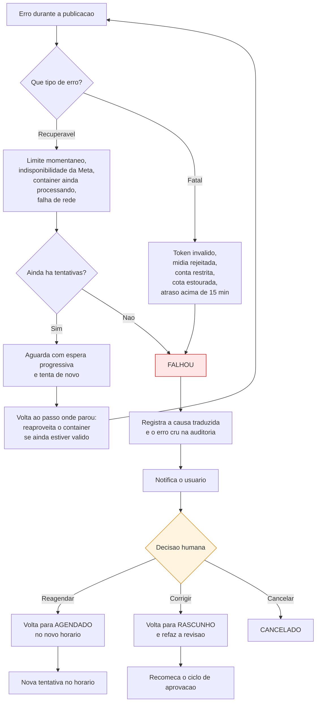

**A decisão de projeto por trás disso:** o sistema **nunca** publica atrasado por conta própria.
Se uma postagem falhou às 9h e o problema só se resolveu às 15h, publicar sozinho às 15h pode ser
exatamente o errado — a promoção acabou, o assunto passou, o contexto mudou. Quem decide é quem
conhece o conteúdo. Registrado em [ADR 0007](adr/0007-falha-exige-decisao-humana.md).

**Estados de interface:**

| Estado | O que o usuário vê |
|---|---|
| Tentando de novo | Badge "tentativa 2 de 5" com o horário da próxima tentativa |
| Falhou | Cartão vermelho no topo do painel, com a causa em português |
| Causa: token | "A conexão com o Instagram expirou. Reconecte a conta" mais o botão de reconectar |
| Causa: mídia | "O Instagram recusou o arquivo: proporção fora do permitido" mais o botão de trocar a mídia |
| Causa: cota | "A conta atingiu o limite de publicações das últimas 24 horas" mais a sugestão de novo horário |
| Causa: conta restrita | "A conta está com restrição no Instagram. Verifique no aplicativo" |
| Causa: sistema fora do ar | "O sistema estava indisponível no horário marcado e a postagem não saiu. Escolha um novo horário ou cancele" |
| Auditoria | Aba com todas as tentativas, tempos e a resposta original da Meta, sem o token |

**Regra de ouro das mensagens:** toda mensagem de erro precisa dizer o que aconteceu **e** qual é a
próxima ação. "Erro 2207052" não é mensagem. "O Instagram não conseguiu baixar o arquivo. Verifique
se a mídia ainda está disponível e tente de novo" é.

---

## 8 — Leitura de métricas

**Quem:** qualquer usuário. **Requisitos:** RF-G01 a RF-G04, RF-G06, RF-G07.

Duas visões: métricas **de cada postagem**, coletadas depois da publicação, e métricas **da conta**, coletadas
todo dia.

### 8.1 — Métricas de uma postagem

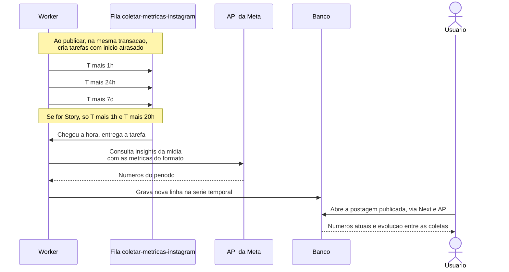

A coleta roda no processo worker. A leitura pelo usuário segue o caminho de sempre: tela no Next,
dados pela API.

**Por que série temporal e não sobrescrita:** guardar cada coleta como uma linha nova custa quase
nada e responde perguntas que a sobrescrita apaga — quanto do alcance veio na primeira hora, se o
conteúdo continuou rendendo depois do primeiro dia, qual formato tem cauda mais longa.

**Estados de interface:**

| Estado | O que o usuário vê |
|---|---|
| Recém-publicado | "Métricas em breve" com o horário da primeira coleta |
| Coletado | Números por formato, com a data e hora da coleta |
| Story dentro da janela | Números normais, com aviso de que ficam congelados após 24h |
| Story fora da janela | Último valor coletado, com a observação de que o Instagram não fornece mais |
| Coleta falhou | Aviso discreto: falha de métrica nunca vira alarme, o conteúdo já está no ar |

**Diferença de gravidade que a interface precisa respeitar:** falhar ao publicar é urgente. Falhar
ao coletar métrica é um aborrecimento. As duas coisas não podem gritar do mesmo jeito.

### 8.2 — Evolução da conta

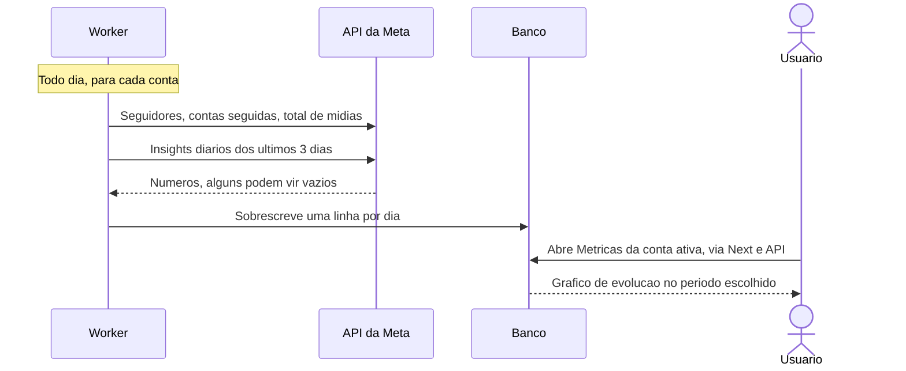

**Estados de interface:**

| Estado | O que o usuário vê |
|---|---|
| Conta recém-conectada | "Coletando o histórico disponível" — a Meta guarda até 90 dias |
| Com dados | Gráficos de seguidores, alcance e interações, com filtro de período; no celular, cartões com os números-chave e gráfico com rolagem |
| Métrica indisponível | "Indisponível — o Instagram não fornece este número para contas com menos de 100 seguidores", nunca zero |
| Dias mais recentes | Aviso de que os números dos últimos 2 dias ainda podem mudar |
| Início dos dados | "Dados desde 15/09/2026" — antes disso, o PostIt ainda não coletava |

---

## 9 — Entrar no sistema

**Quem:** todo usuário. **Requisitos:** RF-H01, RF-H04, RF-H05, RF-H06, RF-H07.

O funcionamento de cada peça — senha, verificação em duas etapas, bloqueio, sessão — está explicado em
linguagem simples em [11 — Segurança](11-seguranca.md).

### 9.1 — Primeiro acesso

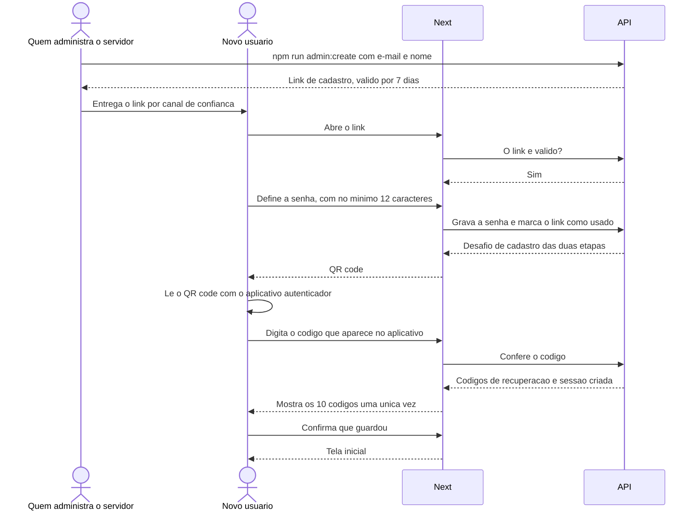

**Estados de interface:**

| Estado | O que o usuário vê |
|---|---|
| Link vencido ou já usado | "Este link não vale mais. Peça um novo a quem administra o sistema" — sem dizer qual dos dois |
| Senha curta | Contador ao vivo com o mínimo de 12 caracteres; nenhuma exigência de símbolo ou número |
| QR code | QR code, instruções curtas e a sugestão de aplicativos. Nenhuma chave em texto |
| Código recusado | "Código incorreto. Confira se o horário do celular está automático" |
| Códigos de recuperação | Os 10 códigos, botões de copiar e baixar, e confirmação obrigatória de que foram guardados |

### 9.2 — Login do dia a dia

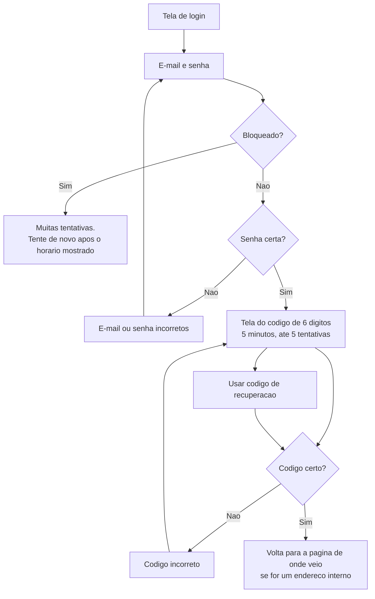

**Estados de interface:**

| Estado | O que o usuário vê |
|---|---|
| Senha errada ou e-mail inexistente | Sempre a mesma frase: "E-mail ou senha incorretos" |
| Bloqueado | "Muitas tentativas. Tente de novo às 14h32" |
| Desafio expirou ou esgotou tentativas | "O tempo para digitar o código acabou. Entre de novo" — volta para e-mail e senha |
| Usou código de recuperação | Aviso de quantos códigos restam e sugestão de gerar novos se estiverem acabando |
| Sessão expirou por inatividade ou teto | Tela de login com "Sua sessão expirou. Entre de novo", e volta para a página onde estava |

**Por que a mesma frase para e-mail inexistente e senha errada:** mensagens diferentes contariam a quem
tenta invadir quais e-mails existem no sistema.

### 9.3 — Recuperação

| Situação | O que fazer | Onde |
|---|---|---|
| Esqueceu a senha | Pedir a quem administra; recebe link de redefinição válido por 24 h. Ao redefinir, todas as sessões caem | `admin:reset-password` |
| Trocou de celular, ainda tem o antigo | Entrar e, no perfil, gerar novos códigos de recuperação; recadastrar o aplicativo | Tela de perfil |
| Perdeu o celular, tem códigos | Entrar usando um código de recuperação | Tela do código |
| Perdeu celular e códigos | Pedir a quem administra, que confirma a identidade por fora do sistema | `admin:reset-2fa` |
| Desconfia de acesso indevido | "Sair dos outros dispositivos" e trocar a senha | Tela de sessões |

### 9.4 — Sessões ativas

**Estados de interface:**

| Estado | O que o usuário vê |
|---|---|
| Lista | Cada sessão com navegador, IP e último uso; a atual marcada como "este dispositivo" |
| Encerrar outras | Confirmação, e a lista fica só com a sessão atual |
| Trocar senha | Pede a senha atual, a nova e um código do aplicativo; avisa que as outras sessões serão encerradas |

---

## 10 — Administrar usuários e permissões

**Quem:** super admin. **Requisitos:** RF-I01 a RF-I09.

Decisão completa em [ADR 0015](adr/0015-super-admin-e-permissoes.md); explicação em linguagem simples em
[11 — Autorização](11-seguranca.md#autorização).

### 10.1 — Criar usuário e dar permissões

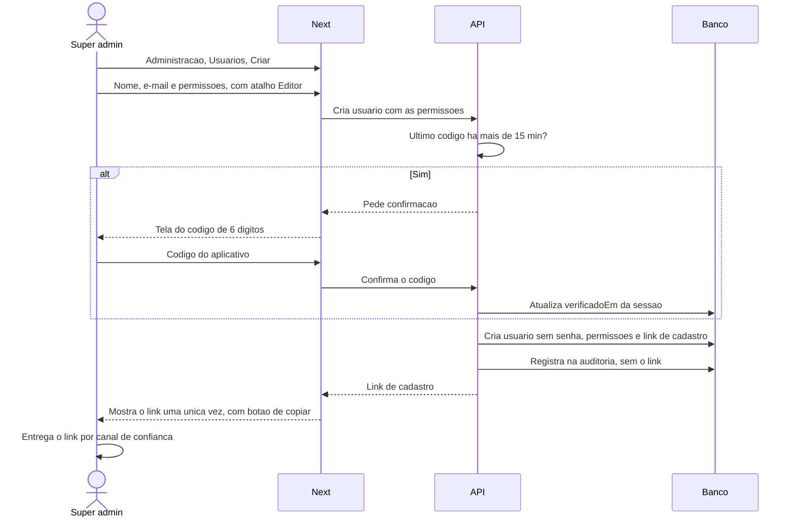

Daí em diante, a pessoa segue a jornada 9.1.

**Estados de interface:**

| Estado | O que o super admin vê |
|---|---|
| Permissões | Cinco caixas com explicação curta de cada uma, e os atalhos "Leitura", "Editor", "Aprovador", "Operador" |
| Permissão sensível | `CONTA_GERENCIAR` e `POSTAGEM_APROVAR_PROPRIA` destacadas, com aviso do que liberam |
| Confirmação | "Para continuar, digite o código do seu aplicativo" — uma vez a cada 15 minutos |
| Link criado | O link, botão de copiar, e o aviso "este link não será mostrado de novo" |
| E-mail já cadastrado | "Já existe um usuário com este e-mail" |

### 10.2 — Alterar permissões ou desativar

| Ação | O que acontece |
|---|---|
| Marcar ou desmarcar permissões | Vale na próxima ação do usuário afetado, sem ele sair e entrar. A auditoria guarda antes e depois |
| Tirar uma permissão | Não desfaz aprovações nem agendamentos já feitos por ele |
| Promover a super admin | Pede confirmação explícita; o usuário ganha todas as permissões e a área de administração |
| Remover super admin | Recusado se for o último super admin ativo |
| Desativar | Encerra todas as sessões do usuário na hora. Recusado para si mesmo e para o último super admin |
| Reativar | O usuário volta a entrar, com as permissões que tinha |

### 10.3 — Tentativas de acesso e bloqueios

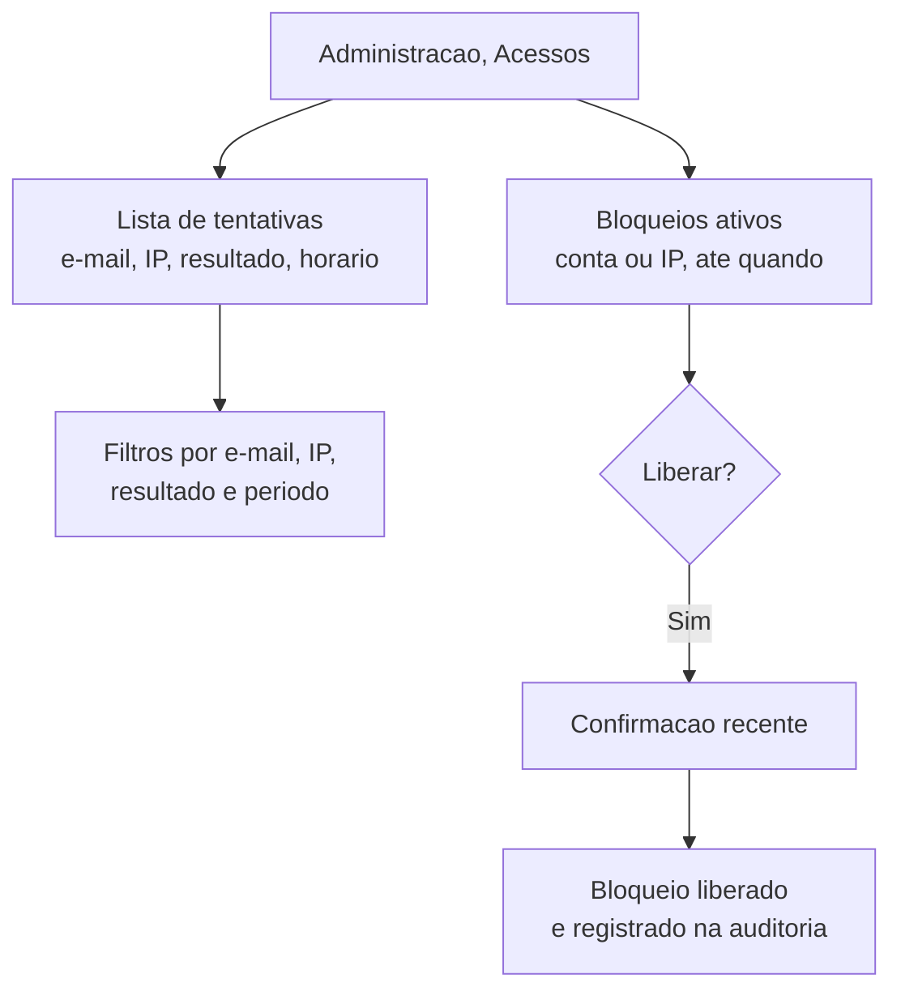

**Estados de interface:**

| Estado | O que o super admin vê |
|---|---|
| Muitas falhas de um mesmo IP em e-mails variados | Destaque: padrão típico de alguém testando e-mails |
| Bloqueio de conta de um colega | Botão "Liberar", com a pergunta "a pessoa confirmou que era ela?" |
| Tentativa bem-sucedida em horário ou IP incomum | Visível na lista, filtrável por resultado `SUCESSO` |

A lista **nunca** mostra senha nem código digitados — eles não são guardados.

### 10.4 — Recuperar o acesso de alguém

| Pedido do usuário | Ação do super admin | Efeito |
|---|---|---|
| Esqueci a senha | Gerar link de redefinição | Link de 24 horas, mostrado uma vez; ao usar, todas as sessões caem |
| Perdi o celular e os códigos | Resetar duas etapas | Confirmar a identidade por fora do sistema antes; todas as sessões caem |
| Acho que alguém entrou na minha conta | Encerrar todas as sessões, e depois gerar link de redefinição | A pessoa entra de novo com senha nova |

### 10.5 — Auditoria

Lista das ações administrativas, filtrável por autor, ação, alvo e período. Cada linha mostra quem fez, pela
tela ou por comando, o quê, sobre quem, os detalhes — como as permissões antes e depois —, o IP e o horário.

---

## 11 — Receber e ler notificações

**Quem:** todo usuário. **Requisitos:** RF-F08, RF-J01 a RF-J05.

Decisão em [ADR 0017](adr/0017-pwa-e-notificacoes-push.md).

### 11.1 — Instalar e ativar notificações

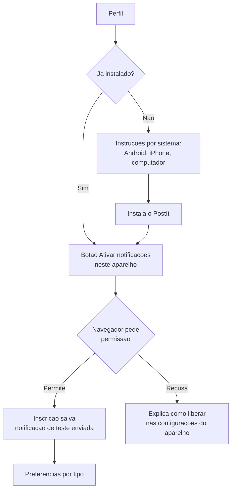

**Estados de interface:**

| Estado | O que o usuário vê |
|---|---|
| iPhone sem o app instalado | "No iPhone, as notificações só funcionam com o PostIt instalado na tela inicial", com o passo a passo |
| Ativado | "Notificações ativas neste aparelho" e o botão "Enviar notificação de teste" |
| Recusado pelo navegador | Como liberar nas configurações do aparelho — o sistema não pode perguntar de novo sozinho |
| Preferências | Cada tipo de aviso com um interruptor de push; aviso de que o sino recebe todos |

### 11.2 — Uma publicação falhou

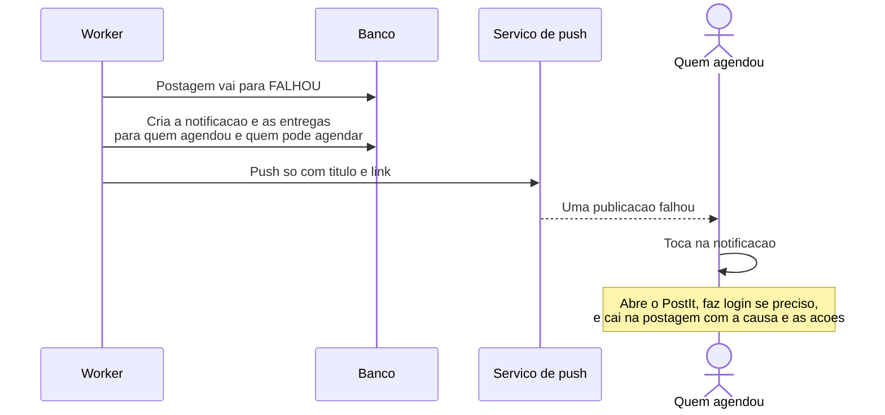

**O que o push mostra:** "Uma publicação falhou" — sem nome da conta, sem legenda, sem o motivo. O motivo e as
ações — reagendar, corrigir, cancelar — aparecem dentro do PostIt, com a pessoa logada.

### 11.3 — O sino

| Estado | O que o usuário vê |
|---|---|
| Não lidas | Número no ícone do sino, na barra de navegação |
| Lista | Frase montada com os dados atuais — "A publicação de 14h na conta @exemplo falhou" —, horário, e link para a tela |
| Aparelho sem push | Tudo chega no sino do mesmo jeito |

---

## Cobertura de requisitos

| Jornada | Requisitos exercitados |
|---|---|
| 1 — Conectar conta | RF-A01, RF-A02, RF-A06, RF-A08 |
| 2 — Imagem de feed | RF-A09, RF-B01, RF-B02, RF-B05, RF-C01, RF-C03, RF-C05, RF-C10, RF-C12, RF-D01, RF-D03 |
| 3 — Reels | RF-B03, RF-C06, RF-C07, RF-C08, RF-F10 |
| 4 — Story | RF-B03, RF-C05, RF-C11 |
| 5 — Aprovação | RF-E01 a RF-E06, RF-I04 |
| 6 — Publicação | RF-D02, RF-D09, RF-F01 a RF-F04, RF-F11 |
| 7 — Falha | RF-A04, RF-F05 a RF-F09, RF-H03 |
| 8 — Métricas | RF-G01 a RF-G04, RF-G06, RF-G07 |
| 9 — Entrar no sistema | RF-H01, RF-H04, RF-H05, RF-H06, RF-H07 |
| 10 — Administrar usuários e permissões | RF-I01 a RF-I09 |
| 11 — Receber e ler notificações | RF-F08, RF-J01 a RF-J05 |

Requisitos não exercitados por nenhuma jornada, por serem de administração ou visualização:
RF-A03, RF-A05, RF-A07, RF-B04, RF-B06, RF-C02, RF-C04, RF-C09, RF-D04 a RF-D08, RF-D10,
RF-G05, RF-H02.
