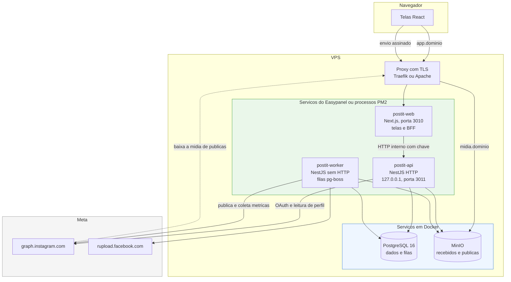
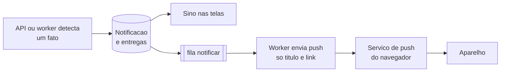
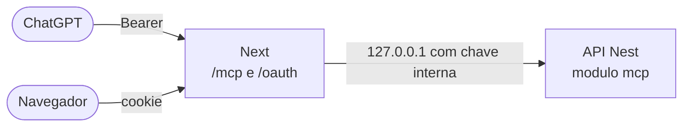
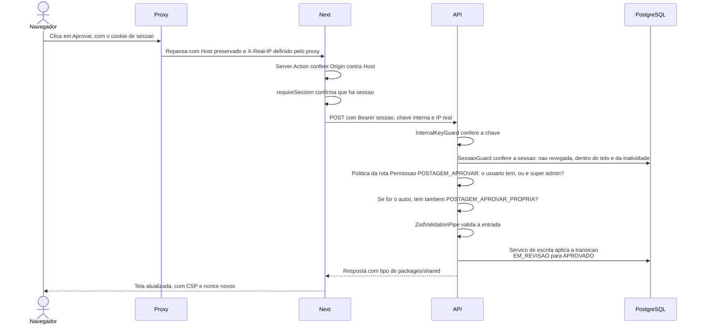
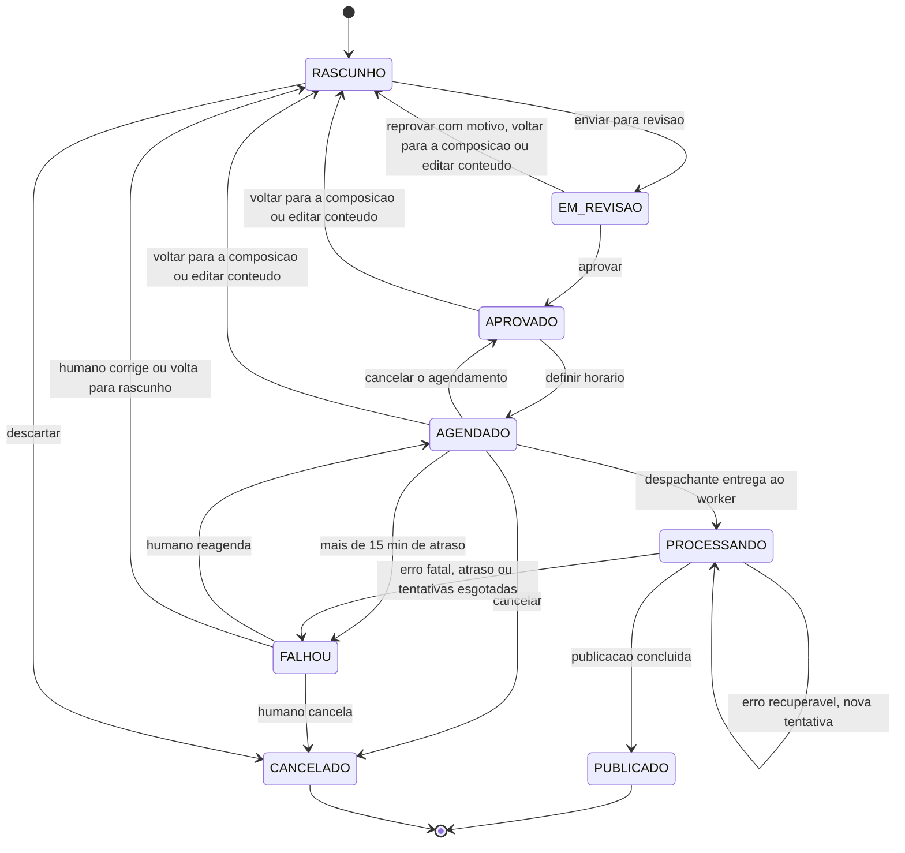

# 05 — Arquitetura

O PostIt é um **monorepo com três processos**: as telas em Next.js, uma API em NestJS e um worker
que usa o mesmo código da API. As decisões de fundo estão em
[ADR 0010](adr/0010-monorepo-next-nest-bff.md), [ADR 0012](adr/0012-upload-direto-minio.md),
[ADR 0013](adr/0013-autenticacao-com-duas-etapas.md) e [ADR 0014](adr/0014-csp-e-cabecalhos-de-seguranca.md).

## Visão de componentes



**Repare no que não existe:** nenhuma seta vai da internet para a API. Ela só é alcançável pelo Next,
de dentro do servidor.

## Responsabilidade de cada peça

| Componente | Faz | Não faz |
|---|---|---|
| **postit-web** (Next) | Mostra as telas, guarda o cookie de sessão, chama a API por dentro do servidor, entrega ao navegador a permissão de envio de arquivo | **Nunca** acessa o banco, o MinIO ou a Meta diretamente |
| **postit-api** (Nest HTTP) | Autentica, valida entrada, aplica as regras de negócio, grava no banco, conecta contas do Instagram, assina envios e valida mídias | **Nunca** publica nem executa filas. Não é alcançável pela internet |
| **postit-worker** (Nest sem HTTP) | Despacha postagens vencidas, cria containers, publica, coleta métricas de postagem e de conta, renova tokens, envia push, faz manutenção | Não atende requisição de ninguém |
| **PostgreSQL** | Guarda toda a verdade — contas, postagens, mídias, sessões, auditoria — e as filas do pg-boss, num esquema separado | Não guarda arquivo |
| **MinIO** | Recebe arquivos enviados pelo navegador em `recebidos/` e serve os validados em `publicas/` para a Meta baixar | Não guarda metadados de negócio |
| **Proxy reverso** | Termina TLS, manda o domínio do app para o Next e o de mídia para o MinIO | Não tem lógica de aplicação. Não conhece a API |

## As decisões estruturais

### 1. O Next é a porta de entrada; a API fica escondida

O navegador só conversa com o Next. Quando uma tela precisa de dados ou salva algo, o **servidor do
Next** chama a API em `127.0.0.1`, repassando a sessão do usuário e uma chave interna.

- Leituras acontecem em **Server Components**, que buscam dados antes de montar a página
- Escritas acontecem em **Server Actions**, funções do servidor chamadas pelos formulários

Por isso não há CORS, não há endereço de API exposto no navegador, e a API nunca recebe tráfego da
internet. Detalhes em [ADR 0010](adr/0010-monorepo-next-nest-bff.md).

O assistente por MCP (parte 1f) **entra pela mesma porta**: ver a decisão 9.

### 2. API e worker são o mesmo código, iniciado de dois jeitos

`apps/api/src/main.ts` sobe o servidor HTTP. `apps/api/src/worker.ts` sobe o mesmo projeto Nest sem
HTTP, só com as filas. Os dois reaproveitam os mesmos módulos de banco, integração com o Instagram e
regras de domínio.

Publicação leva minutos: criar container, a Meta processar o vídeo, publicar. Isso roda no worker,
longe do processo que atende as telas. Reiniciar a API não interrompe uma publicação em andamento, e
vice-versa.

### 3. Só o worker publica — e a estrutura garante

O módulo de publicação e o módulo de filas são importados **só** pelo módulo do worker. O processo
HTTP da API simplesmente não tem esse código carregado. Mesmo o "publicar agora" da tela só grava a
postagem como agendada para o instante atual; o worker faz o resto.

Um teste de arquitetura verifica que nenhum módulo da API HTTP importa publicação ou filas.

Um só caminho de publicação significa um só lugar onde idempotência, retentativa e tradução de erro
precisam estar certas.

### 4. Tudo mora no Postgres, inclusive as filas

Uma postagem agendada é uma **linha na tabela `Postagem`** com status `AGENDADO` e um horário. O
despachante, no worker, olha a tabela a cada minuto e só então entrega o trabalho ao pg-boss — mudando
o status e criando a tarefa **na mesma transação**. Não há Redis. Ver
[ADR 0008](adr/0008-pg-boss-em-vez-de-bullmq.md) e [09](09-motor-agendamento.md).

### 5. Contrato compartilhado em zod

Schemas de entrada, tipos de resposta, enums e as especificações de mídia do Instagram ficam em
`packages/shared`. A API valida com eles; o Next usa os mesmos para avisar o usuário antes de enviar.
As respostas da API usam os tipos do pacote compartilhado, **nunca** os tipos gerados pelo Prisma —
assim uma mudança no banco não vaza sem querer para as telas.

### 6. O MinIO é público, mas só depois da validação

A Meta não aceita o arquivo na requisição: ela recebe uma **URL** e vai buscar. Por isso a mídia
precisa estar pública ([ADR 0005](adr/0005-minio-midia-publica.md)).

O navegador envia direto para o prefixo privado `recebidos/`. A API valida e só então move para
`publicas/`. Conteúdo não validado nunca fica acessível ([ADR 0012](adr/0012-upload-direto-minio.md)).

### 7. Um aplicativo instalável que avisa com a tela fechada

O Next serve um **PWA**: manifesto de instalação e service worker, com Serwist. Funciona por completo no
celular ([13](13-telas-e-navegacao.md)). O service worker **não guarda dado pessoal**: páginas e dados
autenticados vão sempre à rede.

Notificações são geradas pela API ou pelo worker, gravadas no banco e entregues de duas formas: **sino**
nas telas, sempre, e **push** para quem ativou no aparelho, enviado pelo worker na fila `notificar`.
Detalhes em [ADR 0017](adr/0017-pwa-e-notificacoes-push.md).



### 8. Edição simultânea

Duas pessoas podem abrir a mesma postagem. Toda alteração feita por usuário envia o número de **versão** que a
tela carregou; a API grava só se a versão ainda for a mesma e responde 409 caso contrário, dizendo quem alterou e
quando. A tela preserva o que a pessoa digitou. Mudanças do worker não mexem na versão. Detalhes em
[07](07-modelo-dados.md) e RF-C12.

### 9. O assistente entra pela mesma porta

A construir na parte 1f; decisão em [ADR 0029](adr/0029-assistente-por-mcp.md). Um assistente de IA — o ChatGPT,
primeiro — compõe rascunhos por **MCP**, autorizado por **OAuth** em nome da pessoa.

- O Next expõe `/mcp`, `/oauth/*` e os `/.well-known` do OAuth como **route handlers que só repassam** à API, com a
  chave interna. É a exceção fechada à "toda escrita é Server Action": rotas de máquina, sem cookie, só
  `Authorization: Bearer` — sem cookie, não há CSRF.
- A lógica fica na API, num módulo `mcp/` do processo HTTP, reaproveitando os serviços de postagem e de mídia. Nada
  do MCP publica, e ele não importa fila (regra 1). A edição pelo assistente usa a mesma trava de versão da decisão 8.
- A API continua sem nome público: o caminho até ela segue sendo um só.



## Uma requisição do começo ao fim

Exemplo: o usuário, já logado com senha e verificação em duas etapas, aprova uma postagem.



O login em si — senha, desafio e código de 6 digitos — está em
[11 — O login, passo a passo](11-seguranca.md#o-login-passo-a-passo).

## Máquina de estados da postagem

O coração do sistema. Todo comportamento se ancora aqui. A máquina vive em
`apps/api/src/domain/post/`, como código puro, sem banco e sem HTTP.

> **Enviar e aprovar são decisões separadas desde a 1e** ([ADR 0026](adr/0026-postagem-em-duas-etapas.md),
> 23/09/2026). Até ali, "marcar como pronta" encadeava `RASCUNHO → EM_REVISAO → APROVADO` numa
> transação, sem aresta inventada. O encadeamento que sobrou é **aprovar e agendar**: `EM_REVISAO →
> APROVADO → AGENDADO`, as duas transições abaixo, numa transação e com uma linha de `Aprovacao` — de novo
> sem abrir `EM_REVISAO → AGENDADO`, e só a partir de `EM_REVISAO`.
>
> A 1e acrescentou **uma** aresta: `AGENDADO → APROVADO`, cancelar o agendamento sem perder a aprovação.
> Ela não fere a I-1 — é de `APROVADO` que se chega a `AGENDADO`, não o contrário.



### Invariantes

Regras que valem sempre e que a implementação precisa garantir, não apenas respeitar por convenção:

| # | Invariante | Como se garante |
|---|---|---|
| I-1 | Só uma postagem `APROVADO` pode virar `AGENDADO` | Transição validada no domínio, na API — não só na tela |
| I-2 | Editar conteúdo em `EM_REVISAO`, `APROVADO`, `AGENDADO` **ou `FALHOU`** derruba para `RASCUNHO` **e apaga `publicarEm`** | Regra no serviço de escrita, aplicada a qualquer alteração de conteúdo — inclusive o texto alternativo de uma foto. `FALHOU` entrou em 22/09/2026: a versão aprovada era a que falhou, e corrigi-la é conteúdo novo. `EM_REVISAO` entrou em 23/09/2026 (ADR 0026): sem isso, quem aprova reescreveria a postagem de um colega e a aprovaria em seguida. A aresta tem duas portas sem edição: "voltar para a composição" (`POST :postId/reopen`, com `POSTAGEM_EDITAR`) de revisão, aprovada e agendada, e "voltar para rascunho" (`POST :postId/to-draft`, com `POSTAGEM_AGENDAR`) da que falhou. Toda queda zera tentativas e causa. O horário sai junto porque uma postagem que não vai sair não pode exibir horário de saída — ver [09](09-motor-agendamento.md#o-horário-de-uma-postagem-que-volta-a-ser-rascunho) |
| I-3 | `PUBLICADO` é terminal e irreversível | Nenhuma transição sai de `PUBLICADO`. A API da Meta não apaga posts |
| I-4 | `FALHOU` só sai por ação humana | O worker nunca reagenda sozinho a partir de `FALHOU` |
| I-5 | Uma postagem com identificador de mídia gravado nunca republica | Verificação no início da execução, antes de qualquer chamada à Meta |
| I-6 | Só uma execução por postagem ao mesmo tempo | Trava otimista na transição para `PROCESSANDO`, criando a tarefa na mesma transação, com `singletonKey` igual ao id da postagem numa fila `exclusive`; e o **arrendamento** da execução (`execucaoId`, `execucaoExpiraEm`), porque o pg-boss reinicia a tarefa vencida com a anterior ainda rodando. Ver [09](09-motor-agendamento.md#a-camada-que-o-pg-boss-não-dá-o-arrendamento) |
| I-7 | `publicarEm` é sempre UTC | Coluna com fuso; conversão só na borda da tela |
| I-8 | Nenhuma publicação começa mais de 15 minutos depois do horário marcado — e nenhuma chamada à Meta acontece mais de 45 minutos depois | Verificação no despachante e na primeira execução do publicador; o teto de 45 minutos, antes de cada chamada. Ver [ADR 0007](adr/0007-falha-exige-decisao-humana.md) |
| I-9 | Só o processo worker publica | Módulos de publicação e filas importados só pelo `WorkerModule`, com teste de arquitetura |
| I-10 | Sempre existe ao menos um super admin ativo | Desativar ou remover super admin conta os restantes na mesma transação e desiste se sobraria zero. Ver [ADR 0015](adr/0015-super-admin-e-permissoes.md) |
| I-11 | Toda mudança de status feita por uma pessoa grava uma linha em `Aprovacao`, na mesma transação | O primitivo de escrita da postagem recusa mudar status sem o registro da decisão — enviar, aprovar, reprovar, voltar para rascunho, agendar, desagendar, cancelar, invalidar por edição. É dele que a Revisão conta a história ([ADR 0026](adr/0026-postagem-em-duas-etapas.md)); o que o worker faz vai para `EventoPublicacao` |

A invariante I-5 é a que impede o pior acidente possível: publicar duas vezes. Ela é verificada
**antes** de qualquer chamada à Meta, e o identificador é gravado **na mesma transação** que muda o
status para `PUBLICADO`.

## Organização do código

```
postit/
├── apps/
│   ├── web/                              # Next.js — telas e BFF
│   │   ├── app/                          # rotas em português: é o endereço que o usuário vê (ADR 0023)
│   │   │   ├── (autenticado)/            # páginas protegidas
│   │   │   │   ├── c/[conta]/            # telas da conta ativa: a conta vem do endereço — ver doc 13
│   │   │   │   │   ├── calendario/
│   │   │   │   │   ├── postagens/
│   │   │   │   │   └── metricas/         # por postagem e da conta
│   │   │   │   ├── contas/
│   │   │   │   │   └── conectar/retorno/ # URI de retorno do OAuth do Instagram
│   │   │   │   ├── acervo/               # compartilhado entre as contas
│   │   │   │   ├── saude/                # todas as contas
│   │   │   │   ├── notificacoes/         # o sino, de todas as contas
│   │   │   │   ├── perfil/               # senha, codigos e sessoes; preferencias e push na Fase 1
│   │   │   │   └── admin/                # so super admin: usuarios, permissoes, acessos, auditoria
│   │   │   ├── manifest.ts               # manifesto do app instalavel
│   │   │   ├── sw.ts                     # service worker (Serwist): push e pagina offline, sem dado pessoal
│   │   │   ├── ~offline/                 # pagina "sem conexao"
│   │   │   ├── entrar/                   # e-mail e senha
│   │   │   │   ├── codigo/               # o codigo de 6 digitos, ou um de recuperacao
│   │   │   │   └── cadastro/             # primeiro acesso: QR e codigos de recuperacao
│   │   │   ├── cadastro/[token]/         # link gerado por admin:create
│   │   │   ├── redefinir/[token]/        # link gerado por admin:reset-password
│   │   │   └── sessao-expirada/          # GET que confere com a API antes de apagar o cookie
│   │   ├── components/
│   │   ├── lib/
│   │   │   ├── api/client.ts             # unica forma de chamar a API (server-only); le so X-Real-IP
│   │   │   ├── auth/                     # nome do cookie, requireSession() com cache()
│   │   │   ├── security/csp.ts           # monta a CSP com o nonce
│   │   │   ├── data/                     # leituras usadas por Server Components
│   │   │   └── actions/                  # escritas: Server Actions
│   │   ├── proxy.ts                      # gera o nonce e a CSP; confere se o cookie existe
│   │   └── e2e/                          # testes de tela Playwright, desktop e celular — ver doc 15
│   │
│   └── api/                              # NestJS com Fastify
│       └── src/
│           ├── main.ts                   # processo HTTP
│           ├── worker.ts                 # processo de filas
│           ├── app.module.ts             # modulos do processo HTTP
│           ├── worker.module.ts          # modulos do processo worker
│           ├── config/env.ts             # variaveis validadas com zod no boot
│           ├── common/                   # guardas, pipe zod, erros, filtro global, crypto.ts
│           ├── prisma/                   # PrismaService, usado pelos dois processos
│           ├── auth/                     # autenticacao — ver ADR 0013
│           │   ├── password.ts           # argon2id e hash isca
│           │   ├── session.service.ts    # criar, conferir, revogar; inatividade e teto
│           │   ├── challenge.service.ts  # etapa entre senha e sessao
│           │   ├── totp.service.ts       # cadastro, verificacao, anti-reuso, codigos de recuperacao
│           │   ├── lockout.service.ts    # tentativas repetidas, por conta e por IP
│           │   ├── links.service.ts      # cadastro e redefinicao
│           │   └── guards/               # chave interna, sessao, politica de acesso
│           ├── authorization/            # catalogo de permissoes, decorators de politica, guard — ver ADR 0015
│           ├── admin/                    # usuarios, permissoes, tentativas e bloqueios, auditoria — so HTTP
│           ├── cli/                      # emergencia: admin:create, admin:promote, admin:reset-password, admin:reset-2fa
│           ├── users/
│           ├── accounts/                 # conexao e desconexao de contas
│           ├── media/                    # permissao de envio, validacao, acervo
│           ├── posts/                    # composicao e agendamento
│           ├── approval/
│           ├── metrics/                  # leitura das metricas de postagem e de conta
│           ├── notifications/            # gerar notificacoes, destinatarios, sino, inscricoes push
│           ├── health/                   # painel de saude e /health
│           ├── storage/                  # porta e adaptador do MinIO
│           ├── instagram/                # tudo que e especifico do Instagram
│           │   ├── client.ts             # unico lugar que anexa o token
│           │   ├── oauth.ts
│           │   ├── publishing.ts         # container e media_publish
│           │   ├── insights.ts
│           │   └── errors.ts             # traducao de codigos da Meta
│           ├── domain/                   # regras puras: maquina de estados, fuso, invariantes
│           ├── queues/                   # pg-boss — so no worker
│           ├── publishing/               # despachante e consumidores — so no worker
│           │   └── instagram/            # publicar, metricas de postagem e de conta, tokens
│           └── fake-meta/                # imita a Graph API nos testes; ativa so com NODE_ENV=test
│
├── packages/
│   ├── shared/                           # schemas zod, tipos de resposta, enums,
│   │                                     # especificacoes de midia do Instagram,
│   │                                     # safeRedirect() e politica de senha
│   └── database/                         # schema.prisma (nomes em ingles mapeados para o banco), migrations, seed
│
├── docs/
├── .github/workflows/                    # CI, CodeQL — ver doc 15
├── .githooks/pre-commit                  # sobe a versao patch
├── Dockerfile                            # uma imagem, comandos web, api e worker — etapa 1, ver doc 10
├── docker-compose.yml                    # Postgres e MinIO do computador local
├── ecosystem.config.cjs                  # só na etapa 2, depois da aprovação
├── scripts/
│   ├── deploy.sh                         # etapa 2: deploy.sh vX.Y.Z — só aceita tag
│   ├── docker-entrypoint.sh              # despacha web, api (migrations antes) ou worker na imagem
│   ├── version.mjs                       # propaga a versao unica
│   └── tunnel.cjs                        # dois tuneis rapidos da Cloudflare, app e midia — ver doc 14
├── turbo.json
└── tsconfig.base.json
```

### Convenções dentro da API

| Convenção | Motivo |
|---|---|
| Módulos com nome de funcionalidade, em inglês | Código em inglês ([ADR 0023](adr/0023-codigo-em-ingles.md)) |
| Serviços separados em `*.query.service.ts` (só lê) e `*.domain.service.ts` (escreve e abre transação) | Deixa claro onde mora cada efeito colateral. Padrão do `nossobuncker` |
| `apps/api/src/domain/` sem Nest, sem Prisma, sem HTTP | Máquina de estados, invariantes e cálculo de fuso testáveis sem subir nada |
| Integrações externas atrás de uma porta, como `storage/` | Trocar o MinIO por S3 não mexe no resto. Padrão do `nossobuncker` |
| Uma pasta por rede em `instagram/` e em `publishing/instagram/` | Prepara outras redes sem abstração antecipada. Ver [ADR 0009](adr/0009-preparacao-multi-rede.md) |
| Erros próprios traduzidos por um filtro global | Mensagem em português e formato de resposta único |

**`instagram/client.ts` é o único lugar que anexa o token.** Mesmo princípio da função `chamar()` do
`sorteio-comentarios-instagram/src/lib/instagram.ts`: só há um lugar para auditar a promessa de que o
token nunca vaza.

## Fluxo de dados de uma publicação

Tudo acontece no processo worker. Ordem exata, com o ponto de retomada de cada etapa:

| Passo | Quem | Ação | Se falhar aqui, ao retomar |
|---|---|---|---|
| 1 | Despachante | Verifica cota disponível | Adia, mantém `AGENDADO` |
| 2 | Despachante | Numa transação: `PROCESSANDO` com trava otimista e criação da tarefa | Nada aconteceu; a próxima volta tenta de novo |
| 3 | Publicador | Verifica se já tem identificador de mídia publicada | — |
| 4 | Publicador | Monta a URL pública da mídia em `publicas/` | Refaz, é determinístico |
| 5 | Publicador | Cria o container na Meta | Reaproveita o container gravado se ainda válido |
| 6 | Publicador | Grava o identificador do container e o prazo | Se não gravou, o passo 5 refaz e cria outro. Custa cota de container, não de publicação |
| 7 | Publicador | Consulta o estado até ficar pronto | Recomeça a consulta do container já gravado |
| 8 | Publicador | Publica | **Ponto crítico.** Ver abaixo |
| 9 | Publicador | Numa transação: grava identificador e permalink, marca `PUBLICADO`, cria as tarefas de métricas | Nada foi gravado; a reconciliação descobre que publicou |

**O ponto crítico é o passo 8.** Se a chamada de publicação der timeout, não sabemos se a Meta
publicou. Retentar cegamente arrisca duplicar. A resposta é **não retentar às cegas**: antes de
publicar de novo, consultar as mídias recentes da conta procurando uma que corresponda ao container.
Só se não encontrar é que se tenta de novo. Procedimento em
[09 — Idempotência](09-motor-agendamento.md#idempotência).

## O que não está nesta arquitetura, e por quê

| Ausente | Por quê |
|---|---|
| API exposta na internet | O Next é o único caminho até ela — inclusive o do assistente por MCP, que ele só repassa. Expor a API só aumentaria a superfície de ataque. Ver [ADR 0010](adr/0010-monorepo-next-nest-bff.md) e [ADR 0029](adr/0029-assistente-por-mcp.md) |
| CORS | O navegador nunca chama a API diretamente |
| Token no navegador (JWT) | Sessão opaca em cookie `httpOnly`, com verificação em duas etapas. Ver [ADR 0013](adr/0013-autenticacao-com-duas-etapas.md) |
| Rotas POST próprias no Next | Toda escrita é Server Action, que confere a origem. Ver [11 — CSRF](11-seguranca.md#csrf). **Exceção fechada**: `/mcp` e o OAuth, rotas de máquina sem cookie que só repassam à API ([ADR 0029](adr/0029-assistente-por-mcp.md)) |
| Recursos de terceiros nas páginas | CSP restrita ao próprio app e ao domínio de mídia. Ver [ADR 0014](adr/0014-csp-e-cabecalhos-de-seguranca.md) |
| TanStack Query | Leituras em Server Components e escritas em Server Actions cobrem o MVP. O arrastar do calendário usa atualização otimista do React. Reavaliar se a interatividade pedir |
| App de worker separado | Worker e API compartilham o código. Separar é mecânico se um dia fizer sentido |
| Redis | O pg-boss guarda as filas no Postgres. Ver [ADR 0008](adr/0008-pg-boss-em-vez-de-bullmq.md) |
| Webhooks da Meta | No MVP a publicação é iniciada por nós. **Entram com comentários e mensagens**: o proxy mandará uma rota de webhook direto à API — o padrão já existe em `openreply/app/api/webhook`. Ver [ADR 0009](adr/0009-preparacao-multi-rede.md) |
| Interface genérica de publicador | Só existe uma rede. A abstração nasce com a segunda |
| CDN e cache de leitura | Volume de uso interno não justifica |
| Múltiplas instâncias | Um processo de cada basta. A arquitetura suporta mais, mas não há motivo para começar assim |
| Papéis configuráveis e permissões por conta | Permissões por usuário, de um catálogo fixo e globais. Ver [ADR 0015](adr/0015-super-admin-e-permissoes.md) |
| Biblioteca de autorização | Cinco permissões fixas cabem num enum e num guard |

## Documentos relacionados

- [06 — Stack](06-stack.md) — por que cada tecnologia
- [07 — Modelo de dados](07-modelo-dados.md) — as entidades
- [09 — Motor de agendamento](09-motor-agendamento.md) — o detalhe do worker
- [10 — Infra e deploy](10-infra-deploy.md) — como isso roda na VPS
- [11 — Segurança](11-seguranca.md) — autenticação, segredos e superfície exposta
