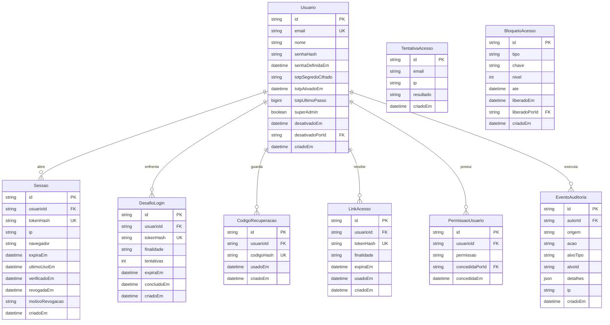
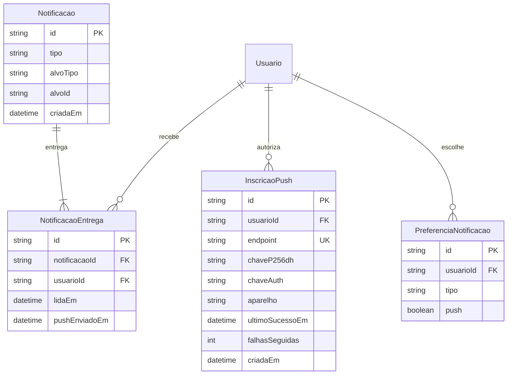

# 07 — Modelo de Dados

O schema do Prisma, as migrations e o seed ficam em **`packages/database`**. API e worker usam o
client por um `PrismaService` compartilhado em `apps/api/src/prisma/`. O Next **não acessa o banco**:
tudo passa pela API ([ADR 0010](adr/0010-monorepo-next-nest-bff.md)).

**Regra de fronteira:** as respostas da API usam tipos declarados em `packages/shared`, **nunca** os
tipos gerados pelo Prisma. Assim, um campo novo no banco — ou um campo sensível como `tokenCifrado`,
`senhaHash` e `totpSegredoCifrado` — não vaza para as telas sem alguém decidir isso.

## Diagrama de entidades

O diagrama está dividido em três: autenticação e administração da ferramenta, o domínio de publicação, e
notificações.

### Autenticação e administração



`TentativaAcesso` e `BloqueioAcesso` não têm chave estrangeira para `Usuario` de propósito: registram
também tentativas com e-mails que não existem.

### Publicação

```mermaid
erDiagram
    Usuario ||--o{ Aprovacao : registra
    Usuario ||--o{ ComentarioInterno : escreve

    Conta ||--o{ Postagem : recebe
    Conta ||--o{ EventoToken : possui
    Conta ||--o{ MetricaConta : mede

    Postagem ||--|{ PostagemMidia : contem
    Postagem ||--o{ Colaborador : convida
    Postagem ||--o{ ContainerPublicacao : gera
    Postagem ||--o| Publicacao : resulta_em
    Postagem ||--o{ Aprovacao : passa_por
    Postagem ||--o{ ComentarioInterno : discute
    Postagem ||--o{ EventoPublicacao : audita

    Midia ||--o{ PostagemMidia : usada_em
    PostagemMidia ||--o{ Marcacao : posiciona

    Publicacao ||--o{ MetricaPostagem : mede

    Usuario {
        string id PK
        string nome
    }

    Conta {
        string id PK
        string rede
        string idExterno
        string username
        string nome
        string fotoChaveObjeto
        string tokenCifrado
        datetime tokenExpiraEm
        datetime tokenRenovadoEm
        string escopos
        string fusoHorario
        boolean ativa
        datetime criadoEm
    }

    Midia {
        string id PK
        string chaveObjeto UK
        string mimeType
        int bytes
        int largura
        int altura
        int duracaoMs
        string codecVideo
        string codecAudio
        boolean moovNoInicio
        string hashSha256
        datetime criadoEm
    }

    Postagem {
        string id PK
        string contaId FK
        string formato
        string status
        string legenda
        datetime publicarEm
        boolean apareceNoFeed
        int capaOffsetMs
        string capaMidiaId FK
        boolean geradoPorIA
        int versao
        int tentativas
        string ultimoErroCodigo
        string ultimoErroMensagem
        string criadoPorId FK
        string agendadoPorId FK
        string atualizadoPorId FK
        datetime criadoEm
        datetime atualizadoEm
    }

    PostagemMidia {
        string id PK
        string postagemId FK
        string midiaId FK
        int ordem
        string textoAlternativo
    }

    Marcacao {
        string id PK
        string postagemMidiaId FK
        string username
        float x
        float y
    }

    Colaborador {
        string id PK
        string postagemId FK
        string username
    }

    ContainerPublicacao {
        string id PK
        string postagemId FK
        string igContainerId
        string papel
        string statusCode
        datetime criadoEm
        datetime expiraEm
    }

    Publicacao {
        string id PK
        string postagemId FK UK
        string idExterno UK
        string permalink
        datetime publicadoEm
    }

    MetricaPostagem {
        string id PK
        string publicacaoId FK
        string momento
        datetime coletadoEm
        json valores
    }

    Aprovacao {
        string id PK
        string postagemId FK
        string usuarioId FK
        string acao
        string motivo
        datetime criadoEm
    }

    ComentarioInterno {
        string id PK
        string postagemId FK
        string usuarioId FK
        string texto
        datetime criadoEm
    }

    EventoPublicacao {
        string id PK
        string postagemId FK
        string etapa
        string resultado
        int duracaoMs
        json respostaMeta
        datetime criadoEm
    }

    EventoToken {
        string id PK
        string contaId FK
        string acao
        string resultado
        datetime criadoEm
    }

    MetricaConta {
        string id PK
        string contaId FK
        date dia
        json valores
        datetime coletadoEm
    }
```

### Notificações



## As entidades, e por que existem

A autenticação completa está em [ADR 0013](adr/0013-autenticacao-com-duas-etapas.md) e, explicada em
linguagem simples, em [11 — Segurança](11-seguranca.md).

### `Usuario`
Quem usa a ferramenta. Poucos, sem cadastro aberto: cada um é criado pelo comando `admin:create` no
servidor. Não confundir com conta de rede social.

| Campo | O que guarda |
|---|---|
| `senhaHash` | A senha processada com **argon2id** — nunca a senha. Vazio até a pessoa usar o link de cadastro |
| `senhaDefinidaEm` | Quando a senha **atual** foi definida: pelo link ou pela troca no perfil. É o que o Perfil mostra. Vazio em quem definiu antes da coluna existir — a tela diz "data não registrada" em vez de inventar. Gravado num lugar só, `UsersService.setPassword` |
| `totpSegredoCifrado` | O segredo da verificação em duas etapas, **cifrado** com `ENCRYPTION_KEY`. Vazio até o cadastro |
| `totpAtivadoEm` | Quando a verificação em duas etapas foi confirmada. Vazio significa que o próximo login pede o cadastro |
| `totpUltimoPasso` | O último passo de 30 segundos cujo código foi aceito. Um código do mesmo passo, ou anterior, é recusado — impede reusar um código visto por cima do ombro |
| `superAdmin` | Se o usuário é super admin: todas as permissões e acesso à área de administração. Não é uma permissão do catálogo. Ver [ADR 0015](adr/0015-super-admin-e-permissoes.md) |
| `desativadoEm`, `desativadoPorId` | Quando e por quem o usuário foi desativado. Desativado não entra, e suas sessões foram revogadas. Reativar limpa os dois campos |

**Invariante I-10: sempre existe ao menos um super admin ativo.** Desativar ou remover super admin acontece
numa transação que conta os super admins ativos restantes e desiste se sobraria zero. Ver
[05](05-arquitetura.md#invariantes).

### `PermissaoUsuario`
Uma linha por permissão concedida a um usuário. Sem linha, sem permissão.

| Campo | O que guarda |
|---|---|
| `permissao` | Um valor do catálogo fixo: `POSTAGEM_EDITAR`, `POSTAGEM_APROVAR`, `POSTAGEM_APROVAR_PROPRIA`, `POSTAGEM_AGENDAR`, `CONTA_GERENCIAR` |
| `concedidaPorId`, `concedidaEm` | Quem concedeu e quando |

**Por que uma tabela e não uma lista num campo do usuário:** permite restrição de unicidade por par
usuário-permissão, consulta direta de "quem pode aprovar" e o registro de quem concedeu cada uma.

Os atalhos da tela — "Editor", "Aprovador", "Operador" — **não** são guardados: só marcam linhas desta
tabela. Super admin não precisa de linhas aqui.

### `Sessao`
Um login ativo. Criada quando o usuário completa a verificação em duas etapas.

**O token de sessão não está no banco** — só o hash sha256 dele, em `tokenHash`. O token de verdade fica
no cookie do navegador. Quem ler a tabela, inclusive por um backup vazado, não consegue usar as sessões.

| Campo | Regra |
|---|---|
| `expiraEm` | Criação + `SESSION_MAX_DAYS` (30). **Nunca estendido** — teto absoluto |
| `ultimoUsoEm` | Atualizado no máximo uma vez por hora. Sem uso por `SESSION_IDLE_DAYS` (7), a sessão não vale mais |
| `revogadaEm`, `motivoRevogacao` | Preenchidos ao encerrar: `SAIU`, `TROCA_SENHA`, `REDEFINICAO_SENHA`, `RESET_2FA`, `ENCERRADA_PELO_USUARIO` |
| `ip`, `navegador` | Para o usuário reconhecer onde está logado e para investigar incidentes |

Uma sessão só vale se `revogadaEm` está vazio, `expiraEm` não passou e o último uso foi há menos de 7
dias.

### `DesafioLogin`
A etapa entre a senha certa e a sessão criada. Senha certa **não** cria sessão: cria um desafio.

- `finalidade`: `CADASTRAR_2FA` no primeiro acesso, `VERIFICAR_2FA` nos demais
- Token só como hash; válido por **5 minutos**; no máximo **5 tentativas**; uso único (`concluidoEm`)

### `CodigoRecuperacao`
Os 10 códigos de uso único para quando o celular não estiver disponível. Guardados só como hash; `usadoEm`
marca o que já foi gasto. Gerar novos códigos apaga os anteriores.

### `LinkAcesso`
Links gerados pelos comandos de administração, já que o sistema não envia e-mail.

| `finalidade` | Validade | Ao usar |
|---|---|---|
| `CADASTRO` | 7 dias | A pessoa define a senha e segue para o cadastro da verificação em duas etapas |
| `REDEFINICAO_SENHA` | 24 horas | Define a nova senha e revoga **todas** as sessões |

Token só como hash, uso único.

### `TentativaAcesso` e `BloqueioAcesso`
A memória da proteção contra tentativas repetidas.

- `TentativaAcesso` registra cada tentativa de login ou de código: e-mail digitado, IP e resultado
  (`SUCESSO`, `SENHA_ERRADA`, `EMAIL_INEXISTENTE`, `CODIGO_ERRADO`, `BLOQUEADO`). **Nunca** a senha nem o
  código digitados
- `BloqueioAcesso` registra bloqueios ativos: `tipo` (`CONTA` ou `IP`), `chave` (o e-mail ou o IP),
  `nivel` (1 para o primeiro bloqueio, 2 para reincidência em 24 h) e `ate`

Limites e durações em [11 — Proteção contra tentativas repetidas](11-seguranca.md#proteção-contra-tentativas-repetidas).

O super admin vê as duas tabelas na área de administração e pode **liberar um bloqueio**: `liberadoEm` e
`liberadoPorId` são preenchidos e o bloqueio deixa de valer, sem apagar o registro.

### `EventoAuditoria`
A trilha de ações administrativas: criar, desativar e reativar usuário; promover e remover super admin;
alterar permissões; gerar link de redefinição; resetar verificação em duas etapas; encerrar sessões de
outro usuário; liberar bloqueio.

| Campo | O que guarda |
|---|---|
| `autorId` | Quem fez. Vazio quando a ação veio de comando no servidor |
| `origem` | `WEB` ou `CLI` |
| `acao` | O tipo de ação |
| `alvoTipo`, `alvoId` | Sobre quem ou o quê — normalmente um usuário ou um bloqueio |
| `detalhes` | O que mudou, como as permissões antes e depois. **Nunca** links, códigos, senhas ou tokens |
| `ip` | De onde veio, quando pela tela |

Guardado por **24 meses**. Não é apagado junto com o usuário afetado: a auditoria precisa sobreviver ao que
ela audita.

### `Sessao.verificadoEm`
O momento do último código do aplicativo digitado nesta sessão — no login ou numa confirmação. Ações que
alteram algo na área de administração exigem que tenha sido há menos de **15 minutos**
(RF-I08).

### `Conta`
Uma conta de rede social conectada. No MVP, sempre uma conta profissional do Instagram, e **pode
haver várias**. Guarda o token **cifrado**, nunca em texto claro, junto com a data de expiração —
que é consultada pela renovação de tokens e pelo painel de saúde.

**Por que `Conta` e não `ContaInstagram`:** está previsto suportar outras redes no futuro. O
conceito "conta conectada" é o mesmo em qualquer rede, então o nome é genérico e o campo `rede` diz
de qual se trata. O `idExterno` é o identificador da conta **dentro da rede** — no Instagram, o
`id` do usuário que a Meta devolve. Ver [ADR 0009](adr/0009-preparacao-multi-rede.md).

`nome` e `fotoChaveObjeto` alimentam o seletor de conta ([13](13-telas-e-navegacao.md#conta-ativa)). A foto é **copiada para o
MinIO** na conexão e na renovação do token: as telas nunca carregam imagem da Meta ([ADR 0014](adr/0014-csp-e-cabecalhos-de-seguranca.md)).

O `fusoHorario` fica aqui, não no usuário: contas diferentes podem operar em fusos diferentes, e é
o fuso da conta que define o que "10h da manhã" significa.

### `Midia`
Um arquivo no MinIO mais os metadados extraídos na inspeção. Existe separada da postagem porque a
mesma mídia pode servir a mais de uma postagem (RF-B04).

**Só existe registro `Midia` para arquivo já validado.** O navegador envia para o prefixo privado
`recebidos/`; a API inspeciona, e só se o arquivo passar cria a `Midia` e move o objeto para
`publicas/`. A `chaveObjeto` aponta sempre para `publicas/`. Ver
[ADR 0012](adr/0012-upload-direto-minio.md).

Os campos `codecVideo`, `codecAudio` e `moovNoInicio` são resultado da inspeção no envio e servem
para recusar cedo o que a Meta recusaria tarde. O `hashSha256` detecta reenvio do mesmo arquivo.

### `Postagem`
A unidade central. Existe no nosso banco muito antes de existir no Instagram — e pode nunca chegar
a existir lá, se for cancelada.

O campo `tentativas` conta as execuções do publicador. Além de informativo, ele é usado para saber
se a execução atual é a primeira, que é quando se aplica a regra de no máximo 15 minutos de atraso
(invariante I-8 de [05](05-arquitetura.md)).

| Campo | Para quê |
|---|---|
| `versao` | Controle de edição simultânea. Sobe a cada alteração feita por usuário; ver abaixo |
| `criadoPorId` | O autor. Decide a regra de aprovar a própria postagem |
| `agendadoPorId` | Quem agendou. Recebe a notificação se a publicação falhar |
| `atualizadoPorId` | Quem fez a última alteração. Aparece no aviso de conflito de edição |

**Edição simultânea (RF-C12).** Toda alteração feita por usuário — conteúdo, agendamento, transição de
aprovação — envia a `versao` que a tela carregou e grava com a condição `id` **e** `versao`. Se nenhuma linha
foi alterada, alguém mudou a postagem nesse meio-tempo: a API responde 409 com quem alterou e quando. A
gravação bem-sucedida soma um em `versao`.

Mudanças feitas pelo **worker** — status `PROCESSANDO`, `PUBLICADO`, `FALHOU`, tentativas — **não** mexem em
`versao`. O conflito com o worker já é barrado pela condição de status: reagendar exige `AGENDADO`, e uma
postagem já em `PROCESSANDO` não pode ser reagendada.

**Campos específicos do Instagram:** `formato` usa os formatos do Instagram, e `apareceNoFeed`,
`capaOffsetMs` e `capaMidiaId` seguem a API da Meta. Quando outra rede chegar,
esses campos serão revistos com informação real sobre ela — não antes.

Campos que só valem para alguns formatos, e que a validação precisa cobrar de acordo:

| Campo | Vale para |
|---|---|
| `legenda` | Tudo menos Stories |
| `apareceNoFeed` | Reels |
| `capaOffsetMs` e `capaMidiaId` | Reels, e são mutuamente exclusivos |
| `geradoPorIA` | Tudo menos item de carrossel |

### `PostagemMidia`
Liga postagem a mídia **com ordem**. A ordem é a essência do carrossel: trocar a ordem muda o post.
Para formatos de mídia única, há uma linha só, com `ordem` igual a zero.

**`textoAlternativo` fica aqui, e não na postagem:** num carrossel, cada imagem tem o seu — a API da Meta recebe
`alt_text` em cada item filho ([08](08-integracao-instagram.md)). A tela de revisão mostra o texto de cada foto e avisa
quando falta ([13](13-telas-e-navegacao.md)). Só vale para imagens.

### `Marcacao`
Menção posicionada. Aponta para `PostagemMidia`, não para `Postagem` — num carrossel, cada imagem
tem suas próprias marcações. As coordenadas vão de 0.0 a 1.0, como a API exige.

### `Colaborador`
Perfis convidados a coautorar, no máximo 3. Entidade separada porque é lista, e porque um dia pode
guardar o estado do convite, que a API expõe como aceito ou pendente.

### `ContainerPublicacao`
**A entidade que impede a duplicação.** Registra cada container criado na Meta, com o prazo de
expiração de 24 horas. É **específica do Instagram**: publicar em duas etapas, com container, é um
conceito da API da Meta. Por isso o campo mantém o nome `igContainerId`.

Quando o publicador é retomado após uma falha, ele consulta esta tabela antes de qualquer
coisa: se já existe container válido para aquela postagem, reaproveita em vez de criar outro. Sem
isso, cada retentativa criaria um container novo, consumindo a cota de 400 containers por dia e
correndo o risco de publicar dois.

O campo `papel` distingue o container pai do carrossel dos containers filhos.

### `Publicacao`
O resultado. Existe **uma por postagem, no máximo** — a restrição de unicidade em `postagemId` é a
garantia de banco da invariante I-5. Mesmo que toda a lógica de aplicação falhasse, o banco
recusaria a segunda publicação.

O `idExterno` — o identificador da mídia publicada dentro da rede — também é único: se por algum
caminho impossível a mesma mídia fosse registrada duas vezes, a gravação falharia em vez de mentir.

### `MetricaPostagem`
Série temporal, não sobrescrita. O campo `momento` identifica a coleta — `T1H`, `T24H`, `T7D`,
`STORY_20H` — e `valores` guarda o objeto de métricas como veio, em JSON.

**Por que JSON e não colunas:** cada formato tem um conjunto diferente de métricas, e a Meta muda
esse conjunto ao longo do tempo. Colunas fixas viraria migração a cada mudança. As consultas que
importam são por postagem e por momento, não agregações complexas sobre métricas individuais.

### `MetricaConta`
Uma linha por conta e por dia, com os números da conta como um todo (RF-G06): seguidores, contas seguidas,
total de mídias, alcance, visualizações, contas com interação, interações totais, novos seguidores e deixaram
de seguir, toques em links do perfil.

- **Sobrescrita, não acumulada:** a coleta diária relê os últimos 3 dias e atualiza, porque a Meta pode atrasar
  os números em até 48 horas
- **Guardada indefinidamente.** A Meta só guarda 90 dias de métricas da conta; esta tabela é o histórico
- Métrica que a Meta não fornece fica **ausente** no JSON, nunca zero — a tela precisa distinguir "zero" de
  "indisponível", por exemplo em contas com menos de 100 seguidores

### `Notificacao` e `NotificacaoEntrega`
Uma `Notificacao` é o fato — "a publicação da postagem X falhou". Guarda **só tipo e identificadores**; a frase
é montada na hora de exibir, com os dados atuais e as permissões de quem lê. Padrão do `nossobuncker`.

Uma `NotificacaoEntrega` por destinatário, com quando foi lida e quando o push saiu. Única por notificação e
usuário: a mesma notificação nunca chega duas vezes à mesma pessoa. Padrão do `alivio-crm`.

Os destinatários de cada tipo estão em [02 — Módulo J](02-requisitos.md#módulo-j--notificações) e em
[ADR 0017](adr/0017-pwa-e-notificacoes-push.md).

### `InscricaoPush`
Uma por aparelho em que a pessoa ativou notificações. `endpoint`, `chaveP256dh` e `chaveAuth` são o que o
navegador entrega ao autorizar. Quando o serviço de push informa que a inscrição não existe mais, ela é
apagada; `falhasSeguidas` apaga inscrições que falham repetidamente por outros motivos.

### `PreferenciaNotificacao`
Por usuário e tipo, se quer push. Sem linha, vale o padrão: push ligado. O sino recebe sempre.

### `Aprovacao` e `ComentarioInterno`
Trilha do fluxo de revisão. `Aprovacao` registra as transições, com quem e por quê;
`ComentarioInterno` é a conversa da equipe. Separadas porque uma é evento de estado e a outra é
texto livre — misturar as duas tornaria confuso reconstruir o histórico.

**Por que "interno" no nome:** está planejado responder comentários do Instagram no futuro. Chamar
a conversa da equipe só de `Comentario` criaria confusão garantida quando os comentários do público
chegarem ao sistema.

Aprovar exige a permissão `POSTAGEM_APROVAR`; aprovar a **própria** postagem exige também
`POSTAGEM_APROVAR_PROPRIA`. A regra compara o autor da postagem com quem aprova, no serviço de aprovação.
`Aprovacao.usuarioId` registra quem foi. Ver [11 — Autorização](11-seguranca.md#autorização).

### `EventoPublicacao`
Auditoria. Uma linha por etapa de cada tentativa: criação do container, consulta de estado,
publicação. Guarda a resposta da Meta como veio, **com o token removido**, e quanto tempo levou.

É o que torna verdadeiro o RF-F09: dado o identificador de uma postagem, dá para reconstruir tudo
que aconteceu sem depender de log não estruturado.

### `EventoToken`
Histórico de renovações do token, com sucesso ou falha. Alimenta o painel de saúde e responde à
pergunta que sempre aparece depois de um incidente: quando foi a última renovação bem-sucedida.

## Enumerações

```
RedeSocial        INSTAGRAM
FormatoPostagem   FEED_IMAGEM | FEED_VIDEO | CARROSSEL | REELS | STORIES
StatusPostagem    RASCUNHO | EM_REVISAO | APROVADO | AGENDADO | PROCESSANDO
                  PUBLICADO | FALHOU | CANCELADO
PapelContainer    UNICO | PAI | FILHO
StatusContainer   IN_PROGRESS | FINISHED | ERROR | EXPIRED | PUBLISHED
MomentoMetrica    T1H | T24H | T7D | STORY_20H
AcaoAprovacao     ENVIOU_REVISAO | APROVOU | REPROVOU | INVALIDOU_POR_EDICAO
EtapaPublicacao   CRIAR_CONTAINER | CONSULTAR_STATUS | PUBLICAR | COLETAR_METRICAS
ResultadoEtapa    SUCESSO | ERRO_RECUPERAVEL | ERRO_FATAL
AcaoToken         TROCA_LONGA_DURACAO | RENOVACAO

MotivoRevogacao   SAIU | TROCA_SENHA | REDEFINICAO_SENHA | RESET_2FA | ENCERRADA_PELO_USUARIO
FinalidadeDesafio CADASTRAR_2FA | VERIFICAR_2FA
FinalidadeLink    CADASTRO | REDEFINICAO_SENHA
ResultadoAcesso   SUCESSO | SENHA_ERRADA | EMAIL_INEXISTENTE | CODIGO_ERRADO | BLOQUEADO
TipoBloqueio      CONTA | IP

TipoNotificacao   PUBLICACAO_FALHOU | AGUARDANDO_APROVACAO | TOKEN_EXPIRANDO
                  CONTA_SEM_ACESSO | PROCESSAMENTO_TRAVADO | CONTA_BLOQUEADA

Permissao         POSTAGEM_EDITAR | POSTAGEM_APROVAR | POSTAGEM_APROVAR_PROPRIA
                  POSTAGEM_AGENDAR | CONTA_GERENCIAR
OrigemAuditoria   WEB | CLI
AcaoAuditoria     USUARIO_CRIADO | USUARIO_DESATIVADO | USUARIO_REATIVADO
                  SUPER_ADMIN_PROMOVIDO | SUPER_ADMIN_REMOVIDO | PERMISSOES_ALTERADAS
                  LINK_REDEFINICAO_GERADO | DUAS_ETAPAS_RESETADAS | SESSOES_ENCERRADAS
                  BLOQUEIO_LIBERADO
```

`Permissao` é o catálogo fixo. Acrescentar uma permissão exige código e migração — de propósito: é uma
decisão de produto, não uma configuração.

`StatusContainer` mantém deliberadamente os nomes da Meta, seguindo a regra de idioma de
[06](06-stack.md): é o valor que chega da API e vai para o log de auditoria — traduzir só
atrapalharia na hora de depurar.

`RedeSocial` tem um valor só, e está certo assim: ganha outros quando outras redes forem
construídas, não antes.

## Decisões de modelagem

### Horário em UTC, fuso à parte

`publicarEm` é `timestamptz` e guarda sempre o instante em UTC. O fuso vive em
`Conta.fusoHorario`, como identificador da base IANA — `America/Sao_Paulo`, não `-03:00`.

**Por que o identificador e não o deslocamento:** o deslocamento muda com o horário de verão. Se um
dia o Brasil voltar a adotá-lo, um agendamento gravado como `-03:00` para dezembro estaria uma hora
errado. O identificador IANA carrega as regras, o deslocamento carrega só uma foto delas.

A conversão acontece **só na borda da interface**. Nada no domínio, no worker ou no banco raciocina
em horário local. Registrado em [ADR 0006](adr/0006-fuso-horario-utc.md).

### Restrições que o banco garante

Regras importantes demais para ficarem só na aplicação:

| Restrição | Garante |
|---|---|
| `Publicacao.postagemId` único | Uma postagem nunca é publicada duas vezes (invariante I-5) |
| `Publicacao.idExterno` único | A mesma mídia publicada nunca é registrada duas vezes |
| `Conta (rede, idExterno)` único | A mesma conta não é conectada em duplicidade. A combinação com `rede` evita colisão entre identificadores de redes diferentes |
| `PostagemMidia` único por postagem e ordem | Não há duas mídias na mesma posição do carrossel |
| `Midia.chaveObjeto` único | Não há dois registros apontando para o mesmo objeto |
| `Sessao.tokenHash` único | Um token corresponde a exatamente uma sessão |
| `DesafioLogin.tokenHash`, `LinkAcesso.tokenHash`, `CodigoRecuperacao.codigoHash` únicos | Cada token ou código identifica um único registro |
| `PermissaoUsuario (usuarioId, permissao)` único | A mesma permissão não é concedida duas vezes ao mesmo usuário |
| `MetricaConta (contaId, dia)` único | Um dia de métricas por conta; a recoleta sobrescreve |
| `NotificacaoEntrega (notificacaoId, usuarioId)` único | A mesma notificação nunca chega duas vezes à mesma pessoa |
| `InscricaoPush.endpoint` único | Um aparelho não é inscrito duas vezes |
| `PreferenciaNotificacao (usuarioId, tipo)` único | Uma preferência por tipo |

### Índices previstos

| Índice | Serve a |
|---|---|
| `Postagem (status, publicarEm)` | A varredura do despachante, executada a cada minuto — o índice mais quente do sistema |
| `Postagem (contaId, publicarEm)` | O calendário |
| `ContainerPublicacao (postagemId, expiraEm)` | A checagem de reaproveitamento de container |
| `EventoPublicacao (postagemId, criadoEm)` | A reconstrução da auditoria |
| `MetricaPostagem (publicacaoId, momento)` | A leitura da série temporal |
| `MetricaConta (contaId, dia)` | O gráfico de evolução da conta |
| `NotificacaoEntrega (usuarioId, lidaEm)` | O contador de não lidas do sino, consultado em toda tela |
| `InscricaoPush (usuarioId)` | Encontrar os aparelhos de cada destinatário no envio |
| `Conta (tokenExpiraEm)` | A renovação de tokens e o painel de saúde |
| `Sessao (tokenHash)` | A verificação de sessão, feita em toda requisição à API — o segundo índice mais quente |
| `Sessao (usuarioId, revogadaEm)` | A tela de sessões ativas e o "sair dos outros dispositivos" |
| `TentativaAcesso (email, criadoEm)` e `TentativaAcesso (ip, criadoEm)` | A contagem da janela de 30 minutos, feita a cada tentativa de login |
| `BloqueioAcesso (tipo, chave, ate)` | A checagem de bloqueio, primeira coisa de todo login |
| `criadoEm` nas tabelas de acesso | O expurgo de 90 dias pela manutenção |
| `PermissaoUsuario (usuarioId)` | Carregar as permissões junto com a sessão, em toda requisição |
| `Usuario (superAdmin, desativadoEm)` | A contagem de super admins ativos da invariante I-10 |
| `EventoAuditoria (criadoEm)`, `EventoAuditoria (alvoTipo, alvoId)` | A consulta da trilha e o histórico de um usuário |

### Exclusão

Nada de exclusão em cascata a partir de `Postagem` para `Midia` — o RF-B04 permite reaproveitamento,
então apagar uma postagem só remove a ligação.

`EventoPublicacao` e `Aprovacao` **nunca** são apagados junto com a postagem: a auditoria precisa
sobreviver ao objeto auditado. A exclusão de postagem é lógica, não física.

`Sessao` também usa **exclusão lógica**: ao sair, trocar senha ou redefinir, a sessão ganha `revogadaEm`
e o motivo, em vez de sumir. Assim dá para investigar um incidente — quando e por que cada sessão
terminou. A tarefa de manutenção expurga sessões revogadas ou expiradas há mais de 90 dias, junto com
desafios, links, tentativas e bloqueios antigos.

### Onde as migrations rodam

Em `packages/database`: `npm run db:migrate` no desenvolvimento, `npm run db:deploy` em produção.
**Nunca** `db:push` nem reset em produção — regra herdada do `nossobuncker`. O client gerado fica fora
do git; commitá-lo gerou conflito a cada deploy no `alivio-crm`.

### O que deliberadamente não está no modelo

| Ausente | Por quê |
|---|---|
| Organização, equipe | Ferramenta single-tenant. Ver [ADR 0002](adr/0002-single-tenant.md) |
| Papéis guardados no banco | Permissões são por usuário; os atalhos da tela só marcam permissões. Ver [ADR 0015](adr/0015-super-admin-e-permissoes.md) |
| Permissões por conta do Instagram | As permissões são globais e todos veem todas as contas. Evolução possível, registrada no ADR 0015 |
| Hashtags como entidade | São texto dentro da legenda. A API não oferece busca de hashtag nesta via |
| Localização | Não é publicável nesta via da API. Ver [ADR 0001](adr/0001-instagram-login-em-vez-de-facebook-login.md) |
| Produto e catálogo | Marcação de produto está fora do escopo |
| Modelos de legenda | Útil, mas não é MVP |
| Tabelas de fila | O pg-boss cria e gerencia as dele. Ver abaixo |
| Comentários e mensagens do Instagram | Planejado para depois do MVP. A modelagem será feita quando a funcionalidade for construída. Ver [ADR 0009](adr/0009-preparacao-multi-rede.md) |

### O esquema do pg-boss

O pg-boss cria suas próprias tabelas num esquema separado, chamado `pgboss`, na primeira vez que o
processo worker inicia ([instalação](https://raw.githubusercontent.com/timgit/pg-boss/master/docs/install.md)).
Elas **não** fazem parte do `schema.prisma` e **não** são criadas pelas migrações do Prisma.

Regras práticas:

- Não editar as tabelas do pg-boss à mão, exceto para leitura no painel de saúde
- Se o Prisma um dia for configurado para vários esquemas, não incluir `pgboss` na lista
- O dump do banco já cobre esse esquema; não há nada extra a fazer

A documentação oficial não traz orientação específica sobre convivência com ORMs. Registrado como
ponto a confirmar na instalação, no item V-14 de [08](08-integracao-instagram.md#a-validar-em-desenvolvimento).

## Documentos relacionados

- [05 — Arquitetura](05-arquitetura.md) — a máquina de estados e as invariantes
- [09 — Motor de agendamento](09-motor-agendamento.md) — como `ContainerPublicacao` é usada na prática
- [02 — Requisitos](02-requisitos.md) — os requisitos que cada entidade atende
