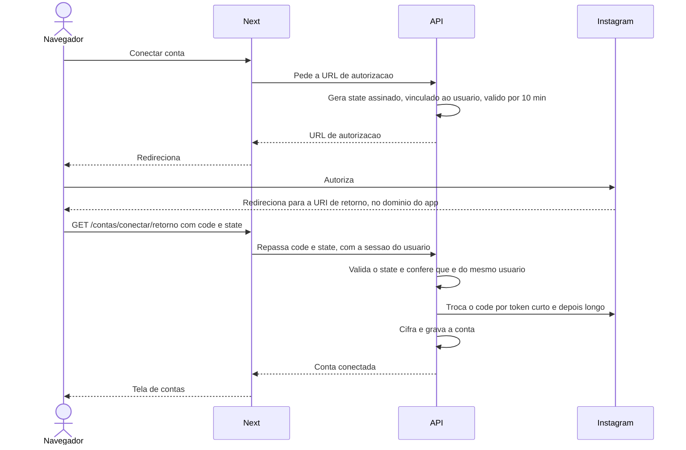
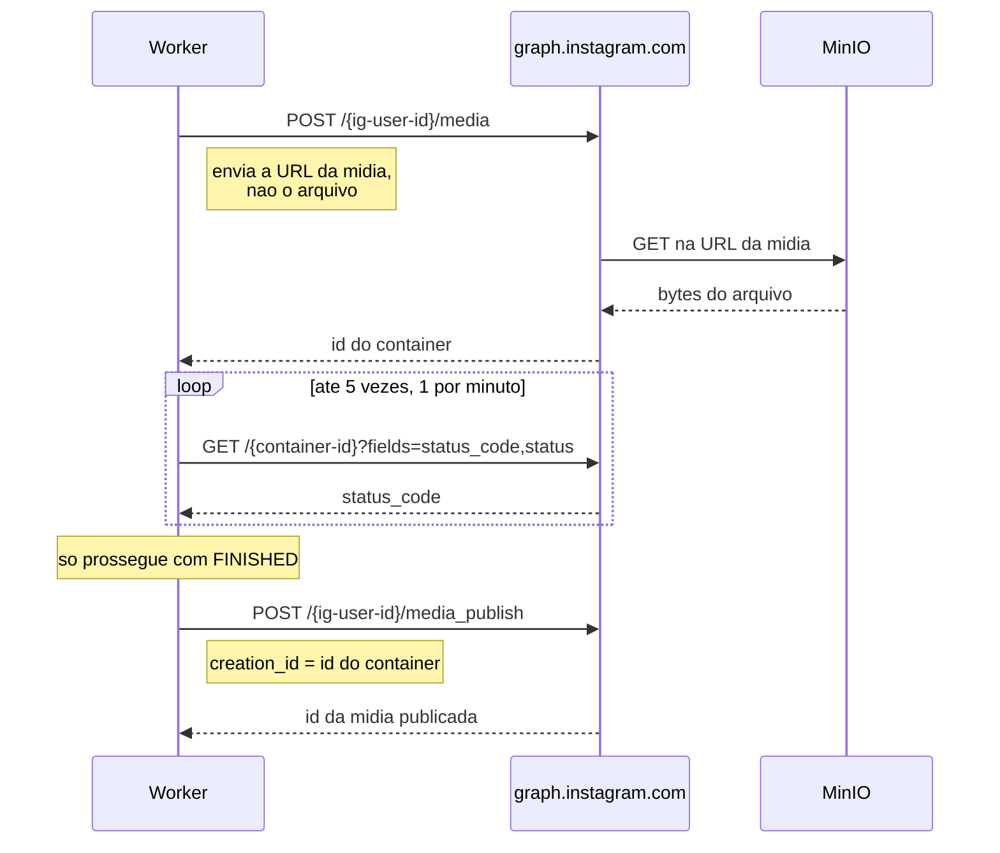

# 08 — Integração com o Instagram

Referência técnica da integração com a API oficial da Meta. Toda afirmação aqui traz o link da
documentação oficial. O que a documentação não confirma está isolado na seção
[A validar em desenvolvimento](#a-validar-em-desenvolvimento) — nada é afirmado como certo sem fonte.

Verificação da documentação oficial feita em **09/09/2026**. As seções sobre cadastro de contas
testadoras e escopos futuros foram verificadas em **14/09/2026**; métricas da conta, em **15/09/2026**. A Meta muda a documentação sem aviso;
ao reencontrar divergência, atualize este arquivo e a data.

---

## Qual API, e por quê

A Meta oferece dois caminhos para publicar no Instagram. Eles são **excludentes**: um aplicativo usa
um ou outro, nunca os dois.

| | Instagram API with **Instagram Login** | Instagram API with **Facebook Login** |
|---|---|---|
| Host | `graph.instagram.com` | `graph.facebook.com` |
| Página do Facebook vinculada | **Não precisa** | Obrigatória |
| Token | Token de usuário do Instagram | Token de Página do Facebook |
| Escopos para publicar | `instagram_business_basic`, `instagram_business_content_publish` | `instagram_basic`, `instagram_content_publish`, `pages_read_engagement` |
| Publicação de conteúdo | Suportada | Suportada |
| Marcação de localização | **Não** | Sim |
| Marcação de produto | Não | Sim |
| Busca de hashtag | Não | Sim |

**Escolhemos Instagram Login.** Fonte:
[Instagram Platform Overview](https://developers.facebook.com/docs/instagram-platform/overview/) e
[Instagram API with Instagram Login](https://developers.facebook.com/docs/instagram-platform/instagram-api-with-instagram-login/),
que afirma textualmente: *"This API setup does not require a Facebook Page to be linked to the
Instagram professional account."*

A seção *Requirements* do
[guia de publicação](https://developers.facebook.com/docs/instagram-platform/content-publishing/)
confirma o conjunto para Instagram Login: host `graph.instagram.com`, token de usuário do
Instagram, permissões `instagram_business_basic` e `instagram_business_content_publish`.

**Razão da escolha:** elimina a exigência de Página do Facebook vinculada, o que simplifica
drasticamente a conexão de contas e remove uma classe inteira de falhas — Página desvinculada,
autorização de publicação da Página pendente, papel insuficiente no Business Manager. O preço é
perder marcação de localização, marcação de produto e busca de hashtag, recursos que não fazem
parte do MVP. Decisão registrada em
[ADR 0001](adr/0001-instagram-login-em-vez-de-facebook-login.md).

### Atenção à grafia do escopo

A própria documentação da Meta escreve o nome do escopo de duas formas diferentes:

| Página | Grafia |
|---|---|
| [business-login](https://developers.facebook.com/docs/instagram-platform/instagram-api-with-instagram-login/business-login) — a que define o parâmetro do OAuth | `instagram_business_content_publish` |
| [content-publishing](https://developers.facebook.com/docs/instagram-platform/content-publishing/) | `instagram_business_content_publish` |
| [Permissions Reference](https://developers.facebook.com/docs/permissions) — registro canônico | `instagram_business_content_publish` |
| [App Review do Instagram](https://developers.facebook.com/docs/instagram-platform/app-review) | `instagram_business_content_publishing` |

A última é um erro de digitação na documentação. **Use `instagram_business_content_publish`**, sem
o sufixo. É a grafia da página que define o OAuth e a do registro canônico de permissões.

### Escopos que o projeto usa

| Escopo | Para quê | Requisito |
|---|---|---|
| `instagram_business_basic` | Ler dados do perfil e renovar o token | RF-A01, RF-A03 |
| `instagram_business_content_publish` | Criar container e publicar | RF-F01 a RF-F03 |
| `instagram_business_manage_insights` | Ler métricas das publicações e da conta | RF-G01 a RF-G03, RF-G06 |

Nenhum escopo além desses. Pedir permissão que não se usa aumenta o atrito da autorização e amplia o
estrago de um token vazado, sem benefício. Comentários e mensagens diretas estão planejados para
depois do MVP, e seus escopos só serão pedidos quando forem construídos — ver
[Escopos futuros](#escopos-futuros-comentários-e-mensagens).

---

## Níveis de acesso e App Review

Este é o ponto que decide se o projeto pode existir sem passar por aprovação da Meta.

| Nível | Alcance | App Review |
|---|---|---|
| **Standard Access** | Só contas de quem tem papel no aplicativo — administrador, desenvolvedor ou testador | Não exigido |
| **Advanced Access** | Qualquer conta de qualquer usuário | Exigido, mais verificação de negócio |

Fonte:
[Access Levels](https://developers.facebook.com/docs/graph-api/overview/access-levels/) — *"Permissions
with Standard Access can only be requested from app users who have a role on the requesting app."*

A página de
[App Review do Instagram](https://developers.facebook.com/docs/instagram-platform/app-review)
enquadra os cenários diretamente:

- *"My app is only for a business I own or manage"* → Standard Access, App Review **não exigido**
- *"I am a Tech Provider and my app serves multiple businesses"* → Advanced Access, App Review exigido

**O PostIt se encaixa no primeiro caso.** Sendo ferramenta interna, as contas conectadas são as
do próprio dono, que tem papel no aplicativo. **Não há necessidade de App Review.**

Consequência prática para o roadmap: a Fase 0 não depende de aprovação da Meta e não tem prazo de
espera externo.

**Se um dia o produto atender contas de terceiros**, o cenário muda: seria necessário Advanced
Access, verificação de negócio, e para o escopo de publicação especificamente, um vídeo
demonstrando a criação de uma postagem com legenda e metadados.

### Cada conta precisa ser cadastrada no aplicativo

O MVP aceita **várias contas do Instagram**. A contrapartida do Standard Access é que cada uma
precisa ser cadastrada no aplicativo Meta **antes** de ser conectada no PostIt. Sem isso, a
autorização falha.

O que a documentação oficial confirma
([Overview](https://developers.facebook.com/docs/instagram-platform/overview/),
[Messaging API](https://developers.facebook.com/documentation/instagram-platform/instagram-api-with-instagram-login/messaging-api)):

- Standard Access vale para contas profissionais *"you own or manage"*
- *"App testers must have a role on your app, grant your app access to all the required
  permissions, and have a role on the Instagram professional account."*
- Os papéis ficam na seção *Roles* do painel do aplicativo
  ([App Roles](https://developers.facebook.com/docs/development/build-and-test/app-roles/))

**Passo a passo, para cada conta nova:**

| # | Onde | O que fazer | Fonte |
|---|---|---|---|
| 1 | Painel do aplicativo Meta, seção *Roles* | Adicionar a conta do Instagram com o papel **Instagram Tester** — não o papel "Tester" genérico | Fórum oficial de desenvolvedores ¹ |
| 2 | Instagram na web, logado na conta convidada | Aceitar o convite em [instagram.com/accounts/manage_access](https://www.instagram.com/accounts/manage_access/), aba *Tester Invites* | Fórum oficial de desenvolvedores ¹ |
| 3 | PostIt, tela de contas | Clicar em "Conectar conta" e autorizar | Jornada 1 de [04](04-jornada-usuario.md) |

¹ [Discussão no fórum oficial](https://developers.facebook.com/community/threads/2645731442173067/).
A documentação oficial não traz o caminho exato dos menus; os passos 1 e 2 vêm de resposta marcada
como solução no fórum de desenvolvedores da Meta. **Os nomes de menu podem mudar** — ao executar
pela primeira vez, registrar o caminho real no item V-10 da
[lista a validar](#a-validar-em-desenvolvimento).

Cada conta também tem o **seu próprio** limite de 50 publicações por dia, o seu token e o seu fuso
horário.

---

## Versão da API

Alvo: **v26.0**, lançada em 29/07/2026. Fonte:
[Graph API Changelog](https://developers.facebook.com/docs/graph-api/changelog).

| Versão | Lançamento | Disponível até |
|---|---|---|
| v26.0 | 29/07/2026 | a definir |
| v25.0 | 18/02/2026 | 29/07/2028 |
| v24.0 | 08/10/2025 | 18/02/2028 |
| v23.0 | 29/05/2025 | 08/10/2027 |
| v20.0 | 21/05/2024 | **24/09/2026** |

A versão fica em variável de ambiente com padrão `v26.0` e validação de formato — no schema zod de
`apps/api/src/config/env.ts`, seguindo a ideia já usada em `sorteio-comentarios-instagram/src/lib/env.ts`. Fixar a versão no código e poder
sobrescrever por ambiente é o que permite testar uma versão nova sem publicar código.

Os exemplos na documentação do Instagram ainda mostram `v25.0` — é a defasagem normal entre o
changelog e as páginas de guia, não um indício de que v26.0 não sirva.

---

## Fluxo de autorização

### Quem faz o quê

A URI de retorno precisa ser pública, e a API não é ([ADR 0010](adr/0010-monorepo-next-nest-bff.md)).
Por isso o Next recebe o retorno e **só repassa** para a API. Toda a lógica — gerar e validar o
`state`, trocar tokens, cifrar e gravar — fica na API.



| Onde | Faz |
|---|---|
| Next — `apps/web/app/(autenticado)/contas/conectar/retorno/` | Recebe o retorno do Instagram e repassa `code` e `state` à API. Nada mais |
| API — `apps/api/src/accounts/` | Expõe as rotas de iniciar e concluir a conexão |
| API — `apps/api/src/instagram/oauth.ts` | Monta a URL, assina e valida o `state`, troca tokens |

O Next **nunca** vê `IG_APP_SECRET` nem o token do Instagram.

### 1. Redirecionar para a autorização

```
https://www.instagram.com/oauth/authorize
  ?client_id=<ID_DO_APP>
  &redirect_uri=<URI_DE_RETORNO>
  &response_type=code
  &scope=instagram_business_basic,instagram_business_content_publish,instagram_business_manage_insights
  &state=<ESTADO_ASSINADO>
```

O `state` carrega assinatura HMAC com validade curta e o identificador do usuário que iniciou a
conexão, seguindo o padrão de `openreply/lib/meta/oauth.ts`. Sem assinatura, o retorno aceita
requisição forjada; sem o usuário, alguém poderia concluir uma conexão iniciada por outra pessoa.

**O `client_id` NÃO é o App ID do Facebook.** O Instagram Login tem um par próprio — *Instagram app ID*
e *Instagram app secret* —, e usar o par do painel principal falha na autorização sem dizer por quê. A
[documentação da Meta](https://developers.facebook.com/docs/instagram-platform/instagram-api-with-instagram-login/business-login)
dá o caminho: *App Dashboard > Instagram > API setup with Instagram login > 3. Set up Instagram business
login > Business login settings*. É de lá que saem `IG_APP_ID` e `IG_APP_SECRET`. **Confirmado em
17/09/2026**, ao conectar a primeira conta.

**A URI de retorno é comparada caractere a caractere, e o painel pode mexer nela.** A mesma página
avisa: *"the App Dashboard might have added a trailing slash to your URIs, so we recommend that you
verify by checking the list."* Depois de salvar, releia a lista — uma barra final acrescentada pelo
painel derruba a troca do código com um erro que não explica nada.

### 2. Trocar o código por um token de curta duração

```
POST https://api.instagram.com/oauth/access_token
```

O código *"is valid for 1 hour and can only be used once"*. O token resultante dura **1 hora**.

### 3. Trocar por token de longa duração

```
GET https://graph.instagram.com/access_token
  ?grant_type=ig_exchange_token
  &client_secret=<SEGREDO_DO_APP>
  &access_token=<TOKEN_CURTO>
```

Resposta: `access_token`, `token_type`, `expires_in`. Validade: **60 dias**. Fonte:
[access_token](https://developers.facebook.com/docs/instagram-platform/reference/access_token/).

### 4. Renovar antes de expirar

```
GET https://graph.instagram.com/refresh_access_token
  ?grant_type=ig_refresh_token
  &access_token=<TOKEN_LONGO>
```

Condições, conforme
[refresh_access_token](https://developers.facebook.com/docs/instagram-platform/reference/refresh_access_token/):

- O token precisa ter **pelo menos 24 horas de idade** e ainda não ter expirado
- A renovação exige o escopo `instagram_business_basic`
- O token renovado vale mais 60 dias **a contar da renovação**, não da emissão original

**O que invalida um token:** passar de 60 dias sem renovação — e aí não há mais recuperação, só
reconexão manual; troca de senha da conta; revogação pelo usuário; remoção do aplicativo.

### Política de renovação do projeto

A tarefa recorrente `renovar-tokens-instagram`, no processo worker, roda diariamente e renova todo
token com mais de 30 dias de idade. Isso dá uma folga de 30 dias: mesmo que ela falhe por um mês
inteiro, o token não expira.

Se a renovação falhar e restarem menos de 7 dias, a conta é sinalizada no painel de saúde (RF-A04)
e as postagens agendadas para depois da expiração recebem aviso.

**Por que essa folga larga:** um token expirado significa que todas as publicações agendadas
daquela conta vão falhar, em silêncio, até alguém perceber. É a falha mais cara do sistema e a mais
fácil de prevenir.

---

## Publicação em duas etapas

Publicar não é uma chamada. São duas, com uma espera no meio.



### Etapa 1 — criar o container

```
POST https://graph.instagram.com/v26.0/<IG_USER_ID>/media
Authorization: Bearer <TOKEN>
Content-Type: application/json
```

Resposta: `{"id": "<ID_DO_CONTAINER>"}`

### Etapa 2 — publicar

```
POST https://graph.instagram.com/v26.0/<IG_USER_ID>/media_publish
{"creation_id": "<ID_DO_CONTAINER>"}
```

Resposta: `{"id": "<ID_DA_MIDIA>"}`. Fonte:
[media_publish](https://developers.facebook.com/docs/instagram-platform/instagram-graph-api/reference/ig-user/media_publish/).

### Valores de `media_type`

`IMAGE` — padrão se omitido · `VIDEO` · `CAROUSEL` · `REELS` · `STORIES`

A documentação registra: *"Required for carousels, stories, and reels."* Ou seja, imagem simples
não precisa informar.

**Cuidado ao ler de volta:** depois de publicado, o campo `media_type` da mídia retorna apenas
`CAROUSEL_ALBUM`, `IMAGE` ou `VIDEO`. Para distinguir um Reels de um Story de um post de feed, é
preciso ler **`media_product_type`**, que retorna `AD`, `FEED`, `STORY` ou `REELS`. Fonte:
[Instagram Media](https://developers.facebook.com/docs/instagram-platform/reference/instagram-media/).

### Upload resumível para vídeos grandes

Alternativa ao envio por URL, usada quando o arquivo é grande:

1. `POST /<IG_USER_ID>/media` com `upload_type=resumable` — retorna o identificador do container
2. `POST https://rupload.facebook.com/ig-api-upload/<VERSAO>/<ID_DO_CONTAINER>`
   com cabeçalhos `Authorization: OAuth <TOKEN>`, `offset: 0` e `file_size: <bytes>`, e o binário
   no corpo. Sucesso responde `{"success": true, "message": "Upload successful."}`
3. `POST /<IG_USER_ID>/media_publish`

Note que o host de upload é `rupload.facebook.com` mesmo no fluxo de Instagram Login — não é erro
de digitação da documentação.

### Consulta do estado do container

```
GET https://graph.instagram.com/v26.0/<ID_DO_CONTAINER>?fields=status_code,status
```

| `status_code` | Significado |
|---|---|
| `IN_PROGRESS` | Ainda processando |
| `FINISHED` | Pronto para publicar |
| `ERROR` | Falhou no processamento |
| `EXPIRED` | Não foi publicado em 24 horas |
| `PUBLISHED` | Já publicado |

Orientação oficial: *"Query a container's status once per minute, for no more than 5 minutes."*
E: *"Containers expire after 24 hours."*

Publicar antes de `FINISHED` retorna erro `9007 / 2207027`.

**O campo `status`** traz texto livre de diagnóstico. A documentação não define uma lista fechada de
valores para ele — use sempre `status_code` para decidir o que fazer, e guarde `status` apenas na
auditoria.

---

## Matriz de parâmetros por formato

Quais campos valem em cada formato, na criação do container. Fonte:
[IG User /media](https://developers.facebook.com/docs/instagram-platform/instagram-graph-api/reference/ig-user/media/).

| Parâmetro | Imagem feed | Vídeo feed | Carrossel pai | Item do carrossel | Reels | Stories |
|---|---|---|---|---|---|---|
| `image_url` | obrigatório | — | — | sim | — | sim, se imagem |
| `video_url` | — | obrigatório | — | sim | obrigatório | sim, se vídeo |
| `media_type` | opcional | `VIDEO` | `CAROUSEL` | — | `REELS` | `STORIES` |
| `caption` | sim | sim | sim, no pai | **não** | sim | **não** |
| `children` | — | — | obrigatório, 2 a 10 | — | — | — |
| `is_carousel_item` | — | — | — | `true` | não | — |
| `cover_url` | — | — | — | — | sim | — |
| `thumb_offset` | — | sim | — | — | sim | — |
| `share_to_feed` | — | — | sim | — | sim | — |
| `audio_name` | — | — | — | — | sim | — |
| `collaborators` | sim | **não** | sim | — | sim | **não** |
| `user_tags` | sim | sim | — | sim | sim | sim |
| `alt_text` | sim | — | — | sim, imagens | não | não |
| `is_ai_generated` | sim | sim | sim | não | sim | sim |
| `location_id` | indisponível | indisponível | indisponível | não | indisponível | não |
| `product_tags` | indisponível | indisponível | indisponível | não | — | não |
| `upload_type=resumable` | — | sim | — | sim | sim | sim |

"Indisponível" significa que o parâmetro existe na API, mas não pela via do Instagram Login.

### Detalhes que a tabela não comporta

**`caption`** — *"Maximum 2200 characters, 30 hashtags, and 20 @ tags."* Estes três limites viram
os contadores do RF-C03.

**`cover_url` e `thumb_offset`** — se os dois forem enviados, **`cover_url` prevalece**. Se a capa
não tiver proporção 9:16, ela é cortada no retângulo 9:16 central. O `thumb_offset` é em
milissegundos, padrão zero. Na interface (RF-C07), os dois são mutuamente exclusivos justamente
para não depender dessa regra de precedência.

**`share_to_feed`** — `true` faz o Reels aparecer no feed **e** na aba Reels; `false` restringe à
aba Reels. Isso afeta a prévia da grade do perfil do RF-D08.

**Carrossel** — *"Carousels are limited to 10 images, videos, or a mix of the two."* E:
*"Carousel images are all cropped based on the first image in the carousel, with the default being a
1:1 aspect ratio."* A primeira imagem define o recorte de todas — a interface precisa mostrar isso
na prévia. Menos de 2 ou mais de 10 itens retorna erro `2207028`.

**Stories** — *"Stories expire after 24 hours."* E, textualmente: *"Publishing stickers (i.e., link,
poll, location) is not supported; however mentioning users without a sticker is supported."* É a
base do aviso obrigatório do RF-C11.

**Reels** — não podem entrar em carrossel. A marcação de música por `audio_name` só funciona com
áudio original, e o nome só pode ser definido uma vez.

**`collaborators`** — a referência do parâmetro diz *"A list of up to 3 instagram usernames"*, mas a
página de leitura de colaboradores diz *"Up to 5 Instagram accounts can be added as collaborators."*
**Adotamos 3**, que é o limite declarado no parâmetro de criação — o mais conservador dos dois.
Ver [A validar em desenvolvimento](#a-validar-em-desenvolvimento).

### `user_tags`

Formato:

```json
[{"username": "fulano", "x": 0.5, "y": 0.8}]
```

- `username` — obrigatório, e o perfil precisa ser público
- `x` — distância percentual da borda esquerda, de 0.0 a 1.0
- `y` — distância percentual da borda superior, de 0.0 a 1.0

As coordenadas são **obrigatórias em imagens** e **opcionais em stories**. O número máximo de
marcações não está declarado na documentação; existe o erro `2207040`, ligado ao limite de 20
menções da legenda.

### Localização: por que é impossível nesta via

O parâmetro `location_id` espera o identificador de uma Página do Facebook que tenha dados de
localização. Descobrir esse identificador exige o
[Pages Search API](https://developers.facebook.com/docs/pages-api/search-pages/), que precisa de
credencial do lado Facebook — token de usuário do Facebook, ou token de aplicativo com a permissão
de acesso a metadados públicos de Página.

O host `graph.instagram.com` não é mencionado em nenhum ponto dessa API. E a referência de mídia do
Instagram Login declara que os campos `location`, `location_name`, `latitude` e `longitude` não são
suportados.

**Os dois lados estão fechados:** não dá para escrever a localização nem para descobrir o
identificador dela. Não há contorno dentro do Instagram Login. Registrado em
[ADR 0001](adr/0001-instagram-login-em-vez-de-facebook-login.md) e comunicado ao usuário conforme
[01 — Não-escopo](01-visao-produto.md).

---

## Requisitos da URL da mídia

A Meta **baixa** o arquivo. Isso está documentado sem margem para dúvida:

> *"We cURL media used in publishing attempts, so the media must be hosted on a publicly accessible
> server at the time of the attempt."*

> *"We will cURL the image using the URL that you specify so the image must be on a public server."*

> *"We strongly recommended the HTTP IETF standard character set for URLs, URLs that contain only US
> ASCII characters, or the request will fail."*

**Confirmado pela documentação:**
- O servidor precisa ser publicamente acessível no momento da tentativa
- A URL deve conter apenas caracteres US-ASCII

**Não declarado pela documentação** — tratar como recomendação prudente, não como fato:
- Se HTTPS é obrigatório. A documentação diz "public server", nunca "HTTPS"
- Comportamento diante de redirecionamento
- Exigência de cabeçalho `Content-Type`
- Faixas de IP usadas pela Meta, o que impede lista de permissão
- Prazo de validade da URL. O único prazo documentado é o do container, de 24 horas

**Regras adotadas pelo projeto**, por prudência: HTTPS, sem redirecionamento, sem autenticação,
somente US-ASCII no caminho do objeto, e a URL permanece válida por bem mais que as 24 horas de vida
do container (RNF-09).

O erro típico quando algo aqui falha é `9004 / 2207052`: *"The media could not be fetched from this
uri"*.

---

## Especificações de mídia

Estes números viram as especificações de mídia em `packages/shared`: o Next as usa para avisar o
usuário antes do envio, e a API as usa para validar de verdade depois do envio (RF-B02). Também
definem o tamanho máximo e o tipo aceitos na política de envio assinada
([ADR 0012](adr/0012-upload-direto-minio.md)).

### Imagens — feed e itens de carrossel

| Item | Valor |
|---|---|
| Formato | **Somente JPEG.** *"Extended JPEG formats such as MPO and JPS are not supported."* |
| Tamanho máximo | 8 MB |
| Proporção | 4:5 a 1.91:1 |
| Largura mínima | 320 px |
| Largura máxima | 1440 px |
| Espaço de cor | sRGB. Outros são convertidos automaticamente |
| Filtros | Não suportados |

PNG, WebP, HEIC e AVIF são recusados. É a recusa mais comum no dia a dia, e a mensagem precisa
dizer isso com todas as letras.

### Reels

| Item | Valor |
|---|---|
| Container | MOV ou MP4, sem listas de edição, **átomo `moov` no início do arquivo** |
| Codec de vídeo | HEVC ou H.264, varredura progressiva, GOP fechado, croma 4:2:0 |
| Codec de áudio | AAC, até 48 kHz, 1 ou 2 canais |
| Taxa de vídeo | VBR, até 25 Mbps |
| Taxa de áudio | 128 kbps |
| Quadros por segundo | 23 a 60 |
| Largura máxima | 1920 px |
| Proporção | 0.01:1 a 10:1. Recomendado 9:16 |
| Duração | 3 s a 15 min |
| Tamanho máximo | 300 MB |
| Capa | JPEG, 8 MB, sRGB, 9:16 recomendado |

**O átomo `moov` no início merece atenção.** Muitos codificadores o colocam no fim do arquivo, o
que obriga o leitor a baixar tudo antes de decodificar. É detectável na inspeção do arquivo e é
causa frequente de falha na Meta — o aviso está previsto na jornada 3 de
[04](04-jornada-usuario.md).

### Stories — vídeo

Mesmos codecs, container e taxa de quadros dos Reels. As diferenças:

| Item | Valor |
|---|---|
| Proporção | 0.1:1 a 10:1 |
| Duração | 3 s a 60 s |
| Tamanho máximo | 100 MB |
| Largura máxima | 1920 px |

### Stories — imagem

JPEG, até 8 MB, sRGB, 9:16 recomendado.

### Vídeo de feed

A documentação atual **não publica mais uma tabela de especificações separada para vídeo de feed** —
só existem tabelas de Reels e Stories. O `media_type=VIDEO` continua documentado e aceito, mas na
prática o Instagram trata vídeo único como Reels; confirmar depois de publicar, lendo
`media_product_type`.

**Regra adotada:** aplicar as especificações de Reels também ao vídeo de feed. É o conjunto mais
restritivo entre os documentados, então quem passa nele passa nos dois.

---

## Cotas

Dois limites diferentes, que se confundem com facilidade:

| Limite | Valor | Janela |
|---|---|---|
| **Publicações** | 50 | 24 horas móveis |
| **Criação de containers** | 400 | 24 horas móveis |

**Carrossel conta como uma publicação**, não como o número de itens: *"Carousels count as a single
post."*

### Sobre a divergência do número

A documentação da Meta se contradiz. A seção *Limitations* do guia de publicação afirma 100
publicações por 24 horas; a seção *Create a carousel container*, **na mesma página**, afirma 50. A
referência de `media_publish` afirma 50. E a referência de `content_publishing_limit` documenta
`quota_total` como *"(currently 50)"*.

**O projeto adota 50.** É o valor da referência do endpoint programático, o da referência de
publicação, e o que aparece na maioria das fontes. Projetar para 100 e descobrir que são 50
significa uma rajada de falhas; projetar para 50 e descobrir que são 100 significa apenas um
adiamento desnecessário. O erro barato é o conservador.

### Consulta da cota

```
GET https://graph.facebook.com/v26.0/<IG_USER_ID>/content_publishing_limit
  ?fields=config,quota_usage
  &since=<TIMESTAMP_UNIX>
```

O parâmetro `since` precisa ser *"A Unix timestamp no older than 24 hours."*

```json
{"data":[{"quota_usage":2,"config":{"quota_total":50,"quota_duration":86400}}]}
```

Fonte:
[content_publishing_limit](https://developers.facebook.com/docs/instagram-platform/instagram-graph-api/reference/ig-user/content_publishing_limit/).

**Ressalva importante:** este endpoint só está documentado no host `graph.facebook.com`. Não existe
página de referência equivalente em `graph.instagram.com`. Se ele não responder pela via do
Instagram Login, o sistema recorre à contagem interna de publicações das últimas 24 horas, marcada
como estimativa na interface — é o que o RF-A07 já prevê. Ver
[A validar em desenvolvimento](#a-validar-em-desenvolvimento).

---

## Métricas

```
GET https://graph.instagram.com/v26.0/<ID_DA_MIDIA>/insights?metric=<LISTA>
```

Escopo necessário: `instagram_business_basic` mais `instagram_business_manage_insights`.

### Métricas por formato

| Feed — imagem e vídeo | Reels | Stories |
|---|---|---|
| `comments` | `comments` | `reach` |
| `likes` | `likes` | `views` |
| `saved` | `saved` | `replies` |
| `shares` | `shares` | `shares` |
| `reach` | `reach` | `reposts` |
| `views` | `views` | `follows` |
| `follows` | `reposts` | `link_clicks` |
| `reposts` | `total_interactions` | `navigation` |
| `profile_visits` | `ig_reels_avg_watch_time` | `profile_visits` |
| `profile_activity` | `ig_reels_video_view_total_time` | `profile_activity` |
| `total_interactions` | `reels_skip_rate` | `total_interactions` |
| `total_comments` | `crossposted_views` | `total_views` |
| `total_likes` | `total_comments` | |
| `total_views` | `total_likes` | |

**`impressions` foi descontinuada** após 02/07/2024 em feed e stories. Use `views` e `total_views`.
Pedir uma métrica que não existe para aquele formato gera erro — daí o RF-G03.

**A janela dos Stories:** *"Story media metrics are only available for 24 hours."* Passou disso, o
dado não existe mais em lugar nenhum. É o motivo de o RF-G02 agendar uma coleta específica em T+20h
com prioridade sobre as demais.

Fontes:
[Instagram Media Insights](https://developers.facebook.com/docs/instagram-platform/reference/instagram-media/insights) ·
[Insights](https://developers.facebook.com/docs/instagram-platform/insights/).

## Métricas da conta

Números da conta como um todo, e não de uma postagem (RF-G06, RF-G07). Verificado em 15/09/2026.

### Dados do perfil

```
GET https://graph.instagram.com/v26.0/me
  ?fields=user_id,username,name,account_type,profile_picture_url,followers_count,follows_count,media_count
```

Disponíveis pela via do Instagram Login. Fonte:
[Get started](https://developers.facebook.com/docs/instagram-platform/instagram-api-with-instagram-login/get-started).

**`account_type`, `profile_picture_url` e `name` confirmados em 17/09/2026**, ao conectar a primeira conta
real. A documentação oficial só lista os três contadores; os outros três vieram preenchidos na prática.
Importa registrar porque **campo que não existe faz a Graph API devolver `code: 100`** para a chamada
inteira — e esse mesmo código é o de "URI de retorno errada", então um campo digitado errado aqui apareceria
como problema de configuração do app.

`account_type` é o que separa conta profissional de conta pessoal: os valores aceitos são `BUSINESS` e
`MEDIA_CREATOR` (marco 18).

### Insights da conta

```
GET https://graph.instagram.com/v26.0/<IG_ID>/insights
  ?metric=reach,views,accounts_engaged,total_interactions,follows_and_unfollows,profile_links_taps
  &period=day
  &metric_type=total_value
  &since=<TIMESTAMP_UNIX>
  &until=<TIMESTAMP_UNIX>
```

Escopos: `instagram_business_basic` e `instagram_business_manage_insights`. Fonte:
[IG User Insights](https://developers.facebook.com/docs/instagram-platform/api-reference/instagram-user/insights).

#### ⚠️ `total_value` devolve UM número, não uma série por dia

**Confirmado na documentação oficial e na prática, em 18/09/2026.** É a restrição que molda a coleta
inteira:

- `metric_type=total_value` agrega a janela `since`/`until` **inteira** num valor só;
- `time_series` (o padrão) quebra por dia, **mas só `reach` o suporta**. As outras cinco — `views`,
  `accounts_engaged`, `total_interactions`, `follows_and_unfollows`, `profile_links_taps` — existem
  **apenas** em `total_value`.

Como `MetricaConta` guarda **uma linha por dia**, não há como preencher três dias com uma chamada: é
preciso **uma chamada por dia**, com `since`/`until` delimitando aquele dia. Na rotina são 3 chamadas por
conta por dia; no retroativo de 30 dias, 30. Medido: cerca de 1 segundo por chamada.

Efeito colateral bom: como somos nós que definimos os limites da janela, **nós escolhemos o que conta como
"dia"** — e a escolha foi o fuso da conta (`Conta.fusoHorario`), não UTC, para o número bater com o que o
app do Instagram mostra. O cálculo está em `apps/api/src/domain/metrics/day-window.ts`.

#### O que a conta real devolveu, em 18/09/2026

Primeira coleta da conta de testes (0 seguidores, 0 mídias), 30 dias de retroativo:

| Observação | Resultado |
|---|---|
| Pedir as **seis métricas juntas** | **Aceito.** Não houve `code: 100`, e o caminho de uma-métrica-por-vez não precisou ser usado |
| `follows_and_unfollows` | **Não veio** — sem `total_value.value`. Ficou **ausente** no JSON, que é o correto |
| As outras cinco | Vieram, todas com valor `0` — coerente com uma conta sem seguidores |
| Retroativo antes da conexão | **Funciona.** A conta foi conectada em 17/09 e a coleta trouxe desde 20/08: a Meta guarda as métricas da conta independentemente de quando o app foi autorizado |

A lição que vale registrar: **zero e ausente apareceram lado a lado na mesma linha**, que é exatamente a
distinção que a RF-G07 exige da tela. O alerta de que campo inexistente derruba a chamada com `code: 100`
vale para `fields` do `/me` — **não** para `metric` dos insights, onde a Meta cumpre o que documenta:
*"the API will return an empty data set instead of `0`"*.

| Métrica | O que é |
|---|---|
| `reach` | Contas únicas que viram algum conteúdo |
| `views` | Visualizações de conteúdo |
| `accounts_engaged` | Contas que interagiram |
| `total_interactions` | Soma de curtidas, comentários, salvamentos, compartilhamentos e respostas |
| `follows_and_unfollows` | Novos seguidores e deixaram de seguir |
| `profile_links_taps` | Toques em links e botões de contato do perfil |

### Regras que moldam a coleta

| Regra da Meta | Consequência no PostIt |
|---|---|
| *"User Metrics data is stored for up to 90 days."* | Coletar **todo dia** é o que cria histórico além de 90 dias. Nosso armazenamento é indefinido |
| Dados podem atrasar *"up to 48 hours"* | A coleta diária relê **os últimos 3 dias** e sobrescreve |
| Dado ausente volta como conjunto vazio, não como zero | Guardar ausente como ausente; a tela mostra "indisponível", nunca zero |
| Sem `since` e `until`, a API olha só as últimas 24 horas | Sempre informar o período explicitamente |
| *"Some metrics are not available on Instagram accounts with fewer than 100 followers."* | A conta de testes provavelmente cai nesse caso — bom para testar a tela de indisponível |
| `impressions` descontinuada em 21/04/2025 | Usar `views` |

**Fora do MVP:** dados demográficos de seguidores (`follower_demographics`), por decisão de escopo.

**V-19 — resolvido em 18/09/2026.** A pergunta era quantos dias para trás a primeira coleta consegue
buscar. A resposta mudou de forma com a descoberta acima: como cada dia é **uma chamada própria**, não
existe "janela máxima entre `since` e `until`" a descobrir — cada janela é de um dia só. O que restava era
escolher **quantos dias** buscar, e a escolha foi **30**: a Meta guarda 90, mas 90 chamadas numa execução
arriscariam o prazo da tarefa, e 30 ainda deixam quase três semanas de margem para completar uma lacuna
antes de o dado ser descartado. Confirmado na prática: 30 dias buscados, incluindo dias anteriores à
conexão da conta.

---

## Tabela de códigos de erro

Fonte:
[Error Codes](https://developers.facebook.com/docs/instagram-platform/instagram-graph-api/reference/error-codes/).

Cada linha define a mensagem em português e a ação do sistema. Esta tabela é o conteúdo de
`apps/api/src/instagram/errors.ts`, seguindo o padrão da função `traduzErro()` de
`sorteio-comentarios-instagram/src/lib/instagram.ts`.

### Erros recuperáveis — o sistema tenta de novo

| code / subcode | Mensagem da Meta | Mensagem ao usuário | Ação |
|---|---|---|---|
| `-2 / 2207003` | It takes too long to download the media | O Instagram demorou demais para baixar o arquivo | Nova tentativa |
| `-1 / 2207032` | Create media fail | Não foi possível preparar a publicação | Nova tentativa, container novo |
| `-1 / 2207053` | Unknown upload error | Falha ao enviar o vídeo | Nova tentativa |
| `9007 / 2207027` | The media is not ready for publishing | A mídia ainda está sendo processada | Aguarda e consulta de novo |
| `4`, `17`, `32`, `613` | Rate limit | Muitas requisições ao Instagram agora | Espera progressiva |
| HTTP 5xx | — | O Instagram está instável | Espera progressiva |

### Erros fatais — não adianta insistir

| code / subcode | Mensagem da Meta | Mensagem ao usuário | Ação |
|---|---|---|---|
| `190`, `102` | Token inválido ou expirado | A conexão com o Instagram expirou. Reconecte a conta | `FALHOU`, sinaliza a conta |
| `10`, `200` | Permissão ausente | O aplicativo não tem permissão para publicar nesta conta | `FALHOU` |
| `9 / 2207042` | Maximum number of posts reached | A conta atingiu o limite de publicações das últimas 24 horas | `FALHOU`, sugere novo horário |
| `25 / 2207050` | The Instagram account is restricted | A conta está com restrição no Instagram. Verifique no aplicativo | `FALHOU` |
| `-2 / 2207020` | The media has expired | O preparo da publicação expirou | `FALHOU`, exige novo agendamento |
| `9004 / 2207052` | The media could not be fetched from this uri | O Instagram não conseguiu baixar o arquivo | `FALHOU`, verificar o armazenamento |
| `100 / 2207028` | Carousels need at least 2 and no more than 10 | O carrossel precisa de 2 a 10 itens | `FALHOU`, corrigir a postagem |
| `100 / 2207040` | Cannot use more than max tags | Marcações demais nesta publicação | `FALHOU`, corrigir a postagem |
| `352 / 2207026` | The video format is not supported | Formato de vídeo não aceito. Use MP4 ou MOV | `FALHOU`, trocar a mídia |
| `36000 / 2207004` | The image is too large | A imagem passa de 8 MB | `FALHOU`, trocar a mídia |
| `36001 / 2207005` | The image format is not supported | O Instagram só aceita JPEG | `FALHOU`, trocar a mídia |
| `36003 / 2207009` | Aspect ratio not supported | Proporção fora do permitido. Use entre 4:5 e 1.91:1 | `FALHOU`, trocar a mídia |
| `1 / 2207057` | Thumbnail offset must be greater than or equal to 0 | O instante da capa é inválido | `FALHOU`, corrigir a postagem |

Erros de mídia como `36000`, `36001` e `36003` **não deveriam chegar aqui** — a validação no envio
(RF-B02) precisa barrá-los antes. Se aparecerem em produção, é sinal de que o validador tem uma
lacuna, e isso vale investigação.

### Bloqueios fora do código de erro

Duas situações que impedem a publicação sem retornar um código específico:

- **Page Publishing Authorization** — se a Página conectada exigir e não estiver concluída, a
  requisição falha. Não há como verificar por API se é exigida; a orientação da Meta é concluir
  preventivamente. Só se aplica ao caminho de Facebook Login
- **Autenticação de dois fatores** — se a Página conectada exigir, o usuário do Facebook precisa
  tê-la realizado

---

## A validar em desenvolvimento

Pontos em que a documentação oficial se contradiz ou silencia. Nenhum deles bloqueia o projeto;
todos precisam ser confirmados empiricamente na Fase 1 e o resultado registrado aqui.

| # | Questão | O que a documentação diz | Postura adotada | Como verificar |
|---|---|---|---|---|
| V-1 | Cota de publicações | 100 numa seção, 50 em três outras | Projetar para 50 | Ler `quota_total` do endpoint de cota |
| V-2 | Stories consomem cota? | Nada, em nenhum lugar | Assumir que sim | Ler a cota antes e depois de publicar um Story |
| V-3 | Cota via Instagram Login | Só documentado em `graph.facebook.com` | Ter contagem interna como reserva | Chamar o endpoint com token de Instagram Login |
| V-4 | Limite de colaboradores | 3 na criação, 5 na leitura | Limitar a 3 | Tentar 4 e observar |
| V-5 | HTTPS é obrigatório na URL da mídia? | Diz só "public server" | Usar HTTPS sempre | Não vale testar. Manter HTTPS |
| V-6 | Redirecionamento na URL da mídia | Nada | Evitar redirecionamento | Não vale testar |
| V-7 | Vídeo de feed vira Reels? | Sem tabela própria de specs | Aplicar specs de Reels | Publicar e ler `media_product_type` |
| V-8 | Máximo de `user_tags` | Não declarado | Limitar a 20, como as menções | Aumentar até o erro `2207040` |
| V-9 | Valores de `status` | Sem lista fechada | Decidir só por `status_code` | Coletar os valores observados na auditoria |
| V-10 | Caminho de menu para cadastrar conta testadora | **O procedimento funciona — confirmado em 17/09/2026**, com a conta cadastrada como testadora e conectada ao PostIt. O **caminho exato de menu não foi anotado** na hora, então continua valendo o do fórum | Seguir o passo a passo acima | Anotar os nomes reais dos menus ao cadastrar a próxima conta |
| V-11 | Webhooks funcionam com contas testadoras em Standard Access? | A página de Webhooks exige app em modo **Live** e indica Advanced Access | Não usar webhooks no MVP | Testar antes de construir comentários e DMs. Ver [Escopos futuros](#escopos-futuros-comentários-e-mensagens) |
| V-12 | Novos escopos exigem nova autorização? | Nada explícito | Assumir que sim: cada conta reconecta | Testar ao adicionar o primeiro escopo novo |
| V-18 | Instagram Login aceita `http://localhost` como URI de retorno? | **Parcialmente resolvido em 17/09/2026:** o túnel rápido com https **funciona** como URI de retorno — a primeira conta foi conectada por ele, de ponta a ponta. `localhost` continua sem teste, e não vale a pena testar: a postura de usar o túnel resolve o caso | Usar túnel rápido com https. Ver [14](14-ambientes-e-desenvolvimento.md) | — |
| V-19 | Janela retroativa das métricas da conta | **Resolvido em 18/09/2026** | A pergunta perdeu o sentido original: como só `reach` existe em série temporal, **cada dia é uma chamada própria** e cada janela cobre um dia só. Sobrou escolher quantos dias buscar — **30**, com a Meta guardando 90. Confirmado buscando 30 dias, inclusive anteriores à conexão da conta | — |
| V-20 | Política de privacidade e exclusão de dados em modo de desenvolvimento | Exigidas para o modo Live; para desenvolvimento, não confirmado | Não publicar páginas de política até ser exigido | Tentar configurar o PostIt Dev sem esses campos |

### Itens de infraestrutura

Não são da Meta, mas ficam aqui para a lista de pendências ser uma só.

| # | Questão | O que a documentação diz | Postura adotada | Como verificar |
|---|---|---|---|---|
| V-13 | `singletonKey` do pg-boss impede duas tarefas da mesma postagem? | Descreve `singletonKey` e as políticas de fila, sem deixar explícito como se combinam | Usar e manter as outras três camadas de idempotência | Enviar duas tarefas com a mesma chave e observar. Ver [09](09-motor-agendamento.md#idempotência) |
| V-14 | Esquema do pg-boss convive com as migrações do Prisma? | **Confirmado em 17/09/2026** (pg-boss 12.33.1, esquema versão 42, Prisma 7.10.0) | Esquema separado, fora do `schema.prisma`. Com o esquema `pgboss` já criado e as 12 tabelas dele em uso, `prisma migrate status` respondeu "Database schema is up to date" — **nenhum drift**, porque o Prisma olha só o `public`. A migração `20260917195528_acao_auditoria_tokens_renovados` foi criada e aplicada sem citar `pgboss` em lugar nenhum, e as tabelas, a fila e o agendamento sobreviveram intactos | — |
| V-15 | Envio direto ao MinIO funciona atrás do proxy? | Não verificado | Política de envio assinada, prefixos `recebidos/` e `publicas/`. Ver [ADR 0012](adr/0012-upload-direto-minio.md) | Enviar um arquivo pelo navegador através do proxy e confirmar: assinatura aceita, limite de tamanho respeitado, CORS só do domínio do app, `recebidos/` não legível publicamente |
| V-16 | Server Actions recusam requisição de outra origem atrás do proxy? | Não verificado neste projeto | Proxy preserva o `Host`; nenhuma rota POST própria no Next. Ver [11 — CSRF](11-seguranca.md#csrf) | Disparar uma Server Action a partir de uma página em outro domínio e confirmar a recusa; confirmar que ações legítimas funcionam pelo proxy |
| V-17 | API do `otplib` na versão instalada | **Confirmado em 16/09/2026** (13.5.0) | A 13.x trocou o objeto `authenticator` da 12 por funções soltas: `generateSecret`, `generateURI`, `generateSync` e `verifySync`. A tolerância é `epochTolerance`, em **segundos** (30 = ±1 passo), e a resposta traz `delta`, de onde sai o passo aceito, guardado em `totpUltimoPasso` contra reuso. Código fora do formato de 6 dígitos **lança**, então o formato é conferido antes | — |
| V-21 | Push web no iPhone | Fora da Meta: documentação da Apple | Push só com o app instalado na tela inicial, iOS 16.4 ou mais novo | Instalar o PWA num iPhone e ativar notificações. Ver [ADR 0017](adr/0017-pwa-e-notificacoes-push.md) |
| V-22 | Cabeçalhos no domínio de mídia com o Traefik do Easypanel | O Easypanel aceita configuração própria do Traefik por arquivo ([guia](https://easypanel.io/docs/guides/custom-traefik-config)); não diz se ela se aplica aos domínios criados pelo painel | Na etapa 1, sem garantia desses cabeçalhos; a validação do conteúdo no envio continua sendo a proteção principal | Configurar `sandbox` e `nosniff` para `midia.seudominio` e conferir com `curl -I`. Ver [ADR 0020](adr/0020-easypanel-na-validacao.md) |
| V-23 | O Traefik do Easypanel entrega o IP real do visitante em `X-Real-IP`? | Há relatos de o IP de origem se perder em alguns modos de rede do Docker ([exemplo](https://github.com/traefik/traefik/issues/10708)) | Bloqueio por conta vale sempre; bloqueio por IP só vale se o IP real chegar | Enviar um `X-Real-IP` falso e ver o IP registrado nas tentativas de acesso — item 2 da estreia |
| V-24 | Túnel e nuvem laranja da Cloudflare recusam envio acima de 100 MB? | O limite de corpo de requisição do plano gratuito é de 100 MB | `app` e `midia` de produção como "somente DNS"; no computador local, testar com vídeos menores | Enviar um vídeo de 150 MB pelo túnel e observar |
| V-25 | Container avulso na rede interna do Easypanel, para o painel do pg-boss | Não documentado | Plano B: serviço temporário sem domínio. Ver [10](10-infra-deploy.md#painel-do-pg-boss) | Subir o painel ligado à rede do Easypanel e acessar por túnel SSH |

Cada item verificado deve virar uma linha registrada aqui, com data e resultado — este arquivo é a
memória da integração.

---

## Escopos futuros: comentários e mensagens

Responder comentários e mensagens diretas está **planejado para depois do MVP**. Nada disso é
construído agora, mas algumas descobertas afetam o planejamento e ficam registradas.

### Decisão: o MVP não pede esses escopos

Os escopos `instagram_business_manage_comments` e `instagram_business_manage_messages` só entram
quando a funcionalidade for construída. Até lá, o token de cada conta não dá acesso a comentários
nem a mensagens — se vazar, o estrago é menor.

**Consequência aceita:** quando a funcionalidade chegar, cada conta precisará autorizar de novo,
clicando em "Conectar conta". Com poucas contas, é um minuto por conta. A documentação não afirma
explicitamente que a nova autorização é necessária; é a dedução lógica de que um token só carrega os
escopos concedidos (item V-12).

### O que já se sabe

| Assunto | O que a documentação diz | Fonte |
|---|---|---|
| Os escopos funcionam sem App Review? | Sim, em Standard Access, para contas com papel no aplicativo | [Comment Moderation](https://developers.facebook.com/docs/instagram-platform/instagram-api-with-instagram-login/comment-moderation), [Messaging API](https://developers.facebook.com/documentation/instagram-platform/instagram-api-with-instagram-login/messaging-api) |
| Responder comentário exige webhook? | **Não.** A resposta é `POST /<IG_COMMENT_ID>/replies`. O webhook só serve para **saber** que chegou comentário novo | [Comment Moderation](https://developers.facebook.com/docs/instagram-platform/instagram-api-with-instagram-login/comment-moderation) |
| Quando é possível mandar DM? | *"Only after an Instagram user has sent your app user's Instagram professional account a message can your app send a message to the Instagram user. Your app has 24 hours to respond."* A marcação de atendimento humano estende para 7 dias | [Messaging API](https://developers.facebook.com/documentation/instagram-platform/instagram-api-with-instagram-login/messaging-api) |
| Webhooks exigem o quê? | *"Your app must be set to **Live** in the App Dashboard for Meta to send webhook notifications"*, e a tabela da página indica Advanced Access | [Webhooks](https://developers.facebook.com/docs/instagram-platform/webhooks) |

### O risco que isso cria

A última linha da tabela é a que importa. Se receber webhooks exigir aplicativo em modo Live com
Advanced Access **também para contas testadoras**, então comentários e DMs em tempo real **podem
exigir App Review** — o que o MVP inteiro evita. A documentação não é clara sobre esse caso
(item V-11).

**Saída conhecida para comentários:** em vez de receber aviso, o sistema consulta de tempos em tempos
os comentários das publicações recentes. Mais lento e consome mais chamadas, mas não depende de
webhook.

**Para DMs não há saída equivalente confiável:** a janela de 24 horas torna essencial saber rápido
que a mensagem chegou.

**Recomendação:** antes de começar a construir essa funcionalidade, verificar o item V-11 com uma
conta testadora. O resultado define se o próximo passo é código ou App Review.

### O que será preciso construir

Registrado para não ser surpresa, sem detalhar agora:

- Pedido dos novos escopos e reconexão das contas
- Rota pública para receber webhooks, com validação de assinatura — o proxy encaminha essa rota
  direto à API, que continua sem nome público para o resto. O padrão de validação já existe em
  `openreply/app/api/webhook`
- Modelagem de dados para comentários, conversas e respostas
- Filas próprias no pg-boss, seguindo a convenção de [09](09-motor-agendamento.md)

---

## Padrões de implementação

Convenções derivadas do que já funciona em `sorteio-comentarios-instagram` e `openreply`, adaptadas
ao módulo Nest.

**Tudo do Instagram num módulo só**, `apps/api/src/instagram/`:

| Arquivo | Responsabilidade |
|---|---|
| `instagram.module.ts` | Módulo Nest, importado pela API e pelo worker |
| `client.ts` | Único lugar que anexa o token e faz a chamada HTTP |
| `oauth.ts` | URL de autorização, `state` assinado, troca e renovação de tokens, cópia da foto de perfil |
| `publicacao.ts` | Containers, consulta de estado, `media_publish`, upload resumível |
| `insights.ts` | Métricas por formato |
| `errors.ts` | Tradução dos códigos da Meta para mensagem e ação, com a **origem** (conexão ou uso): o mesmo código quer dizer "conta não é testadora" ao conectar e "o acesso expirou" ao renovar |

**Um único cliente de chamada.** Toda requisição à Meta passa por `apps/api/src/instagram/client.ts`,
e é o único lugar que anexa o token. É essa concentração que sustenta a promessa do RNF-06 de que o
token não vaza: há um lugar só para auditar.

**Token nunca em mensagem de erro.** O cliente remove o token de qualquer coisa que vá para log,
auditoria ou resposta — inclusive da URL, onde é fácil esquecer que ele está.

**Fronteira de pacote no lugar de `server-only`.** No `sorteio-comentarios-instagram`, o
`import 'server-only'` impedia o código de ir parar no navegador. Aqui a proteção é estrutural: o
módulo `instagram` vive em `apps/api`, e `apps/web` não depende desse app. O Next não tem como
importá-lo nem por engano.

**Publicação só no worker.** `InstagramModule` é compartilhado, mas quem chama `publicacao.ts` para
publicar é só o `PublishingModule`, importado exclusivamente pelo worker (invariante I-9 de
[05](05-arquitetura.md#invariantes)). O processo HTTP usa o módulo para OAuth, leitura de perfil e
consulta de cota.

**Tempo limite em toda chamada**, com `AbortSignal.timeout`. O padrão de 20 segundos do
`sorteio-comentarios-instagram` serve para leitura; a publicação usa um limite maior.

**Versão da API em variável de ambiente**, validada com zod no boot, com padrão `v26.0` no código.

**Foto de perfil copiada para o MinIO.** Ao conectar a conta e a cada renovação de token, a API baixa a
foto de perfil e a guarda em `publicas/`. As telas nunca carregam imagem dos servidores da Meta: a CSP
não precisa liberar domínios de terceiros, o navegador do usuário não conversa com a Meta, e a imagem não
some quando o endereço fornecido pela Meta deixar de valer. Ver
[ADR 0014](adr/0014-csp-e-cabecalhos-de-seguranca.md).

**Nomes da Meta preservados.** `media_type`, `creation_id`, `status_code` e `user_tags` mantêm a
grafia original, conforme a regra de idioma de [06](06-stack.md).

---

## Documentos relacionados

- [09 — Motor de agendamento](09-motor-agendamento.md) — como esse fluxo vira tarefa com retentativa
- [02 — Requisitos](02-requisitos.md) — os requisitos que dependem desta integração
- [ADR 0001](adr/0001-instagram-login-em-vez-de-facebook-login.md) — a decisão de fundo
