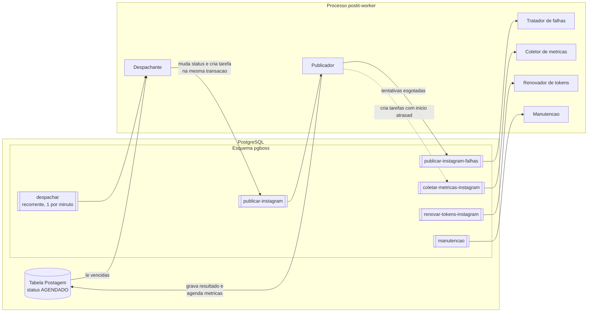
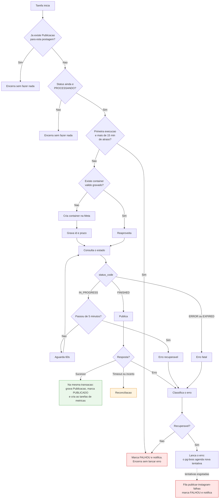

# 09 — Motor de Agendamento

Como uma postagem sai de "agendada" e vira "publicada" sem duplicar e sem sumir.

Este documento e [08](08-integracao-instagram.md) juntos devem bastar para implementar a publicação
sem consultar a documentação da Meta.

A fila de trabalho é o **pg-boss**, que guarda as tarefas dentro do próprio PostgreSQL. A escolha e
as alternativas estão em [ADR 0008](adr/0008-pg-boss-em-vez-de-bullmq.md). Detalhes de API foram
conferidos na [documentação oficial do pg-boss](https://pgboss.io) em 14/09/2026, versão 12.x — ao
instalar, confira de novo, porque nomes de opção mudam entre versões maiores.

---

## A ideia em uma frase

**A agenda fica na tabela `Postagem`; o pg-boss só entra quando chega a hora de executar.**

Uma postagem agendada para daqui a três semanas é uma linha com status `AGENDADO` e um horário.
Não existe tarefa nenhuma na fila para ela ainda. Um processo chamado **despachante** olha a tabela a
cada minuto e, quando o horário de uma postagem chega, entrega o trabalho ao pg-boss.



### Por que a postagem agendada não vira tarefa com início atrasado

O pg-boss aceita tarefas para daqui a X tempo (`startAfter`), e como a fila está no Postgres isso
seria durável. Mesmo assim, a postagem agendada continua sendo só uma linha na tabela, por um motivo
de uso: **o calendário de arrastar e soltar**.

Mudar o horário de uma postagem precisa ser um `UPDATE` num campo. Se cada postagem agendada fosse
uma tarefa na fila, reagendar exigiria cancelar a tarefa antiga e criar outra, mantendo as duas coisas
sincronizadas — e em algum momento elas desencontram. Com a agenda só na tabela, existe um lugar
só para a verdade.

Tarefas com início atrasado são usadas onde ninguém mexe depois de criado: a coleta de métricas.

### Por que pg-boss e não Redis

No desenho anterior a fila ficava no Redis, um segundo banco. Isso criava duas fontes de informação
que podiam discordar, e obrigava a regra "nada de job com atraso longo", porque o Redis podia ser
apagado. Com a fila no Postgres:

- tarefa e postagem entram **no mesmo backup**
- dá para mudar o status da postagem e criar a tarefa **na mesma transação** — ou as duas coisas
  acontecem, ou nenhuma
- um serviço a menos para instalar e vigiar

---

## Onde isso roda

Tudo deste documento acontece no processo **`postit-worker`**: o mesmo código Nest da API,
iniciado sem servidor HTTP. Ver [ADR 0010](adr/0010-monorepo-next-nest-bff.md).

```ts
// apps/api/src/worker.ts — esboço
async function iniciar() {
  const app = await NestFactory.createApplicationContext(WorkerModule)
  app.enableShutdownHooks()   // termina a tarefa em andamento antes de sair
}
```

O `WorkerModule` importa os módulos compartilhados com a API — `PrismaModule`, `StorageModule`,
domínio — **mais** dois que só ele tem:

| Módulo | Papel | Onde |
|---|---|---|
| `QueuesModule` | Cria a instância do pg-boss, cria as filas e registra os agendamentos recorrentes ao iniciar | `apps/api/src/queues/` |
| `PublishingModule` | Despachante, publicador, tratador de falhas, coletor de métricas, renovador de tokens, manutenção | `apps/api/src/publishing/` |

O `InstagramModule` entra pelo `PublishingModule`, e não pelo `WorkerModule`: `forEnv` devolve um
módulo novo a cada chamada, então importá-lo nos dois lugares abriria dois de tudo que ele tem
dentro. Pelo mesmo motivo invertido, `QueuesModule` e `StorageModule` são `@Global()` — há uma
instância do pg-boss e uma do cliente do MinIO por processo.

O `AppModule`, do processo HTTP, **não importa nenhum dos dois**. É isso que garante a invariante I-9
de [05](05-arquitetura.md#invariantes): só o worker publica. Um teste de arquitetura confere.

Os trechos de código abaixo são esboços do que roda dentro dos serviços desses módulos. `this.prisma`
é o `PrismaService` e `this.boss` é a instância do pg-boss fornecida pelo `QueuesModule`.

---

## O despachante

Uma tarefa recorrente do pg-boss, a cada minuto, registrada pelo `QueuesModule` quando o worker inicia:

```ts
await this.boss.schedule('despachar', '* * * * *')   // cron em UTC por padrão
```

O pg-boss verifica os agendamentos recorrentes a cada 30 segundos
([scheduling](https://pgboss.io/api/scheduling)), então o despachante roda aproximadamente uma vez
por minuto.

### O que ele faz

1. Busca postagens `AGENDADO` com `publicarEm` menor ou igual a agora **mais um minuto**, ordenadas
   por `publicarEm`
2. Para cada uma, confere a cota da conta. Sem cota, registra o adiamento e mantém `AGENDADO`
   (RF-D09)
3. Confere se a postagem está atrasada demais — ver [Atraso por indisponibilidade](#atraso-por-indisponibilidade)
4. Numa **única transação**: muda o status para `PROCESSANDO` e cria a tarefa de publicação
5. Depois da varredura, **recolhe as postagens sem dono** — ver [A rede de segurança](#a-rede-de-segurança-recolher-as-postagens-sem-dono)

```ts
// apps/api/src/publishing/instagram/dispatcher.service.ts — resumido
await this.prisma.db.$transaction(async (tx) => {
  // trava otimista: só muda se ainda estiver AGENDADO **e na versão que a varredura leu**
  if (!(await this.store.dispatch(tx, postId, version))) return false

  const jobId = await this.queues.boss.send(PUBLISH_QUEUE, { postId, version }, {
    singletonKey: postId,   // numa fila exclusive — ver camada 1
    startAfter: scheduledAt,
    db: fromPrisma(tx),     // entra na mesma transação
  })
  if (jobId === null) throw new DispatchConflict()   // a duplicata não lança: desfaz à mão
})
```

**A versão na condição não é zelo.** Reagendar uma postagem `AGENDADO` mantém o status e sobe a
`versao`. Sem ela na condição, uma pessoa que reagenda entre a leitura da varredura e a transição veria
a tarefa nascer com o horário **velho** — e a postagem sair antes do que ela acabou de marcar. A versão
também vai na tarefa: é por ela que o publicador e o tratador de falhas sabem de que ciclo a tarefa é.

A opção `db: fromPrisma(tx)` é o ponto mais importante do desenho. Segundo a
[documentação de adaptadores](https://pgboss.io/api/adapters): *"if the transaction rolls back, so
does the job."* Não existe mais o caso "a postagem foi marcada como em processamento, mas a tarefa
nunca entrou na fila".

### Por que "agora mais um minuto"

O despachante roda a cada minuto. Sem essa folga, uma postagem marcada para 10:00:30 só seria pega
na volta das 10:01. Com a folga, ela é pega na volta das 10:00 e a tarefa espera o instante exato
com `startAfter`.

**Efeito colateral aceito:** por até um minuto antes do horário, a postagem já aparece como
`PROCESSANDO` e não pode mais ser reagendada. A interface mostra "saindo em instantes".

### "Publicar agora"

Não é um caminho especial. O botão da tela chama uma Server Action, que pede à API para gravar
`publicarEm` igual ao instante atual e status `AGENDADO`; o despachante, no worker, pega na volta
seguinte. Nem o Next nem o processo HTTP da API publicam. Um caminho só, conforme a regra 1 do
[AGENTS.md](../AGENTS.md). Custo: até um minuto de espera.

Pedir "publicar agora" exige a permissão `POSTAGEM_AGENDAR`, conferida pela API no momento do pedido.

### O worker publica como sistema

Permissões de usuário são conferidas **quando a pessoa age** — ao aprovar, ao agendar. O worker não confere
permissão de ninguém: ele cumpre o que já foi decidido.

Consequência: **tirar a permissão de alguém não desfaz o que essa pessoa já fez.** Uma postagem que ela
agendou continua agendada e sai no horário. Para impedir, quem tem `POSTAGEM_AGENDAR` cancela ou reagenda.
Ver [ADR 0015](adr/0015-super-admin-e-permissoes.md).

### Atraso por indisponibilidade

Se o servidor ou o worker ficar fora do ar às 10h e só voltar às 13h, o despachante encontraria
postagens de 10h vencidas. Publicá-las sozinho às 13h é exatamente o que o
[ADR 0007](adr/0007-falha-exige-decisao-humana.md) proíbe.

Regra: **uma postagem só começa a ser publicada até 15 minutos depois do horário marcado.**

- O despachante manda para `FALHOU` toda postagem `AGENDADO` com mais de 15 minutos de atraso,
  com a causa "o sistema estava indisponível no horário marcado"
- O publicador faz a mesma verificação **na primeira execução** (`tentativas` igual a zero), porque a
  tarefa pode ter sido criada antes da queda e só executada depois dela

A tolerância vale para o **início**. Uma postagem que começou no horário e entrou em retentativa pode
terminar depois — mas nunca passa do **teto de 45 minutos**: passado dele, nenhuma tentativa cria
container nem chama `media_publish`, e a postagem vai para `FALHOU` com a causa `LATE_CEILING`. Decidido
em 22/09/2026, depois de conferir as esperas reais do pg-boss — ver [Retentativa](#retentativa).

---

## O publicador, passo a passo

```ts
// apps/api/src/publishing/instagram/publicador.service.ts — esboço
await this.boss.work('publicar-instagram', async ([tarefa]) => {
  await this.publicarPostagem(tarefa.data.postagemId)
})
```

O pg-boss entrega as tarefas em lista; com o tamanho de lote padrão, a lista tem um item
([workers](https://pgboss.io/api/workers)).



**A diferença entre lançar e não lançar erro é a regra do jogo com o pg-boss:**

- **Erro recuperável → o publicador lança o erro.** O pg-boss entende que falhou e agenda nova
  tentativa sozinho. A postagem continua `PROCESSANDO`
- **Erro fatal → o publicador marca `FALHOU` e termina normalmente.** Para o pg-boss a tarefa
  concluiu; ele não tenta de novo, que é o que queremos

A cada execução, o publicador soma um em `Postagem.tentativas` e grava um `EventoPublicacao`.

### Para carrossel, o passo de container é composto

**O gatilho é a quantidade, não o formato:** a postagem tem mais de uma `PostagemMidia`
([ADR 0024](adr/0024-carrossel-e-quantidade-nao-formato.md)). Com uma mídia só, o passo é o container
único de sempre.

1. Cria um container **filho** por mídia, **na ordem de `PostagemMidia.ordem`** — a primeira define o
   quadro de todas, e as outras entram inteiras, com faixas pretas se a proporção diferir (docs/08)
2. Aguarda cada filho ficar pronto
3. Cria o container **pai**, com `media_type=CAROUSEL` e a lista de filhos em `children`, mais a
   legenda
4. Aguarda o pai ficar pronto
5. Publica o pai

Cada container criado é gravado em `ContainerPublicacao` com o campo `papel` distinguindo pai de
filho. Uma retomada no meio reaproveita os filhos já criados e ainda válidos — sem isso, um
carrossel de 10 itens que falhasse no nono recriaria os nove anteriores a cada tentativa, queimando
a cota de 400 containers diários com rapidez surpreendente.

---

## Configuração das filas

A configuração de cada fila mora em `apps/api/src/queues/queue-definitions.ts`, conferida contra o
pg-boss 12.33.1 instalado. A da publicação:

```ts
{
  name: 'publicar-instagram',
  policy: 'exclusive',       // camada 1 de idempotência — ver abaixo
  retryLimit: 4,             // até 5 execuções no total
  retryDelay: 60,            // primeira espera: 60 s
  retryBackoff: true,        // dobra a espera a cada tentativa
  retryDelayMax: 900,        // nunca espera mais que 15 min
  expireInSeconds: 1800,     // ver abaixo
  heartbeatSeconds: 60,      // ver abaixo
  deadLetter: 'publicar-instagram-falhas',
}
```

Fonte das opções: [jobs](https://pgboss.io/api/jobs) e [queues](https://pgboss.io/api/queues). A
documentação avisa que *"Queues must be created before sending jobs to them"*, então o worker cria
as filas ao iniciar — a de falhas **antes** da de publicação, porque o pg-boss recusa `deadLetter`
apontando para fila que não existe.

**Criar não atualiza.** `createQueue` não mexe em fila que já existe, então o worker chama também
`updateQueue` a cada subida: uma retentativa mudada no código chega ao banco no próximo boot. A
**política** é a exceção — o pg-boss não a muda depois de criada. Por isso o worker confere a política
de cada fila ao subir e **se recusa a rodar** se ela divergir: é melhor parar no boot do que aceitar
duas tarefas da mesma postagem. O conserto é apagar a fila vazia (`deleteQueue`) e deixar o boot
recriá-la.

**Sobre `expireInSeconds`:** é o tempo máximo que uma execução pode durar antes de o pg-boss
considerá-la travada. O padrão é 900 segundos, e um carrossel de 10 itens com até 5 minutos de espera
por container passa disso. Se a execução passar do limite, o pg-boss dá a tarefa por falha e **inicia
outra execução enquanto a primeira ainda roda**: ele só aborta o `signal` do tratador, não tem como
matar a promessa. Por isso 30 minutos, definidos explicitamente — e por isso o publicador respeita o
`signal` antes de toda chamada que muda algo na Meta.

**Sobre `heartbeatSeconds`:** sem ele, um worker morto no meio de uma publicação (queda, `kill -9`)
deixaria a tarefa "ativa" até o `expireInSeconds` vencer — 30 minutos para a retomada começar. Com o
sinal de vida a cada minuto, renovado pelo próprio pg-boss enquanto o tratador roda, a tarefa órfã é
notada em cerca de um minuto.

**O despachante não é `exclusive`.** Uma varredura travada seguraria todas as seguintes até expirar, e
cada postagem vencida nesse meio-tempo iria para `FALHOU` por atraso. Duas varreduras simultâneas já
são inofensivas pela camada 3. Ela também não repete: a próxima volta do cron, um minuto depois, já é a
repetição.

| Fila | Criada por | O que faz | Tentativas |
|---|---|---|---|
| `despachar` | Recorrente, a cada minuto | Entrega postagens vencidas ao publicador | — |
| `publicar-instagram` | Despachante | Cria containers e publica | 5, espera dobrando de 1 a 15 min |
| `publicar-instagram-falhas` | pg-boss, ao esgotar tentativas | Marca `FALHOU` e notifica | 3 |
| `coletar-metricas-instagram` | Publicador, com início atrasado | Busca métricas de uma publicação | 3 |
| `renovar-tokens-instagram` | Recorrente, diária | Renova tokens com mais de 30 dias | 3 |
| `coletar-metricas-conta-instagram` | Recorrente, diária | Coleta as métricas de cada conta, relendo os últimos 3 dias | 3 |
| `notificar` | Quem gera a notificação — API ou worker | Envia o push aos aparelhos inscritos dos destinatários | 3 |
| `manutencao` | Recorrente, diária, 4h UTC | **Hoje (desde 24/09/2026):** apaga as imagens ajustadas (derivadas) que ninguém usa — mais de 24 horas, fora de postagem viva, sem ser capa nem ter derivada dela (ADR 0025; `OrphanDerivativesService`). **Previsto:** containers expirados, retenção de mídia, postagens travadas; expurgo de sessões revogadas ou expiradas, desafios de login, links de acesso, tentativas e bloqueios com mais de 90 dias. Os envios abandonados em `recebidos/` já saem pela regra de ciclo de vida do MinIO | 1 |

**Filas com o nome da rede** são as que dependem da API daquela rede. Quando uma segunda rede
chegar, ela ganha as suas — `publicar-tiktok`, por exemplo — com limites e paralelismo próprios, sem
uma rede atrasar a outra. Ver [ADR 0009](adr/0009-preparacao-multi-rede.md).

Tarefas concluídas são apagadas pelo pg-boss depois de um tempo (`deleteAfterSeconds`, padrão 7
dias). A auditoria de longo prazo não depende disso: vive em `EventoPublicacao`.

---

## Idempotência

A promessa do RNF-02: nenhuma postagem é publicada duas vezes, sob nenhuma circunstância. Ela se
sustenta em quatro camadas independentes — se uma falhar, a seguinte segura.

### Camada 1 — desduplicação da fila
A tarefa é criada com `singletonKey` igual ao identificador da postagem, numa fila de política
**`exclusive`**, para que o pg-boss não aceite duas tarefas da mesma postagem.

⚠️ **O `singletonKey` sozinho não faz isso.** Conferido em 22/09/2026 (item V-13 em
[08](08-integracao-instagram.md#itens-de-infraestrutura)): numa fila `standard`, a padrão, duas tarefas
com a mesma chave entram as duas — o índice único só existe nas filas com política. A `exclusive`
permite uma tarefa por chave enquanto ela está criada, em retentativa ou ativa, e libera a chave depois
de concluída ou falhada, que é o que o reagendamento de uma postagem `FALHOU` precisa.

A duplicata **não lança erro**: `send()` devolve `null`. Como o despachante muda o status e cria a tarefa
na mesma transação, ele confere o `null` e desfaz — senão a postagem ficaria `PROCESSANDO` sem tarefa.

### Camada 2 — verificação no início da execução
Antes de qualquer chamada à Meta, o publicador consulta se já existe `Publicacao` para aquela
postagem. Se existe, encerra em silêncio. Custo: uma consulta indexada.

### Camada 3 — trava na transição de estado
O despachante só muda para `PROCESSANDO` se o status ainda for `AGENDADO`, e só cria a tarefa se a
mudança aconteceu — tudo na mesma transação. Se duas execuções do despachante tentarem ao mesmo
tempo, uma atualiza uma linha e cria a tarefa; a outra atualiza zero linhas e não faz nada.

**A mesma cerca vale contra a pessoa.** Desde a 1e dá para tirar uma `AGENDADO` do agendamento sem
editar — cancelar o agendamento (volta para `APROVADO`) ou voltar para a composição ([ADR
0026](adr/0026-postagem-em-duas-etapas.md)). Se a pessoa grava primeiro, a escrita dela sobe a `versao`,
e o despachante — que cerca por `{status, versao}` — não encontra a linha. Se o despachante chega
primeiro, a escrita da pessoa, que cerca pelo status, não encontra `AGENDADO` e responde 409: a tela diz
que a postagem mudou e oferece recarregar. A janela é de até um minuto antes do horário, porque o
despachante olha um minuto adiante.

### Camada 4 — restrição de unicidade no banco
`Publicacao.postagemId` é único. Mesmo que todas as camadas anteriores falhassem por um caminho
imprevisto, a segunda gravação seria recusada pelo banco. É a rede de segurança final, e é
deliberadamente uma restrição de banco, não uma verificação de aplicação.

### O caso difícil: timeout na publicação

Todas as camadas acima protegem contra execução duplicada **nossa**. Resta o caso genuinamente
ambíguo: a chamada de publicação deu timeout e não sabemos se a Meta publicou.

Retentar às cegas arrisca duplicar. Desistir arrisca marcar como falha algo que foi publicado — e
aí o usuário publica de novo na mão, e o resultado é o mesmo estrago.

**Antes de chamar**, o publicador grava `publicarPedidoEm` no container. Quem encontrar essa marca —
esta execução, depois da falha, ou outra, depois de uma queda — sabe que o pedido pode ter chegado à
Meta. A partir daí **nunca se cria outro container** para aquela versão da postagem: só se confere e, se
for o caso, publica-se **o mesmo**.

**Procedimento de reconciliação** — decidido pelo estado do container, revisto em 22/09/2026:

1. Aguardar 30 segundos desde o pedido, dando tempo para a Meta consolidar
2. Consultar o estado do container
3. **`PUBLISHED`:** a publicação aconteceu. Grava a `Publicacao` e marca `PUBLICADO`, registrando na
   auditoria que veio por reconciliação. O id da mídia não vem nessa resposta, e listar as mídias da
   conta pela nossa via não está documentado (V-28 e V-29 em [08](08-integracao-instagram.md#a-validar-em-desenvolvimento)):
   a postagem fica **publicada sem link**, e sem métricas. Nunca `FALHOU`, que convidaria alguém a
   publicar de novo
4. **`FINISHED` ou `IN_PROGRESS`:** o container não foi consumido; nova tentativa, com o mesmo container
5. **`ERROR` ou `EXPIRED`:** não há mais como saber. `FALHOU` com a causa `PUBLISH_UNCERTAIN`, e a
   interface avisa explicitamente que é preciso conferir o perfil antes de republicar

O passo 5 é o único cenário em que o sistema admite não saber. Melhor dizer isso do que arriscar
uma publicação duplicada — e a mensagem ao usuário precisa ser honesta sobre a incerteza.

**Recusa clara também confere.** Se o `media_publish` volta com um erro de código conhecido, o
publicador ainda lê o estado do container antes de aceitar: se ele diz `PUBLISHED`, saiu.

⚠️ **Resta uma janela que não se fecha daqui:** duas chamadas ao `media_publish` com o **mesmo**
container — a primeira travada por mais tempo que o arrendamento, ou processada pela Meta muito depois de
enviada. Se a Meta aceita publicar duas vezes o mesmo container não está documentado (V-30 em
[08](08-integracao-instagram.md#a-validar-em-desenvolvimento)).

### A camada que o pg-boss não dá: o arrendamento

As quatro camadas acima impedem uma segunda **linha** no banco. Não impedem uma segunda **chamada à
Meta**, e o pg-boss 12 tem um caminho para isso: uma execução que passa do `expireInSeconds` é dada por
travada, e a retentativa começa **com a primeira ainda rodando** — com o mesmo id de tarefa, então o
pg-boss não tem como distinguir as duas.

Por isso cada execução do publicador começa **tomando a postagem**: um `UPDATE` que só vale se
`execucaoExpiraEm` estiver vazio ou vencido, medido pelo relógio do banco. Quem não consegue sai quieto.
Quem consegue renova o arrendamento antes de cada chamada que muda algo na Meta, e a renovação é cercada
pelo próprio `execucaoId`: se outra execução tomou a postagem, a renovação falha e esta para sem escrever.
O arrendamento de 3 minutos cobre com folga a mais longa das esperas entre duas renovações — o
`media_publish` tem 40 segundos de limite. Ver [07](07-modelo-dados.md#postagem).

### A rede de segurança: recolher as postagens sem dono

Com execuções que saem quietas, há desfechos em que a tarefa termina e a postagem fica no meio: a execução
que caiu na última tentativa com o arrendamento ainda válido, ou a que saiu quieta porque outra a segurava,
e essa outra caiu depois. Sem nada mais, ficariam `PROCESSANDO` para sempre.

A cada varredura, o despachante procura postagens `PROCESSANDO` **sem arrendamento válido** e manda de novo
a tarefa delas. Numa fila `exclusive`, se ainda houver tarefa viva, o pg-boss devolve `null` e nada acontece.
O limite de tentativas é **nosso** — `tentativas`, contado a cada vez que uma execução toma a postagem —,
então recolher não cria tentativa infinita: a sexta execução marca `FALHOU` com a última causa.

---

## Classificação de erros e retentativa

A decisão que orienta tudo: **não gastar tentativa em erro que não vai mudar sozinho, e não
desistir de erro que vai.**

### Retentativa

Quem agenda a nova tentativa é o pg-boss, pela configuração da fila: até 5 execuções. A espera
**real** entre elas, conferida no código do pg-boss 12.33.1 em 22/09/2026, não é 1, 2, 4 e 8 minutos
exatos: tem sorteio, e fica entre 1–2, 2–4, 4–8 e 8–15 minutos. Somada ao preparo do container — até 5
minutos na vida de cada um —, uma postagem em retentativa passaria de 45 minutos de atraso.

Por isso o **teto de 45 minutos**: passado dele, nenhuma tentativa cria container nem publica, e a
postagem vai para `FALHOU` (`LATE_CEILING`). Uma postagem das 10h não sai quase às 11h sem ninguém decidir.

### Recuperáveis — o publicador lança o erro

| Situação | Observação |
|---|---|
| Limite momentâneo de requisições | — |
| Instabilidade da Meta, HTTP 5xx | — |
| Container em processamento além de 5 minutos | O container continua válido e é reaproveitado |
| Falha de rede ou timeout na criação do container | — |
| Timeout na publicação | Passa pela reconciliação antes de lançar |

### Fatais — o publicador marca `FALHOU` e termina sem erro

| Situação | Ação adicional |
|---|---|
| Token inválido ou expirado | Sinaliza a conta no painel de saúde |
| Permissão ausente | Sinaliza a conta |
| Conta restrita no Instagram | Sinaliza a conta |
| Mídia recusada por formato, tamanho ou proporção | Aponta qual mídia, para correção |
| Container em estado de erro ou expirado | Exige novo agendamento |
| Cota estourada | Sugere o próximo horário com cota disponível |
| Postagem inválida — carrossel fora da faixa, marcações demais | Exige correção |
| Mais de 15 minutos de atraso na primeira execução | Explica que o sistema estava indisponível |
| Mais de 45 minutos de atraso em qualquer execução | Pede novo horário |

A tabela completa de códigos está em
[08 — Tabela de códigos de erro](08-integracao-instagram.md#tabela-de-códigos-de-erro).

### O que acontece ao esgotar as tentativas

O pg-boss move a tarefa para a fila `publicar-instagram-falhas`. O tratador dessa fila marca a
postagem como `FALHOU`, com a causa da última tentativa, e notifica.

O tratador **nunca lança erro**. A escrita dele é cercada pela versão que veio na tarefa e pelo
arrendamento livre: se a postagem já saiu, está noutro ciclo ou alguém ainda a segura, ele sai quieto — e o
que sobrar sem dono o despachante recolhe. Lançar gastaria as tentativas desta fila em segundos (a espera
padrão do pg-boss é de 1 segundo), com a postagem ainda segura por uma execução viva.

A postagem **fica lá**. O sistema não reagenda sozinho, não publica atrasado, não tenta de novo no
dia seguinte.

Essa é a decisão de [ADR 0007](adr/0007-falha-exige-decisao-humana.md). Uma postagem que falhou às
9h e foi publicada sozinha às 15h pode ser pior que uma postagem que não saiu: a promoção acabou, a
data passou, o contexto mudou. Quem decide é quem conhece o conteúdo.

O sistema faz a parte dele: notifica (RF-F08), explica em português (RNF-07) e oferece as três
ações — reagendar, corrigir ou cancelar.

---

## Guarda de cota

Antes de criar a tarefa, o despachante confere a cota da conta. Sem cota, a postagem permanece em
`AGENDADO` e o adiamento é registrado.

**Por que conferir antes e não simplesmente tentar:** cada tentativa que estoura a cota gera um erro
que polui a auditoria, sem chance de sucesso. Numa leva de dez postagens sem cota, seriam dez
chamadas inúteis à Meta.

A fonte da cota é o endpoint documentado em [08](08-integracao-instagram.md#cotas). Se ele não
responder pela via do Instagram Login — ponto V-3 da lista de validação —, o sistema conta as
publicações das últimas 24 horas na própria tabela `Publicacao` e trata o número como estimativa,
com margem de segurança de 10%.

Quando a cota volta a existir, as postagens adiadas entram na varredura seguinte, na ordem de
`publicarEm`: a mais antiga primeiro. A tolerância de 15 minutos de atraso também vale aqui: uma
postagem adiada por cota além disso vai para `FALHOU`, com a causa "limite de publicações atingido".

---

## Coleta de métricas

Na mesma transação que grava a `Publicacao`, o publicador cria as tarefas de coleta com início
atrasado:

```ts
await this.queues.boss.send(POST_METRICS_QUEUE,
  { postId, moment: 'T7D' },
  { startAfter: seteDiasDepois, db: fromPrisma(tx) })
```

A tarefa leva o id da **postagem**, e não o da publicação: a `Publicacao` é gravada com
`ON CONFLICT DO NOTHING`, que não devolve o id, e `postagemId` é único nela. Só a publicação com id de mídia
ganha tarefas — a confirmada pelo container, sem id, não tem o que medir.

⚠️ **Até a Fase 5, ninguém consome esta fila.** As tarefas nascem desde a 1d, como o desenho pede, e
esperam. O pg-boss apaga tarefa que fica em `created` por mais de 14 dias (`retentionSeconds`), então
as de publicações anteriores à Fase 5 podem sumir sem rodar, e as que rodarem vão rodar atrasadas — o
coletor precisa aceitar `coletadoEm` bem depois do momento. Um consumidor vazio, antes disso, concluiria
as tarefas e perderia justamente o que se quer guardar.

| Momento | Formato | Observação |
|---|---|---|
| T+1h | Todos | Primeira leitura |
| T+20h | **Só Stories** | Dentro da janela de 24h, com folga de 4 horas |
| T+24h | Todos menos Stories | — |
| T+7d | Todos menos Stories | Última leitura |

Agora isso é seguro: as tarefas estão no Postgres, entram no backup e sobrevivem a reinícios.

**O T+20h dos Stories é a tarefa mais sensível do sistema.** Métricas de Story deixam de existir
após 24 horas, definitivamente. A folga de 4 horas cobre indisponibilidade momentânea da Meta e as
três tentativas. Perdeu a janela, o dado se foi. No volume previsto — dezenas de postagens por
semana — a fila nunca acumula a ponto de ameaçar essa folga; se um dia acumular, os Stories ganham
fila própria.

Falha de coleta **nunca** vira alarme. O conteúdo já está publicado; o dado é secundário. A
diferença de gravidade entre falhar ao publicar e falhar ao medir precisa aparecer na interface,
conforme a jornada 8 de [04](04-jornada-usuario.md).

## Métricas da conta

```ts
await this.boss.schedule('coletar-metricas-conta-instagram', '0 6 * * *')   // todo dia às 6h UTC
```

Para cada conta conectada, busca os dados do perfil e os insights diários da conta — detalhes e fontes em
[08 — Métricas da conta](08-integracao-instagram.md#métricas-da-conta).

⚠️ **Uma chamada por dia, não uma por execução.** Cinco das seis métricas só existem em
`metric_type=total_value`, que agrega a janela inteira num número só — ver
[08](08-integracao-instagram.md#️-total_value-devolve-um-número-não-uma-série-por-dia). Como a tabela quer
uma linha por dia, cada dia é uma chamada com `since`/`until` próprios: 3 na rotina, 30 no retroativo,
cerca de 1 segundo cada.

- **Relê os últimos 3 dias** a cada execução e sobrescreve a linha de cada dia: a Meta pode atrasar os números
  em até 48 horas
- **Na primeira coleta de uma conta nova**, busca 30 dias para trás — inclusive anteriores à conexão, porque
  a Meta guarda as métricas da conta independentemente de quando o app foi autorizado (item V-19, resolvido)
- **Procura lacunas na janela de 30 dias**, e não só os 3 da sobreposição: um retroativo interrompido no
  meio precisa ser completado na execução seguinte, senão aqueles dias somem quando a Meta os descartar
- O **dia** de cada linha é o dia civil no fuso da conta, não em UTC — quem calcula é
  `apps/api/src/domain/metrics/day-window.ts`. O cron é em UTC; o rótulo do dia, não
- Métrica que a Meta não devolve fica **ausente**, nunca zero
- Falha de coleta não gera alarme: tenta de novo na execução seguinte, e os 3 dias de sobreposição cobrem um dia
  perdido

A Meta só guarda 90 dias. Uma conta que fique mais de 90 dias sem coleta perde esses dias para sempre — e é
por isso que a coleta é diária e automática.

## Renovação de tokens

```ts
await this.boss.schedule('renovar-tokens-instagram', '0 3 * * *')   // todo dia às 3h UTC
```

Renova todo token com mais de 30 dias de idade — respeitando a regra da Meta de que o token precisa
ter ao menos 24 horas.

A folga é deliberadamente grande. O token vale 60 dias; renovar aos 30 significa que a tarefa pode
falhar por 30 dias seguidos sem que a conta pare. Cada tentativa, com resultado, vira uma linha em
`EventoToken`.

Os agendamentos recorrentes do pg-boss usam UTC quando nenhum fuso é informado
([scheduling](https://pgboss.io/api/scheduling)) — coerente com o
[ADR 0006](adr/0006-fuso-horario-utc.md).

---

## Fuso horário

`publicarEm` é sempre UTC. A conversão acontece **só na borda da interface**, usando o
`fusoHorario` da conta. Nada no worker, no domínio ou no banco raciocina em horário local.

**O caso que quebra implementações ingênuas:** agendar para 15/10/2026 às 10:00 em
`America/Sao_Paulo`. Se o Brasil tiver horário de verão naquela data, o deslocamento na hora do
agendamento é diferente do deslocamento na data alvo. Converter usando o deslocamento **de hoje**
produz um horário errado na data alvo.

A conversão precisa usar o identificador IANA e as regras vigentes **na data alvo**, não hoje. É o
motivo de guardar `America/Sao_Paulo` e não `-03:00`, conforme
[ADR 0006](adr/0006-fuso-horario-utc.md).

Casos de teste obrigatórios no domínio:

| Caso | O que verifica |
|---|---|
| Agendamento após uma transição de horário de verão | O horário local exibido é o pretendido |
| Agendamento dentro da hora que não existe na transição | O sistema recusa ou ajusta de forma previsível |
| Agendamento dentro da hora que acontece duas vezes | O sistema escolhe uma ocorrência de forma determinística |
| Duas contas em fusos diferentes, mesmo horário local | Instantes UTC diferentes |

### Como a conversão funciona — decidido em 20/09/2026

Mora em `apps/api/src/domain/time/zone.ts`, e é **o único lugar do projeto que faz relógio → instante**.
Métricas e agendamento precisam dos dois sentidos, e duas implementações divergiriam justamente no dia
em que isso importa.

**A forma óbvia não serve.** Tratar o relógio como se fosse UTC, medir o deslocamento ali e descontar —
repetindo para refinar — é uma iteração de ponto fixo. Ela converge, e por isso engana: devolve um
instante com cara de resposta boa mesmo quando o relógio pedido **não existe**, e na hora repetida fica
com a ocorrência que a aritmética entregar. Medido: a mesma implementação devolvia a **primeira**
ocorrência em Nova York e a **segunda** em Lisboa.

O que funciona é **cercar e conferir**:

1. o relógio pedido, lido como se fosse UTC, é o alvo;
2. medem-se os deslocamentos do fuso **um dia antes e um dia depois** — o instante verdadeiro é
   `alvo − deslocamento`, e deslocamento IANA vive entre −12 h e +14 h, então ele está dentro de ±24 h;
   como nenhum fuso tem duas transições no mesmo dia, o deslocamento certo é forçosamente um dos dois;
3. cada candidato é lido de volta no fuso e **só vale se mostrar o relógio pedido**.

O número de sobreviventes responde tudo: **nenhum** é a hora que o relógio pulou (recusa, ADR 0006);
**um** é o caso comum; **dois** é a hora que aconteceu duas vezes, e fica o menor — a primeira
ocorrência vira `sort()` seguido de `[0]`, em vez de um `if` sobre horário de verão.

⚠️ **São Paulo não serve para testar isso.** O Brasil não tem horário de verão desde 2019: um teste com
`America/Sao_Paulo` numa data futura passa sem exercitar nenhum dos três ramos. Os casos-limite usam
`Europe/Lisbon`, `America/New_York` e `America/Santiago` — este último porque muda o relógio **à
meia-noite**, e foi ele que revelou que a versão anterior devolvia 23:00 do dia anterior como início do
dia, deslocando a janela inteira de uma métrica em silêncio.

### O horário de uma postagem que volta a ser rascunho

Editar o conteúdo de uma postagem `AGENDADO` a derruba para `RASCUNHO` (invariante I-2, RF-E05). O
`publicarEm` **é apagado junto** — decidido em 20/09/2026. Vale também para as portas sem edição da 1e:
voltar para a composição apaga o horário, e cancelar o agendamento também, mantendo a aprovação.

O motivo: a I-2 existe para tornar visível que a aprovação morreu. Um horário sobrevivente diria o
contrário **no campo que a pessoa foi conferir** — ela corrige uma vírgula, vê "sexta, 10:00" ainda lá,
fecha o navegador satisfeita, e a postagem não sai.

Desde a 1e o horário não mora mais na Composição, e sim na Revisão ([ADR
0026](adr/0026-postagem-em-duas-etapas.md)): antes de "Editar", a tela avisa que a postagem volta para
rascunho e perde o horário, e o novo sai da revisão seguinte. Só o banco não guarda horário que não vai
cumprir — e a linha de `Aprovacao` do agendamento anterior continua contando que ele existiu.

---

## Observabilidade

Cada etapa de cada tentativa vira uma linha em `EventoPublicacao`: qual etapa, o resultado, quanto
tempo levou, e a resposta da Meta como veio — sem o token.

Isso é o que torna verdadeiro o RNF-10: dado o identificador de uma postagem, dá para reconstruir
tudo sem depender de log não estruturado.

### Duas telas, dois públicos

| Tela | Para quem | O que mostra |
|---|---|---|
| **Painel de saúde** (nosso, RF-H02) | Quem usa a ferramenta | O estado do negócio: cota, tokens, postagens com falha |
| **Painel do pg-boss** ([`@pg-boss/dashboard`](https://pgboss.io/dashboard)) | Quem mantém o sistema | O estado das filas: tarefas por estado, falhas, reprocessar e cancelar |

O painel oficial do pg-boss atende o reprocessamento manual do RF-H03 sem código próprio. Como abri-lo em cada etapa da infraestrutura: [10](10-infra-deploy.md#painel-do-pg-boss). Ele fica
atrás de acesso restrito, nunca exposto publicamente — ver [11](11-seguranca.md).

### O que o painel de saúde mostra

| Indicador | Origem |
|---|---|
| Cota restante por conta | Endpoint da Meta ou contagem interna |
| Tokens a menos de 7 dias da expiração | `Conta.tokenExpiraEm` |
| Última renovação bem-sucedida por conta | `EventoToken` |
| Postagens em `FALHOU` sem decisão | `Postagem` |
| Tarefas pendentes e com falha por fila | Tabelas do esquema `pgboss` |
| Postagens `PROCESSANDO` sem atividade há mais de 15 minutos | `Postagem` e `EventoPublicacao` — indica execução travada |
| Tempo médio entre horário agendado e publicação | `Publicacao` versus `Postagem` |

A última linha é a medição do RNF-01. Se a média subir, algo está degradando antes de quebrar.

"Sem atividade" é importante: uma postagem em retentativa fica `PROCESSANDO` legitimamente por vários
minutos, mas grava um evento a cada execução. Travada é a que não grava nada.

### Alertas viram notificações

Só estas situações geram notificação — no sino e por push, para quem é responsável:

| Situação | Tipo | Quem gera |
|---|---|---|
| Postagem em `FALHOU` — alguém precisa decidir | `PUBLICACAO_FALHOU` | Publicador e tratador de falhas |
| Token a menos de 7 dias de expirar, com renovação falhando | `TOKEN_EXPIRANDO` | Renovador de tokens |
| Conta com token inválido ou revogado | `CONTA_SEM_ACESSO` | Publicador ou renovador, ao receber erro de token — **só na passagem de nulo para marcado** em `acessoPerdidoEm`, para a segunda postagem que falha e a renovação de cada dia não repetirem o aviso |
| Postagem `PROCESSANDO` sem atividade há mais de 15 minutos | `PROCESSAMENTO_TRAVADO` | Manutenção |

As outras notificações são geradas pela API: **aguardando aprovação** ao enviar para revisão, **reprovada** ao
reprovar, e conta bloqueada por tentativas.

**Todo aviso nasce na transação do que o causou** (`recordNotice`, em `apps/api/src/notifications/`, desde
24/09/2026): o `PublishFailureService.fail`, a falha definitiva da renovação de token, e o `submit` e o `reject` da
postagem, pelo gancho `extra` do `applyUserWrite`. Desfeita a mudança — cerca que não deixou, 409 de versão —, o
aviso some junto.

Destinatários em [02 — Módulo J](02-requisitos.md#módulo-j--notificações). **O processo HTTP não enfileira nada**
(AGENTS.md, regra 1): o push da parte H varre as entregas com `pushEnviadoEm` nulo e as manda pela fila
`notificar`, com só um título e um link ([ADR 0017](adr/0017-pwa-e-notificacoes-push.md)).

O resto vive no painel e é consultado quando alguém quiser. Alerta demais é o caminho mais curto
para alerta nenhum.

**Risco residual:** se o servidor inteiro cair, ninguém recebe push, porque quem envia é o próprio worker.
Sem monitoramento externo: risco aceito no [ADR 0021](adr/0021-dump-manual-e-sem-monitoramento-externo.md).

---

## Documentos relacionados

- [08 — Integração Instagram](08-integracao-instagram.md) — os detalhes da API que este motor usa
- [05 — Arquitetura](05-arquitetura.md) — máquina de estados e invariantes
- [07 — Modelo de dados](07-modelo-dados.md) — `ContainerPublicacao`, `Publicacao`, `EventoPublicacao`
- [ADR 0008](adr/0008-pg-boss-em-vez-de-bullmq.md) — por que pg-boss
