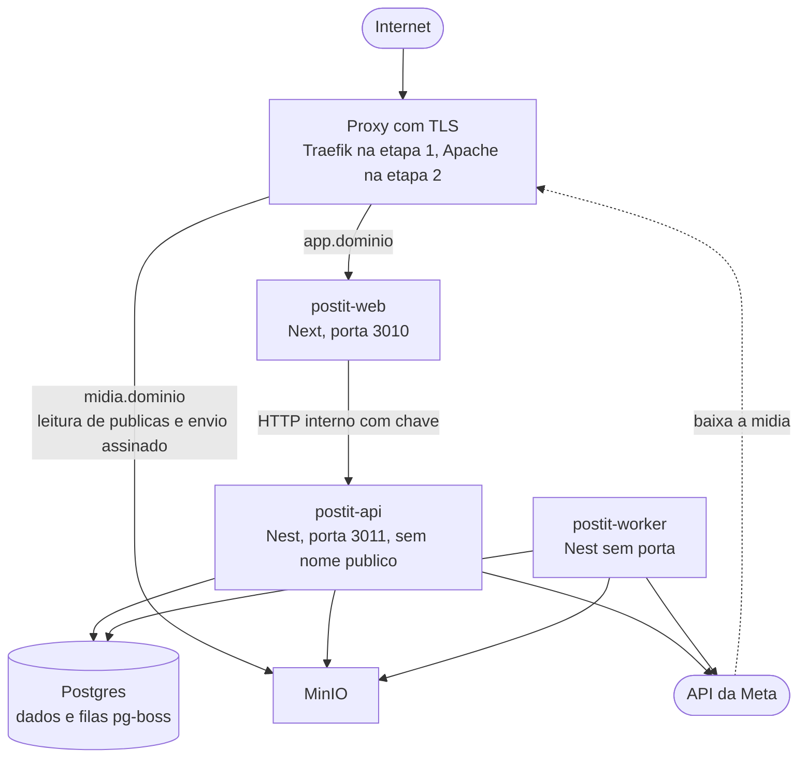

# 10 — Infraestrutura e Deploy

São **três processos**: as telas (Next), a API (Nest) e o worker (o mesmo código Nest, sem HTTP). Ver
[ADR 0010](adr/0010-monorepo-next-nest-bff.md). Onde e como eles rodam muda em duas etapas.

---

## Duas etapas

Decisão em [ADR 0020](adr/0020-easypanel-na-validacao.md).

| | Etapa 1 — validação | Etapa 2 — depois da aprovação |
|---|---|---|
| **Onde** | VPS com **Easypanel** | VPS com **PM2 e Apache**, padrão do `nossobuncker` |
| **Proxy e HTTPS** | Traefik, embutido no Easypanel | Apache |
| **Web, API e worker** | Três serviços App do mesmo `Dockerfile` | Três processos PM2 |
| **Postgres e MinIO** | Serviços do Easypanel | Docker Compose |
| **Deploy** | Branch `producao` apontada para a tag + deploy pelo painel | `scripts/deploy.sh vX.Y.Z` |

**O que não muda entre as etapas:** o código, a regra de só publicar pelo worker, a API sem nome público, os
cabeçalhos de segurança (gerados pelo Next), o dump manual antes de migration e a estreia antes de conectar contas
reais.

**Só se constrói o que a etapa atual usa.** Os arquivos da etapa 2 ficam descritos aqui e são escritos na mudança.

---

## Topologia



**Duas entradas públicas, e só duas:** o domínio do aplicativo, que vai inteiro para o Next, e o
domínio de mídia. **A API não tem nome público** — só o Next a alcança, por dentro do servidor.

**Se o DNS estiver na Cloudflare, "somente DNS"** (nuvem cinza) para `app` e `midia`. Com a nuvem laranja, o tráfego passaria
pela Cloudflare, que no plano gratuito recusa envios acima de 100 MB — e um Reels pode ter 300 MB. Item V-24 de
[08](08-integracao-instagram.md#a-validar-em-desenvolvimento).

---

## Etapa 1 — Easypanel

Referência: o guia do `openreply`, que já roda assim. Documentação do painel em
[easypanel.io/docs](https://easypanel.io/docs).

### Serviços

Um projeto `postit` no Easypanel, com cinco serviços:

| Serviço | Tipo | Domínio | Observações |
|---|---|---|---|
| `postgres` | Postgres | Nenhum | PostgreSQL 16. Nome interno mostrado na página do serviço |
| `minio` | App, imagem `minio/minio` | `midia.seudominio` → porta 9000 | Volume persistente em `/data`. Console de administração **sem domínio** |
| `api` | App, `Dockerfile` do repositório, comando `api` | **Nenhum** | `API_HOST=0.0.0.0`. Aplica as migrations ao iniciar. Réplicas: 1 |
| `worker` | App, mesmo `Dockerfile`, comando `worker` | **Nenhum** | Sem porta, sem verificação de saúde. **Réplicas: 1** |
| `web` | App, mesmo `Dockerfile`, comando `web` | `app.seudominio` → porta 3010 | HTTPS ligado |

Os três Apps apontam para o **mesmo repositório, a mesma branch `producao` e o mesmo `Dockerfile`**. O que muda é só
o comando, que o ponto de entrada da imagem despacha:

| Comando | Executa |
|---|---|
| `web` | Next em produção, porta 3010 |
| `api` | `prisma migrate deploy` e, em seguida, o processo HTTP da API |
| `worker` | O processo worker |
| qualquer outro | Executado como está — é por aí que rodam os comandos `admin:*` pelo terminal do serviço |

**Por que a API aplica as migrations ao iniciar:** a construção da imagem não enxerga o banco, e rodar migration
à mão a cada versão é passo fácil de esquecer. Só a API faz isso, e ela é a primeira a subir no deploy. O dump
manual continua antes ([ADR 0021](adr/0021-dump-manual-e-sem-monitoramento-externo.md)).

**A imagem precisa levar a CLI do Prisma**, que costuma ser dependência de desenvolvimento — lição do `openreply`.

### O que protege a API

- **Sem domínio:** o Traefik não tem rota para ela
- **Sem porta publicada** no servidor
- Continua exigindo a **chave interna**: a rede interna do Easypanel pode ser compartilhada com outros projetos do
  mesmo servidor

`INTERNAL_API_URL` do `web` usa o nome interno do serviço `api`, mostrado no painel.

### O painel do Easypanel

**Quem entra no painel controla o servidor inteiro**: lê todas as variáveis, inclusive `ENCRYPTION_KEY` e
`IG_APP_SECRET`, e mexe em qualquer serviço.
- Senha forte e exclusiva
- Painel acessado **só por https**, num domínio próprio
- Verificação em duas etapas no painel, se ele oferecer

### Variáveis

Preenchidas na aba **Environment** de cada serviço, com os mesmos nomes de [Variáveis de ambiente](#variáveis-de-ambiente).
`DATABASE_URL`, `ENCRYPTION_KEY` e `INTERNAL_API_KEY` precisam ser **idênticas** onde aparecem — com
`ENCRYPTION_KEY` diferente, o worker não decifra os tokens e toda publicação falha.

### MinIO

- **Política do bucket:** leitura anônima **só** em `publicas/*`. É ela que impede ler `recebidos/`
- **CORS:** configurado no próprio MinIO, origem exata `https://app.seudominio`
- **Regra de ciclo de vida** para apagar envios abandonados em `recebidos/`
- Tudo aplicado pelo script de preparação do bucket, rodado pelo terminal do serviço `api`

---

## Etapa 2 — PM2 e Apache

**Escrita na mudança de casa**, não antes. Padrão adotado dos seus repositórios: **Docker Compose só para os
serviços**, e os processos da aplicação rodando por PM2 direto no host ([ADR 0003](adr/0003-vps-docker-pm2.md)).

### Serviços em Docker

```yaml
# docker-compose.yml
#
# Só os serviços de apoio. Web, API e worker rodam por PM2 no host.
#
# Não há Redis: as filas de trabalho ficam no próprio Postgres, gerenciadas
# pelo pg-boss num esquema separado. Ver docs/adr/0008.
#
# Portas deslocadas para não colidir com instalações locais nem com outros
# projetos na mesma VPS. Todas presas a 127.0.0.1: nada de banco exposto
# na internet por descuido de firewall.

services:
  postgres:
    image: postgres:16-alpine
    container_name: postit-postgres
    restart: unless-stopped
    ports:
      - "127.0.0.1:5434:5432"   # 5434 no host, padrão 5432 dentro
    environment:
      POSTGRES_USER: ${POSTGRES_USER}
      POSTGRES_PASSWORD: ${POSTGRES_PASSWORD}
      POSTGRES_DB: ${POSTGRES_DB}
      TZ: UTC                   # o servidor pensa em UTC. Ver ADR 0006
    volumes:
      - postgres-dados:/var/lib/postgresql/data
    healthcheck:
      test: ["CMD-SHELL", "pg_isready -U ${POSTGRES_USER}"]
      interval: 10s
      timeout: 5s
      retries: 5

  minio:
    image: minio/minio:latest
    container_name: postit-minio
    restart: unless-stopped
    ports:
      - "127.0.0.1:9002:9000"   # API S3
      - "127.0.0.1:9003:9001"   # console de administração — só por túnel SSH
    environment:
      MINIO_ROOT_USER: ${MINIO_ROOT_USER}
      MINIO_ROOT_PASSWORD: ${MINIO_ROOT_PASSWORD}
    command: server /data --console-address ":9001"
    volumes:
      - minio-dados:/data
    healthcheck:
      test: ["CMD", "mc", "ready", "local"]
      interval: 15s
      timeout: 5s
      retries: 5

volumes:
  postgres-dados:
  minio-dados:
```

O mesmo arquivo, sem as portas de produção, serve ao computador local desde o início
([14](14-ambientes-e-desenvolvimento.md)).

**Por que `TZ: UTC` no Postgres:** o servidor de banco não deve ter opinião sobre fuso horário. Todo
horário chega e sai em UTC; a conversão acontece na borda da tela. Deixar o container num fuso local é
um convite a erro sutil que só aparece na virada do horário de verão. Vale também para o Postgres da etapa 1.

**Versão mínima:** o pg-boss 12.x exige PostgreSQL 13 ou mais novo
([npm](https://registry.npmjs.org/pg-boss/latest)). A imagem `postgres:16` atende com folga.

### Processos com PM2

```javascript
// ecosystem.config.cjs
//
// Três processos, com responsabilidades que NÃO se misturam:
//   postit-web     telas; única porta de entrada do navegador
//   postit-api     regras de negócio; só o Next chama, em 127.0.0.1
//   postit-worker  publica, coleta métricas, renova tokens. É o MESMO
//                  código da API, iniciado sem HTTP. Só ele publica.
//
// Comandos:
//   pm2 start ecosystem.config.cjs
//   pm2 reload postit-web postit-api   recarga sem derrubar
//   pm2 restart postit-worker          o worker é reiniciado
//   pm2 save && pm2 startup            sobrevive a reboot
//   pm2 logs postit-worker

module.exports = {
  apps: [
    {
      name: 'postit-web',
      cwd: '/opt/postit/apps/web',
      script: 'node_modules/next/dist/bin/next',
      // A porta vai aqui: o Next não lê PORT do .env sozinho
      // (dor registrada no nossobuncker).
      args: 'start -H 127.0.0.1 -p 3010',
      instances: 1,
      exec_mode: 'fork',
      max_memory_restart: '600M',
      env: { NODE_ENV: 'production' },
      error_file: '/opt/postit/logs/web-erro.log',
      out_file: '/opt/postit/logs/web-saida.log',
      time: true,
    },
    {
      name: 'postit-api',
      cwd: '/opt/postit/apps/api',
      script: 'dist/main.js',
      instances: 1,
      exec_mode: 'fork',
      max_memory_restart: '400M',
      env: { NODE_ENV: 'production' },
      error_file: '/opt/postit/logs/api-erro.log',
      out_file: '/opt/postit/logs/api-saida.log',
      time: true,
      kill_timeout: 10000,
    },
    {
      name: 'postit-worker',
      cwd: '/opt/postit/apps/api',
      script: 'dist/worker.js',
      instances: 1,                 // UM só. Ver a nota abaixo
      exec_mode: 'fork',
      max_memory_restart: '800M',   // maior: inspeciona e manipula vídeo
      env: { NODE_ENV: 'production' },
      error_file: '/opt/postit/logs/worker-erro.log',
      out_file: '/opt/postit/logs/worker-saida.log',
      time: true,
      // Espera até 60s antes de matar: dá tempo de a tarefa em andamento
      // terminar em vez de morrer no meio de uma publicação.
      kill_timeout: 60000,
    },
  ],
};
```

**Web e API escutam só em `127.0.0.1`.** Quem fala com a internet é o proxy reverso.

**Sobre `instances: 1` no worker:** a arquitetura suporta mais de um — as quatro camadas de
idempotência de [09](09-motor-agendamento.md) existem justamente para isso. Mas não há motivo para
começar com mais: o volume não pede, e um processo só é mais fácil de depurar. Vale também para as réplicas da
etapa 1.

**Sobre `kill_timeout` no worker:** o padrão do PM2 é 1,6 segundo. Numa publicação em andamento isso
mata o processo no meio da chamada à Meta, criando exatamente o caso ambíguo de timeout descrito em
[09 — Idempotência](09-motor-agendamento.md#idempotência). Sessenta segundos dão margem para terminar. Na etapa 1, o
equivalente é o tempo de espera antes de parar o container; conferir no Easypanel.

Se mesmo assim o processo morrer no meio, a tarefa não se perde: ela está no Postgres, e o pg-boss
volta a entregá-la depois que o tempo máximo da execução (`expireInSeconds`) passar.

**Sobre o Node:** o pg-boss 12.x exige **Node 22.12 ou mais novo** — no host da etapa 2 e na imagem da etapa 1.

### Apache

Dois nomes públicos. A configuração fica versionada em `deploy/apache/`, como no `nossobuncker`.

| Nome | Destino | Métodos | Para quê |
|---|---|---|---|
| `app.seudominio` | `127.0.0.1:3010` (Next) | Todos | O aplicativo inteiro, incluindo a URI de retorno do OAuth do Instagram |
| `midia.seudominio` | `127.0.0.1:9002` (MinIO) | GET no prefixo `publicas/`; POST de envio assinado | A Meta baixar mídias; o navegador enviar arquivos |

```apache
# deploy/apache/app.conf — trecho de segurança

ProxyPreserveHost On
RequestHeader set X-Real-IP "%{REMOTE_ADDR}s"
RequestHeader set X-Forwarded-Proto "https"

# Os cabeçalhos de segurança vêm do Next (ADR 0020). Repeti-los aqui com
# "always" cobre também as páginas de erro do próprio Apache.
Header always set Strict-Transport-Security "max-age=31536000; includeSubDomains"
Header always set X-Content-Type-Options "nosniff"
Header always set Referrer-Policy "strict-origin-when-cross-origin"
Header always set Permissions-Policy "camera=(), microphone=(), geolocation=(), payment=(), usb=()"
Header always set X-Frame-Options "DENY"

ProxyPass        / http://127.0.0.1:3010/
ProxyPassReverse / http://127.0.0.1:3010/
```

A porta 80 só redireciona para https.

### Mudança de casa: da etapa 1 para a etapa 2

1. Instalar na VPS de destino: Node 22.12+, PM2, Docker e Apache; escrever `docker-compose.yml` de produção,
   `ecosystem.config.cjs`, `deploy/apache/` e `scripts/deploy.sh`
2. Copiar as variáveis do Easypanel para `/opt/postit/.env`, **com a mesma `ENCRYPTION_KEY`** — com outra chave,
   todos os tokens e segredos de duas etapas ficam ilegíveis
3. Avisar a equipe e **parar os serviços `web`, `api` e `worker`** no Easypanel. Postagens que vencerem durante a
   parada irão para `FALHOU` pela regra dos 15 minutos
4. Dump do banco no Easypanel e restauração no Postgres novo ([Dump e restauração](#dump-e-restauração))
5. Copiar o bucket inteiro do MinIO antigo para o novo, com `mc mirror`
6. `scripts/deploy.sh` com a mesma tag que estava em produção
7. Apontar o DNS de `app` e `midia` para o novo destino (se mudar de servidor) e desligar o Traefik do domínio
8. Refazer os itens 1 a 4 da [estreia em produção](#estreia-em-produção), agora com o Apache
9. Conferir o painel de saúde, reativar a equipe e só então apagar o projeto no Easypanel

**Mesmo domínio**, para as URIs de retorno cadastradas na Meta continuarem valendo.

---

## O que vale nas duas etapas

### No nome do app

Três regras das quais a segurança depende. Explicação completa em [11 — Segurança](11-seguranca.md).

**1. Preservar o `Host` original.** As Server Actions do Next conferem se a requisição veio do próprio
site comparando o cabeçalho `Origin` com o `Host`. Se o proxy trocar o `Host` pelo endereço interno,
toda ação é recusada — ou, pior, a proteção deixa de fazer sentido. Item V-16 de
[08](08-integracao-instagram.md#a-validar-em-desenvolvimento).

**2. `X-Real-IP` com o IP da conexão, definido pelo proxy.** O visitante consegue enviar um `X-Forwarded-For`
falso; o proxy só acrescenta o IP verdadeiro no fim da lista. O Next lê **só** `X-Real-IP`. Sem isso, a proteção
contra tentativas repetidas pode ser contornada trocando o IP declarado a cada tentativa — falha encontrada no
`nossobuncker`.
- **Apache:** `RequestHeader set X-Real-IP`, como acima
- **Traefik:** comportamento a confirmar — item V-23. Se o IP real não chegar, o bloqueio por IP perde efeito; o
  bloqueio por conta continua valendo

**3. Cabeçalhos de segurança gerados pelo Next**, em toda resposta: CSP com nonce no `proxy.ts` e os fixos no
`next.config`. Justificativa de cada um em [ADR 0014](adr/0014-csp-e-cabecalhos-de-seguranca.md); por que no
Next, em [ADR 0020](adr/0020-easypanel-na-validacao.md). **Sem `preload` no HSTS:** colocar o domínio na lista
embutida dos navegadores leva meses para desfazer.

### No nome de mídia

| Cuidado | Onde fica | Motivo |
|---|---|---|
| Leitura só em `publicas/` | Política do bucket; na etapa 2, também no Apache | Arquivos ainda não validados, em `recebidos/`, nunca são legíveis |
| Envio só com política assinada | MinIO | O MinIO confere a assinatura, o tamanho e o tipo. Outros sites não conseguem enviar |
| CORS com origem exata do app, só POST, sem credenciais | Configuração do MinIO | Só as telas do PostIt enviam arquivos |
| Sem listagem de bucket | Política do bucket | Ninguém enumera o que existe lá dentro |
| Console de administração do MinIO nunca exposto | Sem domínio (etapa 1); túnel SSH (etapa 2) | Controle total do armazenamento |
| Sem redirecionamento | Proxy | A documentação da Meta não garante que redirecionamento funcione |
| Nomes de objeto só em US-ASCII | Código | Exigência documentada da Meta |
| `Content-Security-Policy: default-src 'none'; sandbox`, `nosniff` e cache longo | Apache; no Traefik, a confirmar (V-22) | Se um arquivo indevido passar pela validação, o navegador não executa nada dele |

A proteção do conteúdo publicado é o **nome imprevisível do objeto**, não o controle de acesso — que
não pode existir, já que a Meta precisa baixar sem credencial. Ver
[ADR 0005](adr/0005-minio-midia-publica.md), [ADR 0012](adr/0012-upload-direto-minio.md) e
[11 — Segurança](11-seguranca.md).

**A validar na implementação** (item V-15 de [08](08-integracao-instagram.md#a-validar-em-desenvolvimento)):
se a assinatura do envio continua válida com o MinIO atrás do proxy, e a regra exata de CORS.

### Futuro: webhooks da Meta

Quando comentários e mensagens forem construídos, a Meta precisará avisar o sistema. A regra prevista é
uma rota específica, como `app.seudominio/webhooks/meta`, encaminhada **direto à API**, que validará a
assinatura da Meta. Não existe no MVP. Ver [ADR 0009](adr/0009-preparacao-multi-rede.md).

---

## Variáveis de ambiente

**Cada app valida com zod, no boot, só as variáveis de que precisa** — e em produção, variável faltando ou inválida
impede o processo de subir. Na etapa 1 ficam na aba Environment de cada serviço; na etapa 2 e no computador local,
num `.env` único na raiz. Nomes apenas; valores nunca entram no repositório.

```bash
# .env.example

# ---------- Geral ----------
NODE_ENV=
APP_URL=                    # https://app.seudominio — também decide o cookie Secure

# ---------- Comunicação Next -> API ----------
INTERNAL_API_URL=           # etapa 2: http://127.0.0.1:3011 · etapa 1: nome interno do serviço api
INTERNAL_API_KEY=           # chave interna; web e API precisam da mesma

# ---------- API ----------
API_HOST=                   # etapa 2: 127.0.0.1 · etapa 1: 0.0.0.0, dentro do container
API_PORT=                   # 3011

# ---------- Sessão ----------
SESSION_IDLE_DAYS=    # 7 — sem uso por esse tempo, pede login de novo
SESSION_MAX_DAYS=         # 30 — teto absoluto, mesmo com uso diário
TOTP_ISSUER=               # nome que aparece no aplicativo autenticador, ex.: PostIt

# ---------- Banco ----------
DATABASE_URL=
POSTGRES_USER=
POSTGRES_PASSWORD=
POSTGRES_DB=

# ---------- Armazenamento de mídia ----------
MINIO_ENDPOINT=             # interno, para a API e o worker
MINIO_ROOT_USER=
MINIO_ROOT_PASSWORD=
MINIO_BUCKET=
MINIO_PUBLIC_URL=          # https://midia.seudominio — a que a Meta e o navegador acessam

# ---------- Instagram ----------
IG_APP_ID=
IG_APP_SECRET=
IG_REDIRECT_URI=            # https://app.seudominio/contas/conectar/retorno — rota do Next
IG_API_VERSION=             # padrão v26.0 no código, ver 08

# ---------- Criptografia ----------
ENCRYPTION_KEY=             # 32 bytes em hexadecimal — cifra tokens do Instagram e segredos das duas etapas
STATE_SECRET=               # assinatura HMAC do state do OAuth

# ---------- Notificações push ----------
VAPID_PUBLIC_KEY=           # chave pública, também enviada ao navegador na inscrição
VAPID_PRIVATE_KEY=          # nunca sai do servidor
VAPID_SUBJECT=              # mailto: ou URL de contato exigida pelos serviços de push
```

Cada ambiente — local e produção — tem **suas próprias** chaves. Ver
[14 — Ambientes e desenvolvimento](14-ambientes-e-desenvolvimento.md).

| Variável | Web | API | Worker |
|---|---|---|---|
| `APP_URL` | ✓ | ✓ | |
| `MINIO_PUBLIC_URL` | ✓ — só para montar a CSP | ✓ | ✓ |
| `INTERNAL_API_URL` | ✓ | | |
| `INTERNAL_API_KEY` | ✓ | ✓ | |
| `API_HOST`, `API_PORT` | | ✓ | |
| `SESSION_IDLE_DAYS`, `SESSION_MAX_DAYS`, `TOTP_ISSUER` | | ✓ | |
| `DATABASE_URL` | | ✓ | ✓ |
| Demais `MINIO_*` | | ✓ | ✓ |
| `IG_*` | | ✓ | ✓ |
| `ENCRYPTION_KEY` | | ✓ | ✓ |
| `STATE_SECRET` | | ✓ | |
| `VAPID_PUBLIC_KEY` | ✓ — para a inscrição no navegador | ✓ | ✓ |
| `VAPID_PRIVATE_KEY`, `VAPID_SUBJECT` | | | ✓ |

**A web não tem acesso a banco, MinIO, Meta nem segredos de criptografia.** Se o processo do Next for
comprometido, o atacante não tem essas credenciais à mão. Na etapa 1, isso significa **não** preencher essas
variáveis no serviço `web`.

`ENCRYPTION_KEY`, `STATE_SECRET` e `INTERNAL_API_KEY` são segredos independentes, com propósitos
distintos. Compartilhar segredo entre propósitos diferentes é como reusar senha.

---

## Deploy

**Só versão marcada com tag chega à produção.** Não existe homologação
([ADR 0019](adr/0019-sem-homologacao.md)); a `main` só chega lá quando alguém marca a versão. Fluxo completo em
[15 — Qualidade e fluxo de trabalho](15-qualidade-e-fluxo-de-trabalho.md) e ambientes em
[14](14-ambientes-e-desenvolvimento.md).

### Antes de uma versão com migration: dump manual

**Nenhum deploy faz dump do banco.** Sem homologação, a primeira vez que uma migration roda no servidor é na
produção — e voltar para a tag anterior **não desfaz** a migration. Por isso, quando a versão traz migration
nova, faça o dump **antes** do deploy, com os comandos de [Dump e restauração](#dump-e-restauração).

Para saber se a versão tem migration, sem entrar no servidor:

```bash
git diff --name-only v1.3.9 v1.4.0 -- packages/database/prisma/migrations
```

**Se a versão der problema:**
- **Sem migration:** deploy da tag anterior — volta o código e pronto
- **Com migration:** parar os serviços, restaurar o dump e fazer o deploy da tag anterior. **Tudo que foi gravado
  depois do dump se perde** — postagens criadas, edições, aprovações, métricas coletadas. A versão anterior não
  enxerga o que a migration criou, então voltar só o código, sem o dump, pode deixar dados invisíveis ou quebrar
  telas

**Quando o erro aparece dias depois**, restaurar o dump perde esses dias. Nesse caso, costuma ser melhor
**corrigir para frente**: uma nova versão com a correção, sem voltar o banco.

### Etapa 1: Easypanel

```bash
# No seu computador
git tag v1.4.0 && git push --tags
git push --force origin "v1.4.0^{commit}:refs/heads/producao"   # aponta a branch producao para a tag
```

Depois, no painel, **Deploy nesta ordem**:

1. **`api`** — constrói a imagem, aplica as migrations e sobe
2. **`worker`** — só depois de a API estar de pé, para nunca rodar código novo com banco velho
3. **`web`**

Deploy automático a cada push fica **desligado** nos três, para a ordem ser respeitada. Voltar para uma versão
anterior é o mesmo caminho, com a tag anterior.

Conferir no fim: a tela de login abre por `https://app.seudominio/entrar`, a CSP aparece na resposta, e a versão
nova aparece no rodapé.

### Etapa 2: `scripts/deploy.sh`

Rodado no servidor com a versão como parâmetro: `scripts/deploy.sh v1.4.0`. **Só aceita tag**: sem uma versão
marcada, recusa rodar.

```bash
#!/usr/bin/env bash
set -euo pipefail
VERSAO="${1:?Informe a tag da versão, por exemplo: scripts/deploy.sh v1.4.0}"
cd /opt/postit

git fetch --tags
git rev-parse -q --verify "refs/tags/$VERSAO" >/dev/null \
  || { echo "A tag $VERSAO não existe. Produção só recebe versão marcada."; exit 1; }
git checkout "$VERSAO"
npm ci
npm audit --omit=dev --audit-level=high   # para se houver vulnerabilidade alta ou crítica
npm run build -w @repo/database   # gera o client do Prisma
npm run db:deploy                 # aplica migrations — nunca db:push nem reset em produção
npx turbo build                   # shared, api e web, na ordem certa

pm2 reload postit-web postit-api
pm2 restart postit-worker
pm2 save

# Verificação de fumaça
curl -fsS -H "x-internal-key: $INTERNAL_API_KEY" http://127.0.0.1:3011/health
curl -fsS -o /dev/null http://127.0.0.1:3010/entrar
# a CSP precisa estar presente
curl -fsSI http://127.0.0.1:3010/entrar | grep -qi '^content-security-policy:'
```

**`npm audit` no deploy** interrompe a atualização se alguma dependência de produção tiver
vulnerabilidade alta ou crítica conhecida. Na etapa 1, a mesma verificação roda na CI.

**Ordem importa:** migrations antes do build e do reinício. Código novo com banco velho é a receita
clássica de erro em produção.

**Por que `reload` na web e na API e `restart` no worker:** o `reload` troca o processo sem derrubar,
ideal para quem atende requisição. O worker não atende ninguém, e o `restart` com `kill_timeout` de
60 segundos respeita a tarefa em andamento.

**API e worker sempre juntos:** compartilham o mesmo código compilado, então todo deploy reinicia os
dois.

**O pg-boss cuida do próprio esquema:** ao iniciar, o worker cria ou atualiza as tabelas do pg-boss
sozinho.

**A verificação de fumaça** confirma que a API responde com a chave interna e que a tela de login
abre. Se falhar, o deploy para com erro visível — em vez de terminar "com sucesso" e quebrado.

### Primeira instalação

**Etapa 1:** criar o projeto e os cinco serviços no Easypanel, preencher as variáveis, rodar o script de preparação
do bucket pelo terminal do serviço `api` e fazer o primeiro deploy na ordem acima.

**Etapa 2:** o mesmo script de deploy, precedido de `.env` preenchido, `docker compose up -d` e o script de
preparação do bucket; e `pm2 start ecosystem.config.cjs` + `pm2 startup` no lugar do reload.

**Depois de tudo de pé**, criar o primeiro usuário — pelo terminal do serviço `api` (etapa 1) ou em `/opt/postit`
(etapa 2):

```bash
npm run admin:create -- --email voce@exemplo.com --nome "Seu Nome" --super-admin
# imprime um link de cadastro válido por 7 dias
```

A pessoa abre o link, define a senha e cadastra a verificação em duas etapas. Não existe usuário com senha
padrão, em momento nenhum. **A partir daí, novos usuários são criados pela tela**, na área de administração
([ADR 0015](adr/0015-super-admin-e-permissoes.md)). Recomenda-se criar logo um segundo super admin.

Antes de conectar qualquer conta real, fazer a [estreia em produção](#estreia-em-produção).

### Comandos de emergência

Rodados pelo terminal do serviço `api` (etapa 1) ou em `/opt/postit` (etapa 2). No dia a dia, o super admin faz tudo
isso pela tela; os comandos existem para o primeiro usuário e para quando não houver super admin disponível.

| Comando | Para quê |
|---|---|
| `npm run admin:create -- --email --nome [--super-admin]` | Novo usuário; imprime link de cadastro (7 dias). `--super-admin` para o primeiro |
| `npm run admin:promote -- --email` | Tornar alguém super admin quando todos os super admins perderam acesso |
| `npm run admin:reset-password -- --email` | Senha esquecida; imprime link (24 h); ao usar, encerra todas as sessões |
| `npm run admin:reset-2fa -- --email` | Celular e códigos perdidos; encerra todas as sessões |

**Links são segredos.** Entregue por canal de confiança, nunca num grupo. Os comandos não registram o link
no log. **Toda execução vai para a auditoria**, com origem `CLI` — usar um comando de emergência fica
visível para os super admins.

---

## Dump e restauração

**Não há backup automático** nem backup das mídias. O dump é manual, feito antes de toda versão com migration e
quando o dono quiser, e **guardado na máquina do dono**. Riscos aceitos em
[ADR 0021](adr/0021-dump-manual-e-sem-monitoramento-externo.md).

**O banco é o que importa guardar.** Ele guarda tokens cifrados, sessões, agendamentos, aprovações, métricas,
auditoria — e as filas do pg-boss. Como as tarefas estão no Postgres, um dump restaurado traz postagens e tarefas
consistentes entre si.

### Fazer o dump — do seu computador

```bash
# Etapa 1: Postgres do Easypanel. O filtro encontra o container do serviço postgres do projeto postit
ssh usuario@servidor 'docker exec $(docker ps -q -f name=postit_postgres) pg_dump -U <usuario> -Fc <banco>' \
  > postit-antes-v1.4.0.dump

# Etapa 2: Postgres do Docker Compose
ssh usuario@servidor 'docker exec postit-postgres pg_dump -U <usuario> -Fc <banco>' \
  > postit-antes-v1.4.0.dump
```

O arquivo chega direto ao seu computador, sem ficar no servidor.

**Cuidados com o arquivo:**
- Guardar **fora da pasta do repositório**
- A `ENCRYPTION_KEY` de produção **não** fica junto dele em texto aberto. Sem ela, os tokens do dump são ilegíveis;
  com ela ao lado, quem pegar os dois pega tudo
- Nunca restaurar no ambiente local sem antes apagar tokens, sessões e segredos de duas etapas
  ([ADR 0018](adr/0018-ambientes-e-apps-meta-separados.md))

### Restaurar

1. Parar `web`, `api` e `worker` — pelo painel (etapa 1) ou `pm2 stop all` (etapa 2). O Postgres continua de pé
2. Enviar o dump e restaurar:

```bash
# Etapa 1
ssh usuario@servidor 'docker exec -i $(docker ps -q -f name=postit_postgres) pg_restore --clean --if-exists -U <usuario> -d <banco>' \
  < postit-antes-v1.4.0.dump

# Etapa 2
ssh usuario@servidor 'docker exec -i postit-postgres pg_restore --clean --if-exists -U <usuario> -d <banco>' \
  < postit-antes-v1.4.0.dump
```

3. Subir de novo, na ordem: `api`, `worker`, `web`

**Depois de restaurar**, conferir no painel de saúde as postagens `AGENDADO` cujo horário passou
enquanto o sistema estava parado: pela regra de 15 minutos de atraso, elas vão para `FALHOU` e
esperam decisão humana, em vez de saírem todas de uma vez. Ver
[09 — Atraso por indisponibilidade](09-motor-agendamento.md#atraso-por-indisponibilidade).

Restaurar também **mantém as sessões de login** do momento do dump. Se a restauração for por causa
de incidente de segurança, revogue todas as sessões depois de restaurar, obrigando todos a entrar de
novo.

**Mídias não voltam com o dump.** Postagens cujo arquivo foi perdido precisam do arquivo enviado de novo.

O RNF-11 exige que a restauração seja **executada** ao menos uma vez e o resultado registrado — é o item 8 da
[estreia em produção](#estreia-em-produção). Dump nunca restaurado é dump que não se sabe se funciona.

**Atenção ao restaurar em outro servidor:** os tokens do Instagram estão cifrados com
`ENCRYPTION_KEY`. Sem a mesma chave, eles são ilegíveis e todas as contas precisam ser reconectadas.
A chave precisa estar guardada num lugar seguro, **fora** do dump.

---

## Observabilidade

### Logs

Logs estruturados em JSON, escritos na saída padrão. Cada linha de publicação carrega o identificador da postagem,
o que permite reconstruir uma execução com um filtro.

- **Etapa 1:** aba de logs de cada serviço no Easypanel
- **Etapa 2:** coletados pelo PM2 em `logs/`, um par de arquivos por processo, com rotação por `pm2-logrotate` e
  retenção de 14 dias

A auditoria de longo prazo vive em `EventoPublicacao`, no banco — não no log.

**O log nunca contém token** — nem do Instagram, nem de sessão. Garantido pela concentração em
`apps/api/src/instagram/client.ts` e no módulo `auth`, conforme [11 — Segurança](11-seguranca.md).

### Verificação de saúde

`GET /health` na API responde com a versão da aplicação e o estado de Postgres e MinIO. **Exige a
chave interna** — só é chamada de dentro do servidor, pela verificação de fumaça do deploy.

Na etapa 1, **sem verificação de saúde configurada no Easypanel** no início: se o processo morrer, o container
reinicia sozinho.

O painel de saúde da aplicação (RF-H02) é outra coisa: mostra o estado do **negócio** — cota, tokens,
falhas — não o estado da infraestrutura.

### Painel do pg-boss

O painel oficial ([`@pg-boss/dashboard`](https://pgboss.io/dashboard)) mostra as filas e permite
reprocessar ou cancelar tarefas. **Nunca fica exposto na internet**: ele age direto sobre as filas de
publicação.
- **Etapa 1:** sob demanda, num container avulso na VPS ligado à rede interna do Easypanel, com a porta presa a
  `127.0.0.1` e acesso por túnel SSH; removido depois do uso. Se a rede do Easypanel não aceitar container avulso,
  item V-25, o plano B é um serviço temporário sem domínio, acessado pelo mesmo túnel
- **Etapa 2:** uso sob demanda, na própria VPS, acessado por túnel SSH — o mesmo tratamento do console do MinIO

É por ele que se cumpre o reprocessamento manual do RF-H03 ([09](09-motor-agendamento.md)).

### Alertas

As situações de [09 — Alertas viram notificações](09-motor-agendamento.md#alertas-viram-notificações) —
publicação que falhou, token perto de expirar, conta sem acesso, execução travada — viram notificações no sino
e por push, para quem é responsável. Ver [ADR 0017](adr/0017-pwa-e-notificacoes-push.md).

**Sem monitoramento externo — risco aceito:** se o servidor inteiro cair, ninguém é avisado, porque quem envia o
push é o worker. Ver [ADR 0021](adr/0021-dump-manual-e-sem-monitoramento-externo.md).

---

## Estreia em produção

Sem homologação ([ADR 0019](adr/0019-sem-homologacao.md)), o proxy de verdade só existe na produção. O túnel do
computador local já testa https, cookie `__Host-` e origem, mas não a configuração deste servidor. Por isso,
**uma vez, na primeira instalação, antes de conectar qualquer conta real**:

| # | Conferir | Como |
|---|---|---|
| 1 | Cabeçalhos de segurança e CSP presentes | `curl -sI https://app.seudominio/entrar` pelo domínio público |
| 2 | IP real do visitante chega em `X-Real-IP` | Enviar um `X-Real-IP` falso e ver, nas tentativas de acesso, que foi registrado o IP real — item V-23 na etapa 1 |
| 3 | Envio direto ao MinIO pelo proxy | Item V-15 de [08](08-integracao-instagram.md#a-validar-em-desenvolvimento) |
| 4 | Server Action de outro domínio recusada | Item V-16 de [08](08-integracao-instagram.md#a-validar-em-desenvolvimento) |
| 5 | Login com duas etapas completo | Criar o super admin, cadastrar o autenticador, sair e entrar |
| 6 | Push no celular | Instalar o app e ativar as notificações |
| 7 | Primeira publicação acompanhada | Conectar a primeira conta real, agendar uma postagem para dali a poucos minutos e conferir no perfil. Prova que a Meta baixa a mídia por `midia.seudominio` |
| 8 | Dump e restauração | Fazer um dump, restaurá-lo e conferir que usuários, conta e postagem continuam lá. Cumpre o RNF-11 |

Se qualquer item falhar, corrigir antes de conectar as demais contas. O resultado dos itens V-15, V-16 e V-23 é
registrado em [08](08-integracao-instagram.md) com a data. **Na mudança para a etapa 2**, os itens 1 a 4 são
refeitos com o Apache.

---

## Dimensionamento

Para uma instalação com poucas contas e algumas dezenas de postagens por semana:

| Recurso | Suficiente |
|---|---|
| CPU | 2 vCPU |
| Memória | 4 GB — três processos Node, Postgres e MinIO. **Na etapa 1**, o Easypanel também ocupa memória e a imagem é construída na própria VPS; se a construção do Next falhar por falta de memória, ativar swap ou subir para 8 GB |
| Disco | 40 GB mais o espaço das mídias; na etapa 1, somar as imagens Docker antigas, que o painel permite limpar |
| Banda | Entrada: navegador enviando vídeos. Saída: a Meta baixando as mídias |

O gargalo previsível é **disco**, por causa dos vídeos. Um Reels de 300 MB por dia são 9 GB por mês. A
política de retenção do RNF-12 existe por isso, e o painel de saúde deve mostrar o espaço livre antes
que ele acabe.

---

## Documentos relacionados

- [11 — Segurança](11-seguranca.md) — autenticação, segredos e a superfície exposta
- [ADR 0020](adr/0020-easypanel-na-validacao.md) — as duas etapas
- [ADR 0021](adr/0021-dump-manual-e-sem-monitoramento-externo.md) — dump manual e riscos aceitos
- [ADR 0003](adr/0003-vps-docker-pm2.md) — a decisão de VPS, PM2 e Docker Compose (etapa 2)
- [ADR 0010](adr/0010-monorepo-next-nest-bff.md) — os três processos
- [ADR 0012](adr/0012-upload-direto-minio.md) — o envio direto ao MinIO
