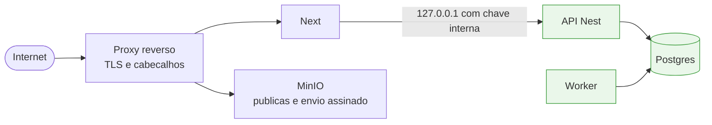
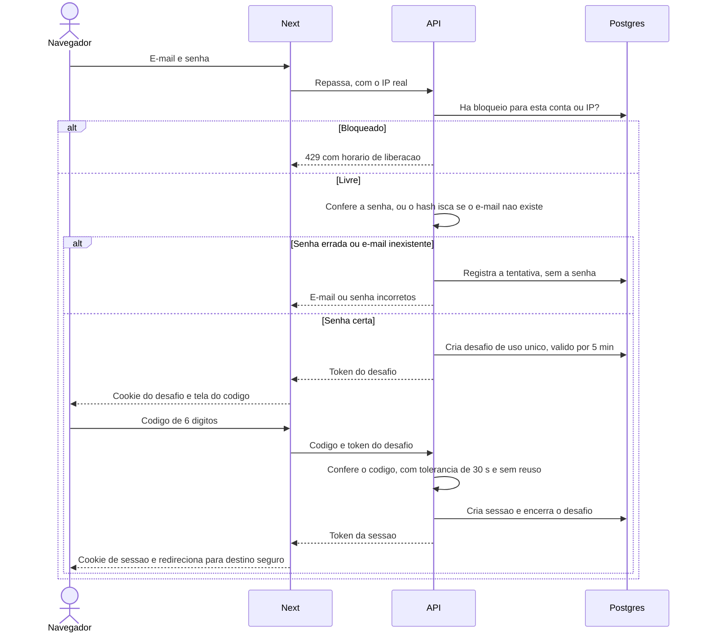

# 11 — Segurança

Ferramenta interna não é desculpa para descuido. O sistema guarda tokens que permitem **publicar no
nome de contas reais** — um vazamento aqui não expõe só dados, expõe a capacidade de agir como o dono
da conta.

**Como ler este documento:**

- **Parte 1** explica os conceitos em linguagem simples, sem pressupor conhecimento de segurança
- **Parte 2** diz como cada conceito é aplicado no PostIt
- **Parte 3** diz o que fazer quando algo dá errado

Decisões de fundo: [ADR 0010](adr/0010-monorepo-next-nest-bff.md) (estrutura),
[ADR 0012](adr/0012-upload-direto-minio.md) (envio de mídia),
[ADR 0013](adr/0013-autenticacao-com-duas-etapas.md) (login) e
[ADR 0014](adr/0014-csp-e-cabecalhos-de-seguranca.md) (CSP e cabeçalhos).

---

# Parte 1 — Os conceitos, em linguagem simples

## Autenticação e autorização

São duas perguntas diferentes, e muita falha de segurança nasce de confundir as duas.

- **Autenticação** responde *"quem é você?"*. É o login
- **Autorização** responde *"o que você pode fazer?"*. É a regra que decide se aquela pessoa pode ver,
  criar, aprovar ou apagar alguma coisa

Numa empresa: o crachá na portaria é a autenticação. Cada sala liberar ou não o seu crachá é a
autorização.

## Hash de senha

Guardar a senha no banco é um desastre esperando acontecer: quem copiar o banco leva as senhas de todo
mundo — e as pessoas reutilizam senhas em outros sites.

Por isso guarda-se um **hash**: o resultado de passar a senha por uma transformação **de mão única**. É
fácil calcular o hash de uma senha e comparar com o guardado. É praticamente impossível fazer o caminho de
volta.

Algoritmos de hash de senha, como o **argon2id**, são **lentos de propósito** e gastam memória. Para você,
fazer login leva uma fração de segundo. Para quem roubou o banco e quer testar milhões de senhas, cada
tentativa custa caro.

## Sessão e cookie

Pedir senha a cada clique seria insuportável. Então, depois do login, o servidor entrega ao navegador um
**crachá temporário**: a **sessão**. É um código aleatório e enorme que o navegador reapresenta a cada
requisição.

Esse código viaja num **cookie**, um pequeno dado que o navegador guarda e envia automaticamente para o
site que o criou. O cookie tem **travas** que o próprio navegador respeita:

| Trava | O que faz |
|---|---|
| `httpOnly` | O JavaScript da página não consegue ler o cookie. Se alguém injetar código malicioso na tela, não rouba a sessão |
| `Secure` | O cookie só viaja por conexão criptografada (https) |
| `SameSite` | Controla se o cookie vai junto quando a requisição foi disparada por outro site |
| Prefixo `__Host-` | Obriga o navegador a exigir `Secure` e impede que um subdomínio sobrescreva o cookie |

## Verificação em duas etapas

Senhas vazam: reutilização em sites invadidos, golpes de phishing, anotações. A verificação em duas etapas
exige **algo que você sabe** (a senha) **e algo que você tem** (o celular).

O método usado aqui é o **TOTP**. No cadastro, o servidor e o aplicativo autenticador do seu celular
combinam um segredo, por meio de um QR code. A partir daí, os dois calculam — cada um sozinho, sem
conversar — o mesmo código de 6 dígitos, que muda a cada 30 segundos. Quem tem só a senha não tem o
código.

**Códigos de recuperação** são a saída de emergência: senhas de uso único, anotadas no cadastro, para o
dia em que o celular sumir.

## Força bruta e enumeração

**Força bruta** é tentar senhas em sequência até acertar. A defesa é **frear**: depois de muitos erros,
recusar tentativas por um tempo.

**Enumeração** é descobrir quais e-mails estão cadastrados, observando se o sistema responde "usuário não
existe" ou "senha errada" — ou até se uma resposta demora mais que a outra. A defesa é responder **sempre
igual**, e **no mesmo tempo**.

## CSRF

*Cross-Site Request Forgery*. Você está logado no PostIt e abre um site malicioso. Esse site tem um
formulário escondido que envia "aprovar postagem" para o PostIt. Seu navegador, obediente, envia —
junto com o seu cookie de sessão. Para o servidor, parece que foi você.

A defesa é o servidor **conferir de onde a requisição veio**, e o cookie **não ir junto** em requisições
disparadas por outros sites.

## Redirecionamento aberto

Uma tela de login costuma ter um endereço como `/entrar?voltar=/calendario`: depois de entrar, você volta
para onde estava. Se o sistema não conferir esse `voltar`, alguém envia um link
`/entrar?voltar=https://site-falso.com`. A pessoa faz login no site verdadeiro — e é mandada para uma
cópia falsa, que pede a senha "de novo".

A defesa é aceitar como destino **só endereços internos**.

## XSS e CSP

*Cross-Site Scripting*. Alguém consegue colocar um código dentro da página — por exemplo, escrevendo um
script numa legenda que a tela exibe sem tratamento. Quando outra pessoa abre a tela, o código roda **no
navegador dela, com a sessão dela**.

A **CSP** (*Content Security Policy*) é uma lista que o site envia ao navegador: *"nesta página, só rode
scripts vindos daqui, só mostre imagens vindas dali"*. O que não estiver na lista, o navegador recusa.

A forma mais forte usa um **nonce**: um número sorteado a cada carregamento de página. Os scripts
legítimos carregam aquele número; um código injetado não sabe qual é, e não roda.

## CORS

CORS é uma regra **do navegador**, não do servidor.

Por padrão, o navegador proíbe que o JavaScript de um site leia respostas de **outro** endereço. O CORS é
a forma de um servidor avisar: *"esse outro site pode me chamar"*.

**O erro comum** é achar que CORS protege uma API. Não protege. Ele só vale para navegadores; um script
rodando fora do navegador ignora a regra por completo. Proteger de verdade é trabalho de autenticação e de
não expor o que não precisa ser exposto.

---

# Parte 2 — Como faremos

## O que precisa ser protegido

| Ativo | Se vazar |
|---|---|
| **Token de acesso do Instagram** | Terceiro publica, apaga e lê métricas como se fosse o dono da conta |
| **Sessão de super admin** | Terceiro controla usuários, permissões e acessos de todos. Mitigado pela confirmação recente em cada ação administrativa |
| **Sessão da ferramenta** | Terceiro entra no PostIt como aquele usuário, com as permissões que ele tiver |
| **Segredo da verificação em duas etapas** | Terceiro gera códigos válidos; junto com a senha, entra |
| `IG_APP_SECRET` | Permite forjar troca de tokens em nome do aplicativo |
| `ENCRYPTION_KEY` | Torna legíveis os tokens do Instagram e os segredos da verificação em duas etapas |
| `STATE_SECRET` | Permite forjar o retorno do OAuth |
| `INTERNAL_API_KEY` | Metade do caminho para falar com a API sem passar pelo Next — a outra metade é estar dentro do servidor |
| Senhas dos usuários | Primeira metade do login |
| Mídia não publicada | Vazamento de conteúdo antes da hora — campanha, anúncio, data marcada |

**Escopos mínimos reduzem o estrago.** O MVP pede ao Instagram só as permissões de publicar, ler o perfil
e ler métricas. Comentários e mensagens diretas estão planejados para depois, e seus escopos
deliberadamente **não** são pedidos agora. Ver
[08 — Escopos futuros](08-integracao-instagram.md#escopos-futuros-comentários-e-mensagens).

## Superfície exposta

A primeira linha de defesa é **o que nem chega a ficar acessível**.



Em verde, o que a internet não alcança de jeito nenhum.

| Componente | Exposto? | Proteção |
|---|---|---|
| Next (aplicativo) | Sim | TLS, CSP, cabeçalhos de segurança, sessão com duas etapas, `requireSession()` em cada página e ação |
| MinIO — `publicas/` | Sim, só leitura | Nome imprevisível, sem listagem, CSP `sandbox` |
| MinIO — envio | Sim, só com política assinada | Assinatura, tamanho e tipo conferidos pelo MinIO; CORS só do domínio do app |
| Next — `/mcp` e OAuth (parte 1f) | Sim, para o assistente | Rotas de máquina sem cookie, só `Authorization: Bearer`, que só repassam à API. Token OAuth curto, com escopo único, guardado como hash e revogável; autorizar exige login com as duas etapas. Ver [ADR 0029](adr/0029-assistente-por-mcp.md) |
| **API Nest** | **Não** | Etapa 1: serviço sem domínio nem porta publicada. Etapa 2: escuta em `127.0.0.1`, sem regra no proxy. Exige chave interna mesmo assim |
| Worker | Não | Não escuta porta nenhuma |
| Postgres | Não | Etapa 1: serviço sem porta publicada. Etapa 2: preso a `127.0.0.1` |
| Console do MinIO | Não | Etapa 1: sem domínio. Etapa 2: preso a `127.0.0.1`; acesso por túnel SSH |
| **Painel do Easypanel** (etapa 1) | Sim | Controla o servidor inteiro e lê todas as variáveis. Senha forte e exclusiva, só por https, duas etapas se o painel oferecer ([ADR 0020](adr/0020-easypanel-na-validacao.md)) |
| Painel do pg-boss | Não | Uso sob demanda por túnel SSH — ele pode reprocessar e cancelar publicações |

**Por que a API exige chave interna mesmo sem estar exposta:** defesa em camadas. Se um dia uma regra de
proxy for mal configurada ou outro processo no servidor for comprometido, a API ainda recusa quem não
apresentar a chave.

## O login, passo a passo



No **primeiro login**, no lugar da tela do código aparece o cadastro: QR code, confirmação de um código e
os 10 códigos de recuperação.

## Verificação em duas etapas

**Obrigatória para todos**, sem exceção. Detalhes em [ADR 0013](adr/0013-autenticacao-com-duas-etapas.md).

| Regra | Como |
|---|---|
| Padrão | TOTP: 6 dígitos, novo código a cada 30 segundos, biblioteca `otplib` |
| Relógio do celular um pouco errado | Aceita o código do passo anterior e do seguinte (±30 s) |
| Mesmo código usado duas vezes | **Recusado.** A API guarda o último passo usado por usuário |
| Segredo no banco | Cifrado com AES-256-GCM e `ENCRYPTION_KEY`, em envelope versionado `v1:` |
| Segredo na tela | Só no cadastro, como QR code gerado pela API. Nunca mais |
| Senha certa sem código | Não cria sessão. Cria um desafio de 5 minutos e no máximo 5 tentativas |
| Códigos de recuperação | 10, mostrados uma vez, guardados como hash, uso único |
| Gerar novos códigos | Exige código do aplicativo; os anteriores deixam de valer |
| Perdeu celular e códigos | Comando no servidor `admin:reset-2fa`, que revoga todas as sessões |
| Erros de código | Contam na proteção contra tentativas repetidas |

## Proteção contra tentativas repetidas

Contagem guardada no Postgres, em duas camadas:

| Camada | O que conta | Limite em 30 minutos | Bloqueio |
|---|---|---|---|
| **Conta** (e-mail) | Senha errada; código errado | 10 | 15 min; se reincidir em 24 h, 60 min |
| **IP** | E-mail inexistente e qualquer falha | 20 | 30 min; se reincidir em 24 h, 60 min |

- **Nunca bloqueio permanente.** Um login bem-sucedido zera a contagem
- **Ordem obrigatória:** confere bloqueio → senha → código. Acertar a senha não fura um bloqueio
- **Mesma mensagem** para e-mail inexistente e senha errada: "E-mail ou senha incorretos"
- **Mesmo tempo de resposta:** quando o e-mail não existe, a senha é conferida contra um **hash isca**,
  preparado quando a API inicia. Sem isso, a resposta mais rápida entregaria quais e-mails existem
- **Bloqueado:** HTTP 429, e a tela mostra até que horas
- **Não se registra** a senha tentada nem o código digitado

**Risco aceito:** quem souber o e-mail de um usuário pode errar de propósito e travar o login dele por
15 minutos. Com a verificação em duas etapas obrigatória, isso é incômodo — não dá acesso a nada.

## Senha

| Regra | Valor |
|---|---|
| Algoritmo | argon2id |
| Tamanho | Mínimo 12, máximo 128 caracteres |
| Composição | **Sem exigência** de maiúscula, número ou símbolo — seguindo o NIST SP 800-63B: comprimento protege mais que complexidade forçada, que só gera `Senha@2026` |
| Restrição | Não pode ser igual ao e-mail |
| Troca | Exige a senha atual **e** um código do aplicativo; revoga as outras sessões |

## Sessão e cookie

| Regra | Valor |
|---|---|
| Token | 32 bytes aleatórios. No banco, só o hash sha256 — quem copiar a tabela não usa as sessões |
| A cada login | Token novo |
| Expira por inatividade | 7 dias sem uso |
| Expira de qualquer forma | 30 dias depois de criada, mesmo com uso diário |
| Encerrar | Na hora: sair, trocar senha, redefinir senha, resetar duas etapas, "sair dos outros dispositivos" |
| Registro | Sessão encerrada fica marcada com data e motivo, para investigação; expurgada em 90 dias |

**O cookie:**

| Atributo | Valor | Por quê |
|---|---|---|
| Nome | `__Host-sessao` com `APP_URL` https; `sessao` em desenvolvimento | O prefixo `__Host-` só funciona com https. Usar o mesmo nome em desenvolvimento quebraria o login |
| `httpOnly` | Sempre | JavaScript não lê a sessão |
| `Secure` | Com `APP_URL` https | Decidido pela URL, não por `NODE_ENV` — dor registrada no `nossobuncker` |
| `SameSite` | `lax` | Ver abaixo |
| Duração | Até o teto de 30 dias | A inatividade é conferida no servidor |

**Por que `lax` e não `strict`.** Com `strict`, o navegador não envia o cookie quando a pessoa chega vinda
de outro site. O retorno da conexão com o Instagram é exatamente isso — o Instagram redireciona o navegador
de volta — e chegaria sem sessão. Com `lax`, o cookie vai em navegação comum, mas **não** em formulários ou
requisições disparadas por outro site. É isso que importa contra CSRF.

**No Next:**

- `proxy.ts` só confere **se o cookie existe**; se não, manda para o login
- `requireSession()` confere a sessão com a API **em cada página e em cada Server Action**, com `cache()` do
  React para consultar a API uma vez por requisição
- `/sessao-expirada` pergunta à API **antes** de apagar o cookie: se a sessão ainda vale, só redireciona.
  Assim outro site não consegue deslogar ninguém apontando para esse endereço

**Tela de sessões ativas:** mostra onde o usuário está logado, com data de último uso, IP e navegador, e
o botão "sair dos outros dispositivos".

## Primeiro acesso e recuperação, sem e-mail

O PostIt não envia e-mail. Links de uso único resolvem criação e recuperação de acesso. **No dia a dia,
o super admin faz tudo pela tela**; os comandos no servidor ficam para o primeiro usuário e para
emergências.

| Situação | Pela tela (super admin) | Comando de emergência | O que acontece |
|---|---|---|---|
| Primeiro usuário | — | `npm run admin:create -- --email --nome --super-admin` | Cria o usuário **sem senha**, já super admin, e imprime link de cadastro válido por 7 dias |
| Novo usuário | Administração → Usuários → Criar | `npm run admin:create -- --email --nome` | Cria sem senha; link de cadastro de 7 dias. A pessoa define a senha e cadastra as duas etapas |
| Esqueceu a senha | Usuário → Gerar link de redefinição | `npm run admin:reset-password -- --email` | Link de 24 horas. Ao redefinir, **todas** as sessões caem |
| Perdeu celular e códigos | Usuário → Resetar duas etapas | `npm run admin:reset-2fa -- --email` | Apaga o segredo e os códigos; todas as sessões caem; o próximo login pede novo cadastro |
| Todos os super admins sem acesso | — | `npm run admin:promote -- --email` | Torna alguém super admin |

Toda ação da tela exige confirmação recente e vai para a auditoria. Ações por comando também vão para a
auditoria, com origem `CLI`.

Links guardados só como hash, uso único. O link é passado à pessoa por um canal de confiança — nunca
colado num grupo.

## Autorização

Decisão completa em [ADR 0015](adr/0015-super-admin-e-permissoes.md).

### O que é, em linguagem simples

Autenticação diz **quem** você é. Autorização diz **o que** você pode fazer. Três ideias guiam a nossa:

- **Menor privilégio.** Cada pessoa tem só as permissões de que precisa. Se a conta de alguém for invadida,
  o estrago fica limitado ao que aquela conta podia fazer
- **Separação de funções.** Tarefas importantes podem exigir pessoas diferentes — quem escreve não
  precisa ser quem publica
- **Decidir no servidor, nunca na tela.** Esconder um botão não impede ninguém de chamar a API diretamente.
  A tela esconde por conveniência; **a API decide** por segurança

### Negar por padrão

Toda rota da API declara uma política. Rota sem declaração é **recusada**.

| Política | Quem passa |
|---|---|
| `@Public` | Qualquer um. Só as rotas de entrar, completar o desafio e usar links de cadastro e redefinição |
| `@AnyAuthenticated` | Qualquer usuário com sessão. Leituras, o próprio perfil, comentar postagem e excluir o próprio comentário nos primeiros 5 minutos ([ADR 0026](adr/0026-postagem-em-duas-etapas.md)) |
| `@RequirePermission(...)` | Usuário com aquela permissão, ou super admin |
| `@SuperAdmin` | Só super admin. Toda a área de administração |
| `@RecentConfirmation` | Somada a outra política: exige código do aplicativo digitado há menos de 15 minutos |

Dois testes automatizados, com as rotas **descobertas pelo Nest**, sem lista escrita à mão:

- **Política de rotas:** falha se alguma rota não declarar política
- **Matriz de permissões:** falha se alguma rota com `@RequirePermission` aceitar usuário sem ela
- **Escritas abertas:** falha se aparecer escrita `@AnyAuthenticated` fora da lista fechada — as do próprio
  perfil, comentar postagem e excluir o próprio comentário. Ação sobre dado compartilhado exige `@RequirePermission`

### As permissões

Todo usuário autenticado **vê** tudo — calendário, postagens, acervo, métricas, contas, painel de saúde —,
**comenta postagens** e gerencia o próprio perfil. **Agir** exige permissão:

| Permissão | Libera |
|---|---|
| `POSTAGEM_EDITAR` | Criar e editar rascunhos, enviar mídia, enviar para revisão, descartar rascunho, voltar uma postagem para a composição |
| `POSTAGEM_APROVAR` | Aprovar e reprovar postagens de outros |
| `POSTAGEM_APROVAR_PROPRIA` | Aprovar a própria postagem, junto com `POSTAGEM_APROVAR` |
| `POSTAGEM_AGENDAR` | Agendar, reagendar, cancelar e cancelar o agendamento, publicar agora, decidir sobre `FALHOU`. Aprovar **e** agendar numa decisão só exige esta e `POSTAGEM_APROVAR` |
| `CONTA_GERENCIAR` | Conectar e desconectar contas do Instagram, alterar fuso |

Regras:

- **Permissões são globais:** valem para todas as contas do Instagram
- **Mudança vale na próxima requisição.** As permissões são carregadas junto com a sessão, a cada
  requisição — tirar uma permissão não espera o login expirar
- **Tirar permissão não desfaz o passado.** O que já foi aprovado ou agendado continua. O worker publica
  como sistema, sem conferir permissão de usuário
- **Sem permissão, a API responde 403**: "Você não tem permissão para esta ação"
- **Autoaprovação** é conferida no serviço de aprovação, comparando o autor da postagem com quem aprova
- `CONTA_GERENCIAR` é a permissão mais sensível entre as operacionais: quem a tem pode desconectar contas.
  Por isso nunca entra nos atalhos da tela

### Super admin

O super admin tem **todas as permissões** e é o único que acessa a área de administração: usuários,
permissões, tentativas de acesso e bloqueios, recuperação de acesso de outros usuários e auditoria.

**É o ativo mais valioso do sistema** — quem controla um super admin controla todos os acessos. Proteções
específicas:

| Proteção | Como |
|---|---|
| Verificação em duas etapas | Obrigatória, como para todos |
| **Confirmação recente** | Toda ação que **altera** algo na administração pede o código do aplicativo se o último foi há mais de 15 minutos. Um computador esquecido logado permite olhar, não mexer |
| **Auditoria** | Toda ação administrativa fica registrada, com autor, alvo, antes e depois, IP e horário, por 24 meses |
| **Nunca zero** | O sistema recusa desativar ou remover o último super admin ativo, e ninguém desativa a si mesmo |
| **Emergência fora da tela** | Se todos os super admins perderem acesso, `admin:promote` no servidor resolve — exige acesso ao servidor |

**Recomendação de uso:** tenha **dois** super admins, para que a perda de um celular não dependa de SSH — e
não mais que o necessário.

### Tentativas de acesso na tela

O super admin vê as tentativas de acesso e os bloqueios ativos, com filtros por e-mail, IP, resultado e
período, e pode **liberar um bloqueio** — por exemplo, quando um colega errou a senha várias vezes. A
liberação fica registrada com quem liberou.

A lista mostra o e-mail digitado e o IP, mas **nunca** a senha ou o código digitados — eles não são
guardados em lugar nenhum.

### Usuário desativado

Desativar revoga todas as sessões na hora e recusa novos logins. A mensagem "conta desativada" só aparece
depois da senha certa; antes disso, a resposta é a mesma de sempre, para não revelar quais contas existem.

## CSRF

Três proteções, juntas:

1. **Cookie `SameSite=lax`** — não vai em formulários e requisições disparadas por outro site
2. **Server Actions do Next conferem a origem** — comparam o cabeçalho `Origin` com o `Host` da requisição.
   Por isso o proxy precisa **preservar o `Host` original**. Comportamento a confirmar atrás do proxy:
   item V-16 de [08](08-integracao-instagram.md#a-validar-em-desenvolvimento)
3. **Nenhuma rota do Next aceita POST fora das Server Actions.** As únicas rotas próprias são GET e não
   causam efeito perigoso: o retorno do OAuth, protegido pelo `state` vinculado ao usuário, e
   `/sessao-expirada`, que confere antes de agir

A API não tem cookie — recebe a sessão no cabeçalho `Authorization` vindo do Next —, então CSRF não se
aplica a ela.

## Redirecionamento aberto

O destino depois do login passa por `safeRedirect()`, em `packages/shared`, com testes:

| Regra | Bloqueia |
|---|---|
| Precisa começar com `/` | `https://site-falso.com` |
| O segundo caractere não pode ser `/` | `//site-falso.com`, que o navegador trata como outro site |
| O segundo caractere não pode ser `\` | `/\site-falso.com`, que alguns navegadores convertem em `//` — falha real encontrada no `nossobuncker` |
| Sem espaços nem caracteres de controle | Variações com tabulação ou quebra de linha |

Destino inválido vira a tela inicial.

## O IP real do visitante

O IP é usado na proteção contra tentativas repetidas e no registro de sessões. Um IP errado ou falsificado
permite contornar o bloqueio.

**A armadilha:** o cabeçalho `X-Forwarded-For` é uma lista que **o próprio visitante pode preencher**. O
proxy só acrescenta o IP real no final. Usar o primeiro item da lista — o que o `nossobuncker` faz — é
aceitar o IP que o atacante escolheu.

**Como faremos:**

1. O proxy **sobrescreve** o cabeçalho `X-Real-IP` com o IP da conexão que ele recebeu. Qualquer valor
   enviado pelo visitante é descartado
2. O Next lê **só** `X-Real-IP` e repassa à API
3. Isso é confiável porque o Next escuta só em `127.0.0.1`: ninguém fala com ele sem passar pelo proxy
4. A API aceita o IP repassado só de quem apresentou a chave interna

## CORS

- **API: nenhum.** O navegador nunca fala com ela; quem fala é o servidor do Next, e CORS não se aplica
  entre servidores. A proteção real da API é não estar na internet
- **MinIO: só para o envio de arquivos.** Origem permitida: exatamente `https://app.dominio`. Método: POST.
  Sem credenciais. E, mesmo com CORS liberado, o envio só é aceito com a política assinada pela API

## CSP e cabeçalhos

Detalhes e justificativa de cada item em [ADR 0014](adr/0014-csp-e-cabecalhos-de-seguranca.md).

**CSP das páginas**, com nonce sorteado a cada carregamento em `proxy.ts`:

```
default-src 'self'
script-src 'self' 'nonce-…'                (desenvolvimento: + 'unsafe-eval')
style-src 'self' 'nonce-…'                 (desenvolvimento: + 'unsafe-inline')
style-src-attr 'unsafe-inline'
img-src 'self' data: blob: https://midia.dominio
media-src 'self' blob: https://midia.dominio
connect-src 'self' https://midia.dominio
font-src 'self'
object-src 'none'
base-uri 'self'
form-action 'self'
frame-ancestors 'none'
worker-src 'self'                          (service worker do app instalável — ADR 0017)
manifest-src 'self'                        (manifesto de instalação — ADR 0017)
upgrade-insecure-requests                  (só com APP_URL https)
```

**A foto de perfil das contas é copiada para o MinIO**, para as páginas nunca carregarem nada dos
servidores da Meta.

**Cabeçalhos gerados pelo próprio Next**, em todas as respostas do app — assim valem igual com o Traefik do
Easypanel e com o Apache ([ADR 0020](adr/0020-easypanel-na-validacao.md)):

| Cabeçalho | Valor |
|---|---|
| `Strict-Transport-Security` | `max-age=31536000; includeSubDomains` — sem `preload` |
| `X-Content-Type-Options` | `nosniff` |
| `Referrer-Policy` | `strict-origin-when-cross-origin` |
| `Permissions-Policy` | `camera=(), microphone=(), geolocation=(), payment=(), usb=()` |
| `X-Frame-Options` | `DENY` |

**No domínio de mídia:** `Content-Security-Policy: default-src 'none'; sandbox`, `nosniff` e HSTS, aplicados pelo
proxy — no Apache, direto; no Traefik do Easypanel, a confirmar (item V-22). Se um
arquivo indevido passar pela validação, o navegador não executa nada dele.

**Na API:** helmet com CSP `default-src 'none'; frame-ancestors 'none'`.

**Câmera no celular:** enviar foto ou vídeo pela câmera usa o seletor de arquivo do navegador, que abre o
aplicativo de câmera do sistema — não a API de câmera da página, que o `Permissions-Policy` bloqueia. Se um dia
a captura acontecer dentro da própria página, a política precisa mudar. Confirmar nos testes em celular.

## O aplicativo instalável e as notificações push

Decisão em [ADR 0017](adr/0017-pwa-e-notificacoes-push.md).

### O service worker não guarda dado pessoal

O service worker é um código que o navegador mantém rodando para o app instalado, capaz de guardar páginas para
funcionar sem internet. Se ele guardar uma página com dados, esses dados ficam no aparelho — **inclusive depois
de sair da conta**. A auditoria de segurança do `nossobuncker` registrou exatamente esse problema.

Regra: **páginas autenticadas e chamadas de dados vão sempre à rede** (`NetworkOnly`). Só arquivos estáticos do
app — scripts, estilos, ícones — ficam guardados. Sem conexão, aparece só a página "sem conexão".

### O push não carrega dado

Uma notificação push aparece na **tela bloqueada** do celular, à vista de quem estiver perto. Por isso:

- O conteúdo é só um **título genérico e um link** — "Uma publicação falhou", "Há uma postagem aguardando
  aprovação". O link é `/notificacoes/<id>`, sem nome de conta; os títulos são fixos por tipo, em
  `packages/shared/src/push.ts`, e um teste confere que o payload tem só `title` e `url`
- **Nunca** nome de conta, legenda, e-mail, nome de usuário ou motivo de erro
- Os detalhes aparecem só dentro do PostIt, com a pessoa logada

A mensagem viaja cifrada pelo protocolo de push: o serviço do fabricante do navegador transporta, mas não lê.

O **endereço da inscrição** (`endpoint`) também é tratado como segredo: quem o tem manda push para o aparelho.
Ele não aparece em log nem volta em resposta da API — o log do worker cita só o id da inscrição. E a inscrição
morre com a sessão que a criou: sair do PostIt num aparelho para o push dele (ADR 0017).

### Chaves VAPID

A `VAPID_PRIVATE_KEY` identifica o PostIt perante os serviços de push. Quem a tiver consegue mandar push para os
aparelhos inscritos — só aparece no `.env` do worker, e cada ambiente tem a sua.

Se vazar: gerar um par novo. As inscrições existentes deixam de funcionar e cada pessoa precisa ativar
notificações de novo no seu aparelho.

## Isolamento de ambientes

Decisão em [ADR 0018](adr/0018-ambientes-e-apps-meta-separados.md) e [ADR 0019](adr/0019-sem-homologacao.md): só local e produção.

**Nenhum ambiente além da produção tem credencial de conta real.**

| Proteção | Como |
|---|---|
| Apps da Meta separados | **PostIt Dev** só no local, com a conta de testes como testadora. **PostIt** só em produção |
| Chaves por ambiente | `ENCRYPTION_KEY`, `STATE_SECRET`, `INTERNAL_API_KEY`, chaves VAPID: diferentes em cada ambiente, nunca copiadas |
| CI | Usa uma Meta falsa; nunca tem segredo de app da Meta |
| Backup de produção em outro ambiente | Proibido sem antes apagar tokens, sessões e segredos de duas etapas |

**Túnel ligado é o PostIt local acessível pela internet.** A verificação em duas etapas protege, mas desligue o
túnel quando não estiver usando. Ver [14](14-ambientes-e-desenvolvimento.md).

## Tokens do Instagram em repouso

Cifrados com **AES-256-GCM**, mesmo padrão de `openreply/lib/meta/`. O mesmo mecanismo cifra os segredos
da verificação em duas etapas.

- Chave em `ENCRYPTION_KEY`, 32 bytes em hexadecimal, fora do repositório
- Vetor de inicialização novo a cada cifra, guardado junto com o texto cifrado
- Envelope versionado `v1:`, para permitir trocar de chave no futuro sem ambiguidade
- A etiqueta de autenticação do GCM detecta adulteração: valor modificado no banco falha ao decifrar, em
  vez de decifrar em silêncio para lixo
- Cifra e decifra num provider único da API, `apps/api/src/comum/cripto.ts`
- **Só API e worker têm a chave.** O processo do Next não recebe `ENCRYPTION_KEY`

**Rotação da chave:** trocar `ENCRYPTION_KEY` exige decifrar tudo com a chave antiga e recifrar com a nova,
num script de migração. Não é automático, e precisa acontecer se houver suspeita de exposição.

## Tokens do Instagram em trânsito

**Um único arquivo anexa o token.** Toda requisição à Meta passa por `apps/api/src/instagram/client.ts`,
seguindo o padrão da função `chamar()` de `sorteio-comentarios-instagram/src/lib/instagram.ts`.

| Regra | Por quê |
|---|---|
| O token entra na requisição só dentro do cliente | Nenhum outro código manipula token |
| Antes de registrar erro, o token é removido, inclusive da URL | Na Meta o token frequentemente vai na URL, onde é fácil esquecer |
| Erro nunca sobe com a URL crua | O objeto de erro carrega código e mensagem, não a requisição inteira |
| O módulo `instagram` só existe no código da API | O Next não tem como importá-lo |
| Tempo limite em toda chamada | Requisição pendurada segura recurso e mascara falha |

## O bucket de mídia

A Meta **baixa** o arquivo por HTTP, sem credencial. Se o arquivo não estiver publicamente acessível no
instante da publicação, não há publicação. Ver [08](08-integracao-instagram.md#requisitos-da-url-da-mídia).

| Prefixo | Quem lê | Quem escreve |
|---|---|---|
| `recebidos/` | Só a API | O navegador, com política de envio assinada pela API, válida por minutos, com tamanho e tipo limitados |
| `publicas/` | Qualquer um que saiba a URL | Só a API, depois de validar |

Arquivo não validado **nunca fica público**; recusado é apagado; envio abandonado é apagado por regra de
ciclo de vida. Ver [ADR 0012](adr/0012-upload-direto-minio.md).

**Em `publicas/`**, todo conteúdo validado — inclusive o que ainda não foi ao ar — fica acessível a quem
souber a URL. As mitigações:

| Mitigação | Efeito |
|---|---|
| Nome do objeto com identificador aleatório de 128 bits | Adivinhar é inviável; a URL é o segredo |
| Listagem do bucket desabilitada | Ninguém enumera o que existe |
| Sem dados no nome do arquivo | Nada de nome de cliente ou data de campanha na URL |
| CSP `sandbox` e `nosniff` | Nenhum arquivo é executado pelo navegador |
| Retenção que remove mídia antiga | Reduz a superfície ao longo do tempo |

**O que não funciona:** URL assinada com prazo curto para a Meta — o download pode acontecer a qualquer
momento em até 24 horas; e lista de IPs da Meta — ela não publica as faixas que usa.

**Conclusão honesta:** a proteção de `publicas/` é a imprevisibilidade da URL, e quem usa a ferramenta
precisa saber disso.

## OAuth do Instagram

A URI de retorno é uma página do Next, que só repassa `code` e `state` à API. Detalhes em
[08](08-integracao-instagram.md#fluxo-de-autorização).

| Cuidado | Por quê |
|---|---|
| `state` gerado pela API, assinado com HMAC, válido por 10 minutos e vinculado ao usuário da sessão | Sem isso, o retorno aceita requisição forjada ou iniciada por outra pessoa |
| `state` verificado antes de qualquer troca de código | Verificar depois é não verificar |
| URI de retorno fixa e registrada no aplicativo Meta | Impede redirecionamento para destino de terceiro |
| Código de autorização usado uma vez só | Regra da Meta; reuso indica ataque |
| `IG_APP_SECRET` e troca de tokens só na API | O Next nunca vê o segredo nem o token |

## O assistente por MCP

A construir na parte 1f ([ADR 0029](adr/0029-assistente-por-mcp.md), [16](16-assistente-mcp.md)). Aqui o PostIt é o
**servidor** de OAuth — o contrário do Instagram, onde ele é o cliente.

| Cuidado | Por quê |
|---|---|
| **Só compor**: nenhuma ferramenta envia para revisão, aprova, agenda, publica ou descarta | Contém o *prompt injection* — um texto malicioso lido pelo assistente o faz, no pior caso, escrever um rascunho ruim, que ninguém publica sem ler |
| Autorizar exige login **com as duas etapas** e consentimento explícito | Regra 11, sem atalho: o assistente nunca vê a senha nem o código |
| PKCE obrigatório; cliente por CIMD ou registro dinâmico; token restrito ao PostIt | Código interceptado não vira token, e token vazado não serve em outro serviço |
| Acesso de 1 h, renovação com rotação até 30 dias, 7 dias sem uso vencem; tudo guardado como hash | Os prazos da sessão. Renovação reusada indica roubo e derruba a autorização inteira |
| Escopo único, e a API confere `POSTAGEM_EDITAR` a cada chamada | Tirar a permissão da pessoa tira a do assistente na próxima chamada |
| O assistente edita só os rascunhos que ele criou | Um assistente enganado não alcança o trabalho de outra pessoa |
| Download de imagem por URL: só https, nunca IP privado ou de loopback — conferido **depois** de resolver o nome e a cada redirecionamento —, teto de 8 MB e de tempo | É o ponto de SSRF: sem isso, a API poderia ser usada para ler o MinIO ou o Postgres por dentro |
| A imagem baixada passa pela mesma conferência do envio | Regra 10: nada fica público sem validar |
| `/mcp` e o OAuth não leem cookie | Sem cookie, não há CSRF — é o que permite serem route handlers `POST` (exceção fechada da regra 13) |

## Validação de entrada

- **Toda entrada da API é validada com zod**, pelos schemas de `packages/shared`. Campo não previsto é
  rejeitado
- **Corpo de requisição limitado a 1 MB** em toda a API, sem exceções
- **Variáveis de ambiente validadas no boot.** Em produção, configuração faltando ou fraca impede o
  processo de subir
- **Respostas da API usam tipos declarados**, nunca o objeto inteiro do banco — evita vazar campos como
  `tokenCifrado`, `senhaHash` ou `totpSegredoCifrado` por acidente
- **Legendas e textos são exibidos como texto**, nunca como HTML. O React já faz isso por padrão; é
  proibido usar `dangerouslySetInnerHTML` com conteúdo de usuário

## O que nunca vai para o log

- Senha, inclusive a tentada
- Códigos da verificação em duas etapas e códigos de recuperação
- Tokens: do Instagram, de sessão, de desafio, de links
- Tokens e códigos do OAuth do assistente, e a URL de download de imagem que ele manda (parte 1f)
- Segredos e chaves de qualquer tipo

**Verificação do RNF-06:** buscar por fragmentos desses valores nos logs de uma execução completa — login,
conexão de conta, publicação — não pode retornar nada. É um teste que se roda, não uma intenção.

---

# Parte 3 — Quando algo dá errado

## Senha de um usuário vazou

1. Rodar `admin:reset-password` para aquele e-mail — todas as sessões dele caem na hora
2. Entregar o link por canal de confiança
3. Conferir as tentativas de acesso registradas para aquela conta
4. Com a verificação em duas etapas, a senha sozinha não deu acesso — mas confirme que não houve sessão
   criada em horário ou IP estranhos

## Usuário perdeu o celular

1. Se tem códigos de recuperação: entra com um deles e cadastra o novo celular
2. Se não tem: confirmar a identidade da pessoa por fora do sistema e rodar `admin:reset-2fa`
3. Se o celular pode ter sido roubado desbloqueado, redefinir a senha também

## Sessão suspeita

1. "Sair dos outros dispositivos" na tela de sessões, ou redefinir a senha
2. Se houver suspeita de comprometimento do banco: revogar **todas** as sessões de todos. Como só o hash
   está guardado, quem copiou a tabela não usa as sessões — mas encerrar tudo é a resposta prudente

## Token do Instagram vazou

1. **Revogar imediatamente:** remover o aplicativo nas configurações da conta do Instagram
2. **Desconectar a conta na ferramenta**, o que apaga o token do banco (RF-A05)
3. **Verificar o perfil** procurando publicações não reconhecidas
4. **Auditar** — `EventoPublicacao` mostra tudo que o sistema fez. O que estiver no perfil e não estiver
   lá indica uso externo do token
5. **Reconectar** pelo fluxo normal
6. **Investigar a origem.** Vazamento de token quase sempre significa vazamento de `ENCRYPTION_KEY`, de
   acesso ao banco ou ao servidor

## O acesso do assistente vazou

(parte 1f) Alguém obteve o token do assistente, ou a conta do ChatGPT de uma pessoa foi comprometida.

1. **Revogar** em "Aplicativos conectados", no Perfil da pessoa, ou pela Administração. O acesso cai na hora, e a
   renovação junto
2. **Conferir os rascunhos "Compostos pelo assistente"** daquela pessoa e descartar os que ela não reconhecer. O
   estrago para aí: nenhum rascunho sai sem uma pessoa enviar para revisão
3. **Auditar** — conceder e revogar ficam em `EventoAuditoria`
4. Se a conta do ChatGPT foi comprometida, a pessoa troca a senha dela lá antes de conectar de novo

## Conta de super admin comprometida

1. **Outro super admin** desativa a conta comprometida — todas as sessões dela caem na hora. Se não houver
   outro, rodar `admin:reset-password` e `admin:reset-2fa` no servidor para aquele e-mail
2. **Consultar a auditoria** a partir do momento suspeito: usuários criados, permissões alteradas, super
   admins promovidos, verificações resetadas
3. **Desfazer cada mudança indevida** — desativar usuários criados pelo invasor, restaurar permissões
4. **Conferir as tentativas de acesso** daquela conta para entender como a invasão aconteceu
5. Recuperar a conta legítima com senha e verificação em duas etapas novas

## Permissão concedida por engano

1. Remover a permissão na tela — vale na próxima requisição do usuário
2. Consultar a auditoria para saber desde quando ele a tinha
3. Revisar o que ele fez nesse período: aprovações em `Aprovacao`, agendamentos e cancelamentos no
   histórico das postagens, contas conectadas ou desconectadas em `EventoToken`

## Uma chave vazou

| Chave | O que fazer |
|---|---|
| `ENCRYPTION_KEY` | Todos os tokens do Instagram e segredos de duas etapas estão comprometidos. Gerar chave nova, revogar os tokens na Meta, reconectar todas as contas, resetar a verificação em duas etapas de todos |
| `INTERNAL_API_KEY` | Gerar nova, atualizar o `.env`, reiniciar web e API juntos |
| `VAPID_PRIVATE_KEY` | Gerar par novo e reiniciar. As inscrições antigas param de funcionar; cada pessoa ativa as notificações de novo |
| `STATE_SECRET` | Gerar nova e reiniciar a API. Conexões em andamento precisam recomeçar |
| `IG_APP_SECRET` | Gerar novo segredo no painel do aplicativo Meta e atualizar o `.env` |

---

## Dados pessoais e retenção

O sistema guarda pouco dado pessoal: e-mail e nome dos usuários, IP e navegador de sessões e tentativas de
acesso, e nomes de usuário públicos do Instagram nas marcações.

| Dado | Retenção |
|---|---|
| Usuários da ferramenta | Enquanto ativos |
| Sessões | Até expirar ou ser encerrada; registro expurgado 90 dias depois |
| Desafios de login e links de acesso | Até expirar ou ser usado; expurgados em 90 dias |
| Tentativas e bloqueios de acesso | 90 dias |
| Contas do Instagram | Enquanto conectadas. Token apagado na desconexão |
| Mídias em `recebidos/` | Horas: validadas, recusadas ou apagadas por abandono |
| Mídias em `publicas/` | 12 meses após a publicação, se nenhuma postagem referenciar (RNF-12) |
| Imagens ajustadas (derivadas) sem uso | 24 horas: a faxina diária apaga a que não está em postagem viva (ADR 0025) |
| Postagens e métricas | Indefinido. É o histórico do trabalho |
| Auditoria de publicação | 24 meses |
| Auditoria de ações administrativas | 24 meses |
| Logs | 14 dias |
| Notificações e entregas | 90 dias |
| Inscrições push | Enquanto válidas; apagadas quando o serviço de push as recusa |
| Métricas da conta | Indefinido. É o histórico da conta |

Nomes de usuário do Instagram usados em marcações são **públicos por natureza**.

---

## Lista de verificação antes de ir ao ar

**Segredos e ambiente**
- [ ] `ENCRYPTION_KEY`, `STATE_SECRET` e `INTERNAL_API_KEY` gerados com aleatoriedade criptográfica, distintos entre si
- [ ] `ENCRYPTION_KEY` guardada fora do backup do banco
- [ ] Arquivo de ambiente fora do repositório e com permissão restrita no servidor
- [ ] `npm audit --omit=dev` sem vulnerabilidade alta ou crítica pendente

**Exposição**
- [ ] API, Next, Postgres e console do MinIO escutando só em `127.0.0.1`
- [ ] Nenhuma regra do proxy apontando para a API
- [ ] Chamada à API sem chave interna é recusada
- [ ] Firewall bloqueando tudo que não seja 22, 80 e 443
- [ ] TLS válido nos dois nomes públicos

**Login e sessão**
- [ ] Primeiro usuário criado por `admin:create --super-admin`, com verificação em duas etapas cadastrada
- [ ] Um segundo super admin criado, para não depender de SSH na perda de um celular
- [ ] Senha certa sem código **não** cria sessão
- [ ] O mesmo código de 6 dígitos usado duas vezes é recusado
- [ ] 11 senhas erradas seguidas bloqueiam a conta, com mensagem de horário
- [ ] E-mail inexistente e senha errada dão a mesma mensagem
- [ ] Cookie com `__Host-`, `httpOnly`, `Secure` e `SameSite=lax` em produção
- [ ] Sair e reusar o cookie antigo não funciona
- [ ] `/entrar?voltar=//site-externo.com` leva para a tela inicial, não para fora
- [ ] Teste de política de rotas passando: nenhuma rota sem declaração de acesso
- [ ] Teste de matriz de permissões passando: nenhuma rota com `@RequirePermission` aceita usuário sem ela
- [ ] Usuário sem `POSTAGEM_AGENDAR` chamando a API de agendar diretamente recebe 403
- [ ] Ação administrativa com último código há mais de 15 minutos pede o código de novo
- [ ] Desativar o último super admin é recusado
- [ ] Toda ação administrativa aparece na auditoria, sem links nem códigos
- [ ] `X-Forwarded-For` falso enviado pelo navegador não muda o IP registrado

**Ambientes e app instalável**
- [ ] Nenhum `.env` fora da produção contém o segredo do app PostIt nem token de conta real
- [ ] Chaves de criptografia, chave interna e VAPID diferentes em cada ambiente
- [ ] Sair da conta no app instalado e abrir sem conexão: nenhum dado pessoal aparece
- [ ] Push recebido na tela bloqueada não mostra nome de conta, legenda nem e-mail

**Páginas e mídia**
- [ ] CSP presente nas páginas, com nonce diferente a cada carregamento
- [ ] Cabeçalhos de segurança presentes inclusive nas páginas de erro do Next
- [ ] O app não abre dentro de um `<iframe>` em outro site
- [ ] Leitura pública só em `publicas/`; listagem do bucket desabilitada
- [ ] Envio sem política assinada é recusado pelo MinIO

**Operação**
- [ ] Fragmento de senha, código, token ou chave não aparece nos logs de login, conexão e publicação
- [ ] Dump manual feito antes de cada versão com migration e **restauração testada** (item 8 da estreia)
- [ ] Painel do Easypanel com senha forte, só por https

---

## Documentos relacionados

- [10 — Infra e deploy](10-infra-deploy.md) — as duas etapas, proxy, portas, dump e restauração
- [08 — Integração Instagram](08-integracao-instagram.md) — o fluxo OAuth e o cliente da Meta
- [07 — Modelo de dados](07-modelo-dados.md) — sessões, desafios, tentativas e bloqueios
- [ADR 0010](adr/0010-monorepo-next-nest-bff.md) — por que a API não fica exposta
- [ADR 0012](adr/0012-upload-direto-minio.md) — o envio direto ao MinIO
- [ADR 0013](adr/0013-autenticacao-com-duas-etapas.md) — autenticação com duas etapas
- [ADR 0014](adr/0014-csp-e-cabecalhos-de-seguranca.md) — CSP e cabeçalhos
