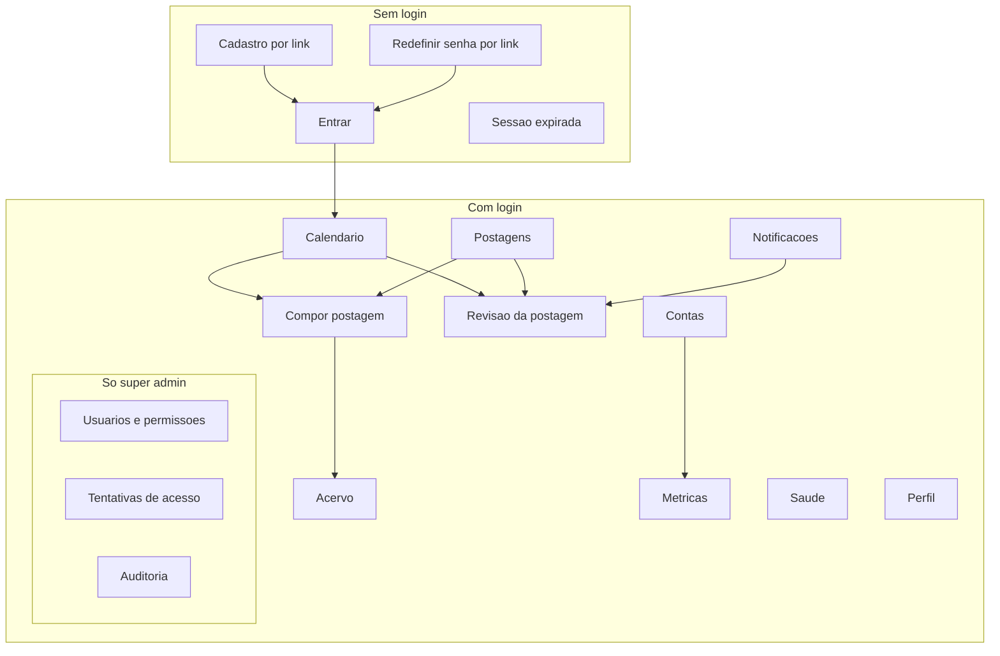

# 13 — Telas e Navegação

O mapa das telas do PostIt: para que serve cada uma, quem pode agir nela e como se comporta no celular.
Os estados de interface de cada fluxo estão nas jornadas de [04](04-jornada-usuario.md).

**Decisão de base:** o PostIt funciona **por completo no celular** — compor, enviar vídeo, marcar pessoas,
reagendar no calendário, aprovar, administrar. E pode ser instalado como aplicativo
([ADR 0017](adr/0017-pwa-e-notificacoes-push.md)).

---

## Princípios

1. **Celular primeiro.** Toda tela é desenhada para a tela pequena e depois ampliada. Não o contrário
2. **Esconder não é proteger.** Botões de ações sem permissão não aparecem, mas quem decide é a API
   ([ADR 0015](adr/0015-super-admin-e-permissoes.md))
3. **Toda ação importante tem alternativa sem gesto.** Arrastar é atalho, nunca o único caminho
4. **Os limites aparecem onde a pessoa decide.** Avisos de formato, tamanho e recursos indisponíveis ficam
   na tela de composição, não em ajuda escondida
5. **Nada de dado sensível fora da tela logada** — nem no push, nem em cache do aparelho

---

## Navegação

| | Celular | Computador |
|---|---|---|
| Conta ativa | Pílula no topo das telas da conta — e **só nelas**: no celular o topo é estreito, e uma pílula em Perfil ou Acervo custaria uma faixa numa tela que não é da conta. **Os alvos da barra inferior voltam para a última conta usada**, e não para a tela de Contas: é por eles que se volta | Seletor no topo da barra lateral, sob o rótulo "CONTA" — **também nas telas gerais**, mostrando a última conta usada |
| Menu principal | Barra inferior com até 5 itens — **escondida na página da postagem**, onde o rodapé é das ações da etapa, como num checkout ([ADR 0026](adr/0026-postagem-em-duas-etapas.md)) | Barra lateral de 248 px, em dois grupos: **Nesta conta** e **Geral** |
| Itens | Calendário, Postagens, Nova postagem, Notificações, Mais | Todos os itens abaixo |
| "Mais" | Métricas, Acervo, Contas, Saúde, Perfil, Administração | — |
| Nova postagem | Botão central da barra inferior, 56 × 56 com raio 18 | Botão de 40 px na barra lateral |
| Quem está usando | Cartão no fim da folha "Mais" | Cartão no rodapé da barra lateral |
| Onde estou | Migalha "conta / seção" no topo do conteúdo | A mesma migalha, acima do título |

O **"Sair"** mora no cartão de quem está usando, nos dois tamanhos de tela, e também na tela Perfil — que no celular
é onde a pessoa procura quando quer resolver algo da própria conta. Não há cabeçalho no computador: o cartão do
rodapé e a migalha já dizem quem é e onde está.

Itens aparecem conforme permissão: **Administração** só para super admin; **Nova postagem** só com
`POSTAGEM_EDITAR`.

Espaçamento seguro para o entalhe e a barra de gestos do celular, e altura de tela dinâmica — padrão já usado
no `nossobuncker`.

---

## Conta ativa

A pessoa escolhe **uma vez** a conta do Instagram em que vai trabalhar, e as telas da conta passam a valer só para
ela. Nada de escolher a conta de novo a cada postagem, filtro ou métrica (RF-A09).

| Telas da conta — seguem o seletor | Telas gerais — independem da conta |
|---|---|
| Calendário, Postagens, Compor, Revisão, Métricas | Notificações, Acervo, Contas, Saúde, Perfil, Administração |

- **Notificações** lista avisos de todas as contas, cada um com a conta indicada. Tocar abre a postagem já na
  conta dela
- **Acervo** é compartilhado: uma mídia enviada pode ser usada em qualquer conta **e em qualquer
  formato**. Por isso o envio não pergunta o formato de destino e não confere proporção — quem faz
  isso é a composição, contra o formato escolhido (RF-B03). É também por ser compartilhado que a
  recusa de excluir (RF-B07) **não diz qual postagem** segura a imagem: ela pode ser de outra conta,
  e a tela do acervo não conhece — nem deve conhecer — o outro lado
- **Saúde** mostra todas as contas lado a lado — cota, token, falhas —, porque é onde se percebe problema em conta
  que ninguém está olhando

### O seletor

- Mostra foto, nome e @ de cada conta conectada, e a conta ativa marcada
- Avisa ali mesmo quando uma conta precisa de atenção, **no lugar do @**: "Reconectar em 5 dias" em `--warning`,
  "Sem acesso · reconectar" em `--destructive`. É frase, e não ícone: quem precisa reconectar precisa saber em
  quantos dias, e um triângulo não diz isso
- Campo de busca quando há mais de cinco contas
- Último item, depois de um risco: **Gerenciar contas**, com ícone de engrenagem, que leva à tela Contas
- No computador é um cartão ancorado no botão; no celular, uma folha que sobe de baixo

  ⚠️ **A forma do celular não tem artboard de referência.** A `SeletorConta` do canvas é 320×600 — largura
  de barra lateral —, e nenhuma artboard de celular (390×844) mostra o painel aberto, só a pílula fechada.
  Confirmado em 18/09/2026, depois de a dúvida aparecer no uso. A folha foi mantida por três razões: fica ao
  alcance do polegar, enquanto a pílula está no topo; cresce com o número de contas sem estourar a tela; e
  sobra espaço para a busca quando houver mais de cinco contas.
- Navegável só pelo teclado, e com rótulo para leitores de tela

### Como funciona por dentro

**A conta ativa fica no endereço da página**, e não guardada no servidor: `/c/<conta>/calendario`,
`/c/<conta>/postagens/<id>`. No lugar de `<conta>` vai o **@ da conta** — `/c/loja.aurora/calendario` —, porque
o endereço é lido por gente: quem recebe o link sabe de que conta ele é antes de abrir. Se o @ mudar no
Instagram, o endereço antigo deixa de existir e a tela manda de volta para a lista de contas, em vez de mostrar
uma conta errada. Por quê:

- **Duas abas podem ficar em contas diferentes**, cada uma com seu endereço, sem uma trocar a conta da outra
- **Links funcionam sozinhos:** a notificação, o favorito do navegador e o link mandado para um colega já levam
  à conta certa
- **Toda chamada à API leva a conta explicitamente.** A API confere que a postagem pertence à conta do endereço;
  se não pertencer, a tela redireciona para o endereço com a conta certa, em vez de mostrar uma conta e agir em
  outra

A **última conta usada** fica num cookie do navegador, só com o identificador da conta. Serve para abrir o
sistema já nela e para a casca continuar mostrando-a nas telas gerais; não vale como autorização de nada.

#### A conta na casca das telas gerais — desde 22/09/2026

Nas telas gerais o endereço não tem conta, mas **a casca continua mostrando a última usada**: o seletor exibe
aquela conta, e Calendário, Postagens e Métricas seguem sendo link para ela. Antes, abrir o Acervo dizia
"Nenhuma conta" e apagava os três itens com o título "Conecte uma conta primeiro" — mentira, quando há conta
conectada —, e voltar custava escolher a conta outra vez.

⚠️ **São duas perguntas diferentes, e só uma mudou.** "Em que conta a ação acontece?" continua sendo respondida
**só pelo endereço** (AGENTS.md, regra 24), e nas telas gerais não há ação de conta nenhuma — o Acervo é
compartilhado, o Perfil é de quem está usando. O que a casca responde é "para qual conta os atalhos apontam?",
e essa resposta nunca vira alvo de escrita.

**Escolher conta continua sendo navegar.** De uma tela geral, escolher uma conta no seletor leva ao calendário
dela: sem isso, "trocar de conta" viraria estado guardado, que é justamente o que o endereço existe para evitar.

⚠️ **O valor do cookie sozinho não serve.** Ele chega pelo layout autenticado, e o layout congela na primeira
carga completa (regra 25): quem entrou numa conta, trocou para outra e foi ao Acervo veria a **primeira**. Por
isso o endereço atual tem precedência e o cookie é só a semente — é o que faz `useShellAccount()`.

### Proteção contra agir na conta errada

- A conta ativa aparece **sempre visível**: na barra lateral, no topo das telas do celular e no caminho da página
  ("Loja Aurora / Postagens / Nova postagem")
- Trocar de conta com alterações não salvas pergunta antes, como sair de qualquer tela com edição pendente
- Revisar, aprovar e agendar mostram a foto e o nome da conta junto do botão

---

## Mapa de telas



| Tela | Para quê | Agir exige | Requisitos | No celular |
|---|---|---|---|---|
| **Entrar** | E-mail e senha, depois o código de 6 dígitos | — | RF-H01, RF-H04, RF-H05 | Teclado numérico no campo do código; preenchimento automático do código quando o sistema operacional oferece |
| **Cadastro** | Definir senha e cadastrar duas etapas pelo link | — | RF-H06, RF-H04 | O QR code não serve se o aplicativo autenticador está no mesmo celular: a tela oferece "abrir no aplicativo autenticador" |
| **Redefinir senha** | Nova senha pelo link | — | RF-H06 | — |
| **Calendário** | Ver e reorganizar a programação | Arrastar ou mover: `POSTAGEM_AGENDAR` | RF-D06, RF-D07, RF-D08 | Visão de **agenda** (lista por dia) como padrão; mês e semana disponíveis. Mover por toque longo e arrastar, **ou** pelo menu "Mover para…" |
| **Postagens** | Lista da conta ativa, com filtros por status e período; fila de pendências. A que falhou mostra a causa em uma linha, em vermelho, até alguém decidir (ADR 0007) | — | RF-E06, RF-A09, RF-F07 | Filtros numa folha deslizante |
| **Postagem · 1 Composição** | A etapa 1 da página da postagem ([ADR 0026](adr/0026-postagem-em-duas-etapas.md)), só para rascunho e para quem edita: formato, mídia, legenda, **texto alternativo de cada foto**; marcações e colaboradores apagados até a Fase 2. **Sem horário**. No topo, as duas etapas; a que voltou reprovada mostra quem reprovou e o motivo. Rodapé: "Salvar rascunho" e **"Continuar para revisão"** (quem pode aprovar) ou **"Enviar para revisão"** (quem só edita) | `POSTAGEM_EDITAR` | RF-B01 a RF-B05, RF-C01 a RF-C12, RF-E01, RF-A09 | Etapas "Etapa 1 de 2" com duas barras; ações fixas no rodapé, **no lugar da barra inferior**. A composição em subetapas, com as marcações, fica para a Fase 2 |
| **Postagem · 2 Revisão** | A etapa 2 — e a página inteira para todo estado depois do rascunho, e para quem não edita. A prévia fiel e os **detalhes de cada foto** de um lado; do outro, o **cartão de estado e decisão** — em revisão: aprovar e agendar (data e hora no fuso da conta) ou reprovar com motivo; aprovada: agendar; agendada: reagendar, editar, cancelar o agendamento; publicando: "tentativa N de 5"; publicada: quando e **Ver no Instagram**; falhou: a causa com o botão dela, reagendar com a próxima hora cheia, voltar para rascunho, cancelar, e o histórico técnico recolhido (ADR 0007) — e os **comentários internos com o histórico intercalado**. Toda decisão que desfaz algo confirma na própria tela. Desenho do `RevisaoDesktop` e do `FalhaCelular`, e do protótipo aprovado em 23/09/2026 | Aprovar e reprovar: `POSTAGEM_APROVAR`; agendar: `POSTAGEM_AGENDAR`; voltar para a composição: `POSTAGEM_EDITAR`; comentar: qualquer logado; reconectar: `CONTA_GERENCIAR` | RF-E02 a RF-E05, RF-D01, RF-D04, RF-F03, RF-F07, RF-F09, RF-B05 | O cartão primeiro, depois a prévia, as fotos e os comentários; as ações principais fixas no rodapé, **no lugar da barra inferior** |
| **Acervo** | Mídias enviadas, reaproveitar, **excluir** | Enviar e excluir: `POSTAGEM_EDITAR` | RF-B01, RF-B04, RF-B07 | Envio pela câmera ou galeria |
| **Contas** | Contas conectadas, prazo do token, cota | Conectar, desconectar, fuso: `CONTA_GERENCIAR` | RF-A01 a RF-A08 | — |
| **Métricas** | Da conta ativa: por postagem e da conta, com evolução | — | RF-G01 a RF-G07 | Gráficos com rolagem horizontal; números-chave em cartões |
| **Notificações** | Sino: lista dos próprios avisos, de todas as contas, com a frase montada na hora e o horário no fuso da conta; tocar abre a tela do aviso e marca como lido; "Marcar todas como lidas". O **selo** na navegação é a lima dos contadores (`--highlight`), com "9+" acima de 9, e some com zero; o número é consultado a cada 60 s e ao voltar para a aba | — | RF-J01 | O sino é um dos cinco alvos da barra inferior, com o selo sobre o ícone. Também acessível pelo toque no push |
| **Saúde** | Todas as contas: cota, tokens, falhas, filas | Decidir sobre falha: `POSTAGEM_AGENDAR` | RF-H02, RF-F07 | — |
| **Perfil** | Identidade e permissões efetivas; Segurança (senha, duas etapas, códigos de recuperação) num bloco só; aparelhos conectados; preferências de notificação e ativar push neste aparelho | — | RF-H07, RF-J03, RF-J04 | Duas colunas no computador. Cada bloco **diz o estado** antes de oferecer o botão, e o formulário abre na linha. "Instalar o PostIt" e "Ativar notificações" ficam aqui, na Fase 1 |
| **Usuários e permissões** | Criar, desativar, reativar, promover; marcar permissões | Super admin, com confirmação recente | RF-I02, RF-I03, RF-I06, RF-I09 | Permissões como lista de interruptores |
| **Tentativas de acesso** | Tentativas, bloqueios, liberar bloqueio | Super admin | RF-I05 | Filtros numa folha deslizante |
| **Auditoria** | Ações administrativas | Super admin | RF-I07 | — |
| **Sessão expirada** | Explica e leva ao login | — | RF-H01 | — |

---

## Pontos delicados no celular

### Calendário

Arrastar postagens com o dedo é impreciso e se confunde com rolar a tela. Por isso:

- A **visão de agenda** — uma lista de dias com as postagens — é o padrão no celular
- Mover exige **toque longo** antes de arrastar, para não disparar sem querer
- Toda postagem tem o menu **"Mover para…"**, com seletor de data e hora — o caminho garantido, e também o
  acessível para leitores de tela
- Soltar em horário passado é recusado e a postagem volta ao lugar

### Editor de marcações

- Tocar na imagem cria uma marcação no ponto tocado
- Arrastar ajusta a posição; a marcação mostra um marcador maior que o dedo, deslocado acima dele, para a
  pessoa ver onde está soltando
- Zoom com dois dedos para posicionar com precisão
- Lista das marcações abaixo da imagem, para editar ou remover sem precisar acertar o ponto

### Envio de vídeo pelo celular

- Câmera ou galeria, com progresso real
- Antes de enviar, a tela confere tipo e tamanho e **avisa quando o arquivo é grande e a conexão parece ser
  móvel**
- **Limitação registrada:** o envio assinado não retoma de onde parou. Se a conexão cair no meio de um vídeo de
  300 MB, o envio recomeça do zero. Envio em partes (multipart), que permite retomar, é a evolução prevista
- A tela não pode ser bloqueada durante o envio sem aviso: o navegador pode interromper o envio com a tela
  apagada

### Cadastro das duas etapas no próprio celular

Ler um QR code com a câmera do mesmo aparelho que mostra o QR code é impossível. A tela oferece o link
`otpauth://`, que abre direto o aplicativo autenticador instalado.

---

## Instalação e notificações

- **Instalar:** no Android e em navegadores de computador, o próprio navegador oferece. No iPhone, é pelo
  menu de compartilhar → "Adicionar à Tela de Início"; a tela de Perfil explica o passo a passo
- **Ativar push:** sempre por um botão explícito no Perfil — nunca uma pergunta de permissão ao abrir o
  sistema, que as pessoas recusam por reflexo
- **No iPhone**, push só funciona com o PostIt instalado na tela inicial (item V-21 a confirmar)
- Detalhes em [ADR 0017](adr/0017-pwa-e-notificacoes-push.md) e na jornada 11 de [04](04-jornada-usuario.md)

---

## Identidade visual

**Aprovada em 15/09/2026.** Proposta visual completa, com telas de exemplo, no
[canvas de identidade visual](https://claude.ai/artifact/8LakiUmjRBfnxRtwBcKAft). Personalidade **criativa e
vibrante**: azul saturado como cor principal, uma faísca de lima para destaques e títulos expressivos. A base
continua sendo o `shadcn/ui` com Tailwind v4 ([06](06-stack.md)); os valores abaixo substituem o tema padrão.

**Telas de referência aprovadas**, no mesmo canvas: calendário no celular, composição no computador, seletor de conta,
marcar pessoas no celular, postagem que falhou, entrar com duas etapas, métricas da conta no celular e revisão e
aprovação. Elas fixam os padrões — barra lateral, seletor de conta, cartões, pílulas de status, prévia, ações no
rodapé do celular. As demais telas seguem esses padrões direto no código, sem desenho próprio.

**Sem degradês nas telas.** A vibração vem da cor e da tipografia, não de efeitos. Fora de cogitação por causa das
marcas: o degradê rosa-roxo-laranja do Instagram e o amarelo de bloco adesivo
([ADR 0016](adr/0016-nome-do-produto.md)).

### Cores do tema

Nomes das variáveis do `shadcn/ui`. O tema segue a configuração do aparelho, com opção de trocar no Perfil.

| Variável | Claro | Escuro | Uso |
|---|---|---|---|
| `--background` | `#F6F7FB` | `#0C0E16` | Fundo da página |
| `--card`, `--popover` | `#FFFFFF` | `#151826` | Cartões, painéis, menus |
| `--muted`, `--secondary` | `#EEF1F8` | `#1D2133` | Botão secundário, áreas de apoio |
| `--border`, `--input` | `#E1E5EF` | `#2A2F45` | Bordas e campos |
| `--foreground` | `#10131C` | `#EEF0F8` | Texto |
| `--muted-foreground` | `#5A6275` | `#9AA2BA` | Texto de apoio |
| `--primary`, `--ring` | `#3544E6` | `#6D86FF` | Ação principal, foco, item ativo |
| `--primary-foreground` | `#FFFFFF` | `#0C0E16` | Texto sobre a primária |
| `--accent` | `#E4E8FF` | `#232A5C` | Fundo de item selecionado e do anel de foco |
| `--destructive` | `#DC2626` | `#F87171` | Só ações destrutivas e falhas |
| `--highlight` (própria) | `#C6F432` | `#C6F432` | Lima: dia de hoje, contadores novos, ponto do ícone. Texto sobre ela: `#182000` |
| `--warning` (própria) | `#9A4705` | `#F0A35E` | Aviso que ainda dá tempo de resolver — "Reconectar em 5 dias". Não é a `--destructive`: o acesso continua funcionando |

**Escala do azul PostIt:** 50 `#EEF1FF` · 100 `#E4E8FF` · 200 `#C7D0FF` · 300 `#A0B0FF` · 400 `#6D86FF` ·
500 `#4A61FB` · 600 `#3544E6` · 700 `#2B36C2` · 800 `#262F9B` · 900 `#232A72` · 950 `#171B47`.

### Cores dos status

Sempre em pílula **com o nome escrito** e um ponto da mesma cor — nunca só a cor, por acessibilidade.

**O nome que aparece na pílula** é o do código (`POST_STATUS_LABELS`), no feminino porque concorda com
"postagem": Rascunho, Em revisão, **Pronta**, **Agendada**, **Publicando**, **Publicada**, Falhou, **Descartada**.
A tabela abaixo usa os nomes dos estados só para dizer a cor. Decidido em 23/09/2026.

| Status | Claro: texto / fundo | Escuro: texto / fundo |
|---|---|---|
| Rascunho | `#525B6E` / `#ECEFF5` | `#B4BBCB` / `#262A3B` |
| Em revisão | `#9A4705` / `#FDEFC8` | `#FBBF45` / `#3B2C0C` |
| Aprovado | `#0B6B80` / `#D3F5FB` | `#4FD8EE` / `#0C3440` |
| Agendado | `#3544E6` / `#E4E8FF` | `#8FA2FF` / `#232A5C` |
| Processando | `#6232C9` / `#EFE7FF` | `#B69CFF` / `#2E2257` |
| Publicado | `#13733A` / `#D9F7E3` | `#5EE08E` / `#0F3A23` |
| Falhou | `#B91C1C` / `#FDE2E2` | `#FF8A8A` / `#431717` |
| Cancelado | `#6B7280`, só borda, texto riscado | `#8D94A6`, só borda, texto riscado |

### Cores dos avatares de conta

Conta sem foto mostra as iniciais sobre uma destas três combinações — **fundo e texto andam sempre juntos**, para o
contraste não depender de sorte:

| Fundo | Texto |
|---|---|
| `#262F9B` (azul 800) | `#C6F432` (lima) |
| `#0B6B80` (teal) | `#D3F5FB` |
| `#171B47` (azul 950) | `#A0B0FF` |

A escolha sai do **@ da conta**, nunca da posição na lista: a mesma conta fica com a mesma cor em toda tela e depois
de qualquer reordenação. É essa constância que faz o avatar servir de reconhecimento rápido. Nada de cor gerada por
matemática a partir do nome — ela cai em tons ilegíveis.

### Tipografia

| Papel | Fonte | Tamanhos |
|---|---|---|
| Títulos | **Bricolage Grotesque**, 600 a 800 | 34 px título de página · 28 · 20 · 18 |
| Texto | **Figtree**, 400 a 700 | 16 px leitura · 14 px formulários, listas e tabelas · 12 px rótulos |
| Horários e contadores | Figtree com números tabulares | — |

**As fontes são servidas pelo próprio app**, com `next/font`, que as baixa na construção. A CSP só permite fontes
do próprio site (`font-src 'self'`, [ADR 0014](adr/0014-csp-e-cabecalhos-de-seguranca.md)): carregar direto do
Google Fonts seria bloqueado.

### Forma

- **Raio:** 10 px em botões e campos, 16 px em cartões e painéis, pílula em status, formatos e filtros
- **Altura dos controles:** 40 px no computador, **44 px no celular**
- **Ícones:** `lucide-react`, traço 2, 20 px no computador e 22 px na barra inferior do celular
- **Barras de rolagem:** finas, sem trilho, com o polegar arredondado no cinza do texto secundário a 40% — 60% sob o
  ponteiro. Nenhuma cor nova: o tema escuro vem junto. Definidas uma vez, em `globals.css`, para o sistema inteiro
  (desde 23/09/2026)
- **Telas de entrada:** página inteira, sem cartão — logo de 44 px, rótulo de etapa, título de 30 px, campos e
  botão de 52 px. O código de 6 dígitos aparece em **seis caixas de 60 px**, com um campo de texto só por baixo:
  são as caixas que são desenho, e não o campo, para o colar, o apagar e o leitor de tela continuarem funcionando

### Ícone do app — opção A, "Ponto"

P geométrico branco sobre o azul PostIt, com o ponto lima no miolo: o momento marcado no calendário.

```svg
<svg viewBox="0 0 512 512" xmlns="http://www.w3.org/2000/svg">
  <rect width="512" height="512" rx="116" fill="#3544E6"/>
  <rect x="126" y="112" width="72" height="290" rx="22" fill="#FFFFFF"/>
  <path d="M162 148 H268 A82 82 0 0 1 268 312 H162" fill="none" stroke="#FFFFFF" stroke-width="72" stroke-linejoin="round"/>
  <circle cx="268" cy="230" r="24" fill="#C6F432"/>
</svg>
```

| Onde | Versão |
|---|---|
| Manifesto do app instalável | 192 e 512 px com cantos arredondados, e uma versão **maskable**: fundo azul sem cantos, que o sistema recorta. O P já cabe na zona segura |
| Favicon, 16 e 32 px | **Sem o ponto lima**, que some nesse tamanho |
| Painel da Meta, nos dois apps | A mesma arte, no tamanho que o painel pedir |
| Topo da barra lateral | 32 px, ao lado do nome PostIt em Bricolage Grotesque 800 |

### Acervo

**Cada card tem uma lixeira no canto superior direito.** No ponteiro preciso ela aparece com o cursor
sobre o card ou com o **foco do teclado**; no toque fica **sempre visível**, porque hover não existe
lá. O alvo é de 44 px, com o desenho de 32 px dentro. Imagem em uso mostra "Em uso numa postagem" e a
lixeira nasce desligada — **apagada, não escondida**, pelo mesmo motivo das incompatíveis na
composição.

**"Selecionar" liga o modo de várias.** As lixeiras somem — um gesto destrutivo por card —, uma caixa
aparece no canto superior esquerdo, e **o card inteiro é a caixa** (`role="checkbox"`): um controle
menor dentro dele seria botão dentro de botão, com alvo de toque abaixo do mínimo. A barra "N
selecionadas · Cancelar · Excluir N" fica grudada no rodapé no celular e na linha do título no
computador.

**Excluir várias pergunta antes**, numa folha de baixo no celular e caixa centrada no computador; a
lixeira de um card, não — é uma imagem só, e chegar até ela já é deliberado. A confirmação é uma folha
e não um segundo estado da barra: ali o "Excluir 8" e o "Confirmar" cairiam no mesmo pixel.

### Prévia da postagem

A prévia na composição e na revisão imita **a estrutura** de um post no feed — foto e nome do perfil, mídia com
contador do carrossel e indicador de marcações, ações, legenda cortada em "mais" — com ícones genéricos, sem logo
nem fonte do Instagram. Segue fundo branco ou preto conforme o tema. **Não mostra** localização, que a API não
permite, nem curtidas, que só existem depois de publicar; uma nota abaixo da prévia avisa as duas ausências.

**No carrossel** (a partir de 21/09/2026) ela navega entre as imagens — contador `2/5` sobre a mídia, setas e
pontinhos — e desenha o quadro na proporção da **primeira** imagem. As outras entram **inteiras** nesse quadro, com
faixas pretas (`--ig-letterbox`) onde a proporção difere — é o que o Instagram publica (docs/08, observado em
23/09/2026); até ali a prévia as recortava. Avisa disso **abaixo** do
cartão. Como qualquer informação nossa, o aviso fica fora da moldura: dentro dela, quebraria a imitação no lugar
exato onde a pessoa está comparando com o aplicativo que conhece.

**Faixas pretas no carrossel:** na composição, a foto que vai sair com faixas ganha a tarja âmbar "Faixas pretas ·
Ajustar", com a frase abaixo da faixa, e a tarja abre o recorte na proporção da foto 1
([ADR 0025](adr/0025-ajustar-imagem-ao-formato.md#o-quadro-do-carrossel)).

**Na composição**, a faixa de miniaturas mostra de 1 a 10 imagens com o número da posição em cada uma, e **termina
num quadrado pontilhado de 112 px com "+ Adicionar"** — o próximo lugar, e não um botão solto sem relação visual
com as fotos. Ele abre um menu com **"Do acervo"** e **"Enviar nova"**, e some quando o formato já está cheio.

**Reordenar é por arrasto**, que é o gesto natural, **e pelos botões `◀ ▶`**, que continuam ali: o arrasto começa
na foto (os controles não arrastam) e, no dedo, só depois de segurar — senão rolar a faixa reordenaria sem querer.
As setas não são redundância, são o que esta página exige como alternativa a toda ação por gesto, e é por elas que
passa quem usa teclado ou leitor de tela. As duas entradas anunciam o resultado por `aria-live`.

**"Enviar nova"** abre o seletor do sistema e mostra a imagem escolhida **antes de qualquer byte subir**, com
"Usar esta imagem" ou "Escolher outra" — e, quando ela não serve ao formato, a oferta de ajuste na mesma tela.

**O acervo abre como folha de baixo no celular e caixa centrada no computador**, resolvido **por classes, sem
JavaScript de breakpoint** — o projeto não tem hook de media query, e renderizar um contêiner para cada tamanho
faria dois `role="dialog"` na mesma página.

### Ajustar a imagem que não serve (a partir de 22/09/2026)

A foto de celular em pé é 3:4 e não cabe no feed pela API. Em vez de barrá-la, a tela **oferece o ajuste**, e há
três portas para a mesma folha ([ADR 0025](adr/0025-ajustar-imagem-ao-formato.md)):

| Porta | O que a pessoa vê | O que acontece depois |
|---|---|---|
| Card do seletor do acervo | "Ajustar para Feed" no lugar de "Não serve para Feed", e o card **não** apagado | A ajustada **entra** na postagem |
| Tarja vermelha da miniatura na faixa | A mesma tarja de sempre, agora tocável | A ajustada **substitui** aquela posição |
| Confirmação do "Enviar nova" | "Ajustar para Feed" ao lado de "Escolher outra" | Sobe a ajustada; a original não sobe |

A folha tem duas pílulas — **Recortar** e **Imagem inteira** — sobre a mesma prévia, para dar para **comparar**: o
véu escuro mostra o que sai no recorte, e a moldura branca mostra o que sobra na outra. Um controle deslizante
escolhe a faixa que fica; no modo "imagem inteira" ele some, porque não há grau de liberdade nenhum.

**Duas regras da tela:** ajustar nunca acontece sozinho — é sempre um toque —, e a tarja continua **vermelha** ao
virar botão, porque a imagem segue bloqueando o salvamento. A cor diz o problema; o texto diz a saída. Enquanto o
arquivo sobe, a folha **não fecha**.

**Apagado passou a significar uma coisa só: "não dá".** Sobrou para a imagem presa numa postagem (RF-B07) e para a
que não cabe porque a postagem chegou ao limite de mídias — nos dois casos não há ajuste que resolva.

---

## Acessibilidade

- Contraste mínimo WCAG AA
- Toda ação por gesto tem alternativa por botão ou menu
- Áreas de toque de no mínimo 44 × 44 px
- Formulários com rótulos visíveis e mensagens de erro ligadas ao campo
- O próprio produto incentiva texto alternativo nas imagens publicadas (RF-B05)

---

## Documentos relacionados

- [04 — Jornada do Usuário](04-jornada-usuario.md) — os estados de interface de cada fluxo
- [02 — Requisitos](02-requisitos.md) — RNF-15, uso completo no celular
- [15 — Qualidade e fluxo de trabalho](15-qualidade-e-fluxo-de-trabalho.md) — testes de tela em celular e computador
