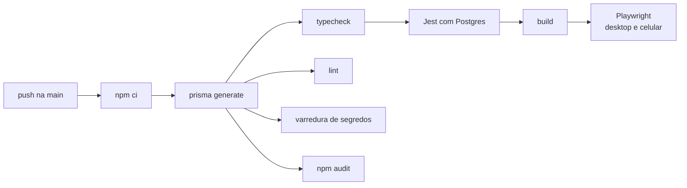

# 15 — Qualidade e Fluxo de Trabalho

Como o código chega do computador à produção: git, versões, integração contínua e testes.

---

## Git

### Fluxo: direto na `main`

- Commits vão **direto na `main`**, como no `hotclone`
- A **integração contínua roda a cada push** e avisa por e-mail do GitHub quando algo quebra. Ela alerta; não
  impede o commit de entrar
- Antes de enviar, rodar localmente `npm run typecheck`, `npm run lint` e `npm run test`
- Branches são opcionais, para experimentos longos

**Consequência aceita:** um erro pode chegar à `main` antes de a CI apontar. A proteção vem depois: a `main` não
vai para lugar nenhum sozinha; produção só recebe **versões marcadas**, depois de a CI passar e do roteiro manual
de publicação rodar no computador local, com a conta de testes. Não há homologação
([ADR 0019](adr/0019-sem-homologacao.md)). Versão com migration pede **dump manual** do banco antes do deploy
([10](10-infra-deploy.md#antes-de-uma-versão-com-migration-dump-manual)).

### Mensagens de commit

Padrão de `hotclone`, `alivio-crm` e `vortex`: `tipo(escopo): resumo`, em português, no imperativo, com corpo
explicando o porquê.

```
fix(publicacao): reaproveita container filho ainda válido na retomada

Um carrossel que falhava no nono item recriava os oito anteriores a cada
tentativa, consumindo a cota diária de containers.
```

| Tipo | Quando |
|---|---|
| `feat` | Funcionalidade nova |
| `fix` | Correção |
| `docs` | Só documentação |
| `test` | Só testes |
| `refactor` | Mudança de código sem mudar comportamento |
| `chore` | Dependências, configuração, scripts |
| `sec` | Correção de segurança |

### O que nunca entra no repositório

`.env` (exceto `.env.example`), client gerado do Prisma, `node_modules`, arquivos de credencial, backups de
banco, mídias. O `.gitignore` inclui padrões como `*-credenciais.*`, `*.dump` e `backup*.sql`, seguindo
`hotclone` e `vortex`.

---

## Versões

Padrão do `nossobuncker`:

- **Uma versão única** no `package.json` da raiz
- `scripts/version.mjs` propaga a versão para os pacotes e para `packages/shared/src/version.ts`
- A versão aparece em `/health`, no rodapé das telas e nos logs — em qualquer lugar dá para saber qual código
  está rodando
- **Hook de pre-commit** sobe o PATCH automaticamente; pular com `SKIP_BUMP=1`. Instalado por `core.hooksPath`
  no `postinstall`, como no `hotclone`
- **MINOR e MAJOR** só manualmente: `npm run version:minor`, `npm run version:major`
- **Liberar para produção** é marcar uma tag: `git tag -a v1.4.0 && git push --tags`. Depois, na etapa 1, apontar a
  branch `producao` para a tag e fazer o deploy no Easypanel; na etapa 2, `scripts/deploy.sh v1.4.0`
  ([10](10-infra-deploy.md#deploy))

Decidido em 24/09/2026, antes da primeira tag:

- **A estreia em produção é a `v1.0.0`.** Até lá a versão fica em `0.x`, e o `npm run version:major` imediatamente
  antes da tag faz a passagem
- **Tag anotada** (`git tag -a`), com a mensagem listando o que entrou — o resumo dos commits desde a tag
  anterior, em português. A tag leve não guarda autor, data nem motivo
- **O PATCH salta entre tags**, e é esperado: o pre-commit sobe a cada commit, então de `v1.0.0` a próxima pode ser
  `v1.0.37`. O número diz qual código está rodando, não quantas versões saíram
- **Sem changelog à parte.** `git log v1.0.0..v1.0.37` é o registro, e o padrão das mensagens de commit, com
  corpo explicando o porquê, é o que o torna legível

---

## Integração contínua

GitHub Actions, rodando a cada push na `main`. Referências: `security.yml` do `alivio-crm`, `concurrency` do
`hotclone`.



| Etapa | O quê | Por quê |
|---|---|---|
| Instalação | `npm ci`, Node 22.12+, cache do npm | Instalação idêntica ao lockfile |
| Prisma | Gerado pelo Turborepo antes do typecheck | Client gerado antes de tudo |
| Typecheck | `tsc --noEmit` em todos os pacotes | — |
| Lint | ESLint 9 | — |
| Varredura de segredos | Busca por padrões de chave e token no código versionado, como no `alivio-crm` | Segredo commitado por engano é pego antes de ficar no histórico por muito tempo |
| Auditoria | `npm audit --omit=dev --audit-level=high` | Vulnerabilidade alta ou crítica em dependência de produção |
| Migrations | `npm run db:deploy` no Postgres vazio da CI | Migration quebrada aparece aqui, e não no deploy |
| Testes da API | Jest, com **Postgres em container** | Ver abaixo |
| Build | `turbo build` | — |
| Testes de tela | Playwright, com Postgres e MinIO em container | Ver abaixo |

- **`concurrency` com cancelamento:** um push novo cancela a execução anterior ainda em andamento
- **CodeQL** — análise de segurança do código — toda semana e a cada push, como no `alivio-crm`
- **Dependabot** — atualizações de dependências — toda semana, com correções pequenas agrupadas.
  **Versão principal nova não vem por ele:** cada uma é decisão registrada (NestJS 11, Prisma 7, Next 16,
  React 19, ESLint 9, TypeScript 5) e várias dependem umas das outras — subir só o `@nestjs/common` para a 12
  quebra o `@nestjs/platform-fastify` 11. Subir de versão principal é trabalho manual, com leitura das
  mudanças incompatíveis e atualização dos docs. Quem vigia falha de segurança é o `npm audit` da CI
- **Não há deploy pela CI.** O deploy é pelo Easypanel (etapa 1) ou pelo `scripts/deploy.sh`, no servidor (etapa 2)

---

## Estratégia de testes

| Camada | Ferramenta | O quê | Onde |
|---|---|---|---|
| **Domínio** | Jest | Máquina de estados, invariantes, fuso horário, especificações de mídia, `safeRedirect()`, política de senha | `apps/api/src/domain/`, `packages/shared` |
| **Integração da API** | Jest + Postgres real | As quatro camadas de idempotência, transações do despachante, trava otimista, bloqueio de tentativas, invariante do último super admin, conflito de edição | `apps/api/src/**/*.spec.ts` |
| **Políticas** | Jest | Nenhuma rota sem política; matriz de permissões; só o worker importa publicação | `apps/api/src/autorizacao/` |
| **Telas, ponta a ponta** | Playwright | Fluxos completos pelo navegador | `apps/web/e2e/` |
| **Publicação real** | Manual | Roteiro da Fase 1 | Computador local, pelo túnel, conta de testes |

### Por que Postgres real nos testes da API

As garantias mais importantes do sistema — não publicar duas vezes, não perder agendamento, não ficar sem super
admin — dependem de **transações e travas do banco**. Um banco falso não reproduz o comportamento de duas
transações concorrentes. Testar isso com o Postgres de verdade é o único teste que vale.

**Trava de segurança**, como no `hotclone`: o teste **recusa rodar** se o nome do banco não terminar em `_test`.
Impede apagar o banco errado por engano de configuração.

**Os testes da API rodam em série**, um arquivo por vez (`maxWorkers: 1`): todos dividem o banco `postit_test`, e em
paralelo um arquivo mudaria os dados de outro no meio do teste.

**Dependências indiretas com falha de segurança** são corrigidas por `overrides` no `package.json` da raiz, com o
motivo de cada uma no comentário ao lado, e retiradas quando a dependência de origem publicar a correção. Nada de
`npm audit fix --force`, que troca versão principal do Prisma e do NestJS.

#### Avisos conhecidos e aceitos — 25/09/2026

O `npm audit` mostra **4 avisos moderados**, todos dentro do cliente `minio` 8.0.7 (a versão mais recente), que a
API usa para falar com o armazenamento. A CI não quebra por eles (ela barra só alto e crítico), e eles ficam **de
propósito**, até o `minio` publicar versão com as dependências atualizadas — o Dependabot traz o PR.

| Aviso | Caminho | O que permite |
|---|---|---|
| [GHSA-vcc3-ghjq-m6fr](https://github.com/advisories/GHSA-vcc3-ghjq-m6fr) | `minio` → `query-string` 7 → `decode-uri-component` 0.2.2 | Travar o processo decodificando um texto percent-encoded malformado |
| [GHSA-528h-pc64-c93x](https://github.com/advisories/GHSA-528h-pc64-c93x) | `minio` → `stream-json` 1.9 | Travar o processo com um JSON muito aninhado |

**Por que não se corrige agora:**

- **`npm audit fix --force` rebaixa o `minio` para a 7.1.3** — versão antiga, com quebra de API, justamente no envio e
  na publicação de mídia.
- **`overrides` não servem aqui**: a correção de cada uma está em outra versão principal. O `query-string` corrigido
  (9.5) só existe como módulo ES, e o `minio` o carrega como CommonJS; o `stream-json` corrigido (3.5) está duas
  versões principais acima da que o `minio` espera. Forçar arriscaria quebrar o armazenamento para fechar um risco
  que, aqui, não tem por onde entrar.

**Por que o risco é baixo:** as duas falhas são **só negação de serviço** — sem vazamento de dado nem execução de
código — e exigem que o atacante controle o texto que o cliente `minio` lê. No PostIt ele só lê o que o próprio
código monta (chaves de objeto geradas em hexadecimal, bucket fixo, nada vindo do usuário) e o que o **nosso** MinIO
responde, que não tem nome público e só é alcançado pela API na rede interna. Para explorar, seria preciso controlar
o armazenamento antes — e aí os arquivos já estariam expostos por outro caminho. O pior caso seria um processo
travado até reiniciar: a tela sem responder, ou publicações atrasadas, que a trava dos 15 minutos manda para
`FALHOU` com aviso em vez de publicar tarde.

**Reavaliar se** o PostIt passar a ler do armazenamento algo vindo de fora — por exemplo, listar objetos cujos nomes
o usuário escolhe —, ou se aparecer aviso **alto** em qualquer das duas.

### Playwright

Testes que abrem o navegador e usam o PostIt como uma pessoa usaria. Rodam com `npm run test:e2e`.

**Rodam em dois tamanhos de tela**, computador e celular, porque o sistema funciona por completo nos dois
([13](13-telas-e-navegacao.md)). O celular imita um Pixel, que usa o mesmo Chromium: um navegador só para instalar na CI.

**Rodam contra o build de produção** (`next start`), na porta 3100, e não contra o `npm run dev`: a CSP de produção é
mais estrita, e é ela que precisa passar. Antes de `npm run test:e2e`, rode `npm run build`. A Meta falsa sobe junto,
na porta 3199, e a API na 3111, contra o banco de teste.

**Rodam em série**, um arquivo por vez, pelo mesmo motivo do Jest: todos dividem o banco `postit_test`. Em paralelo,
um teste zera as contas enquanto o outro as insere — a lista sai duplicada e a falha aparece longe da causa.

**Entram no sistema uma vez.** Um projeto de preparação faz o primeiro acesso completo de dois usuários — um super
admin e um comum — e guarda a sessão; os demais testes começam logados. Refazer o cadastro das duas etapas em cada
teste custava uns 12 segundos por teste, e era o que estourava o tempo de forma aparentemente aleatória. Quem testa o
próprio fluxo de entrada continua fazendo tudo à mão, porque ele desloga.

**Nunca falam com a Meta real.** Na CI, uma **Meta falsa** — um pequeno servidor que imita as respostas da Graph
API, inclusive os erros — ocupa o lugar dela. O endereço da API da Meta só pode ser trocado quando
`NODE_ENV=test`; em qualquer outro ambiente, a variável é ignorada, para ninguém redirecionar tokens reais por
configuração.

Cenários obrigatórios:

| # | Cenário | Verifica |
|---|---|---|
| 1 | Primeiro acesso: link, senha, cadastro das duas etapas, códigos de recuperação | RF-H04, RF-H06 |
| 2 | Login com código gerado a partir do segredo de teste | RF-H04 |
| 3 | Senha certa sem código não entra; código reusado é recusado | RF-H04 |
| 4 | Onze senhas erradas bloqueiam a conta | RF-H05 |
| 5 | Editor não vê o botão de aprovar, e a chamada direta à API recebe 403 — `aprovacao.spec.ts`, com os usuários editor e aprovador da preparação | RF-I04 |
| 6 | Enviar PNG é convertido para JPEG e aceito, com aviso; GIF e arquivo que não é imagem são recusados com a mensagem certa | RF-B02, RF-B06 |
| 7 | Compor, aprovar, agendar e ver no calendário. Desde a 1e: compor, continuar para a revisão e **aprovar e agendar**; o calendário é da Fase 3 | RF-C01, RF-E02, RF-D01, RF-D06 |
| 8 | Publicação contra a Meta falsa, até `PUBLICADO` | RF-F01 a RF-F03 |
| 9 | Duas abas editando a mesma postagem: a segunda recebe o aviso de conflito | RF-C12 |
| 10 | Toda página tem CSP com nonce | RNF-14 |
| 11 | `/entrar?voltar=//site-externo.com` leva para a tela inicial | RF-H01 |
| 12 | Mover postagem pelo menu "Mover para…" no celular | RF-D07, RNF-15 |
| 13 | Trocar a conta ativa troca calendário e postagens; link de postagem de outra conta abre na conta certa; duas abas em contas diferentes não se afetam | RF-A09 |
| 14 | A revisão com papéis ([ADR 0026](adr/0026-postagem-em-duas-etapas.md)): o editor envia e não vê aprovar; quem aprova reprova com motivo obrigatório e o autor vê o motivo na composição; quem aprova sem agendar deixa "falta agendar"; cancelar o agendamento mantém a aprovação; editar uma agendada volta para a composição; quem só vê comenta; no celular, a decisão fica no rodapé no lugar da barra | RF-E01 a RF-E05 |

**O login com duas etapas nos testes** usa um usuário criado com um segredo TOTP conhecido só no ambiente de teste.
O teste calcula o código com a mesma biblioteca, como qualquer aplicativo autenticador faria.

---

## Documentos relacionados

- [14 — Ambientes e desenvolvimento](14-ambientes-e-desenvolvimento.md) — onde cada versão roda
- [10 — Infra e deploy](10-infra-deploy.md) — o deploy nas duas etapas
- [12 — Roadmap](12-roadmap.md) — o roteiro manual de publicação
