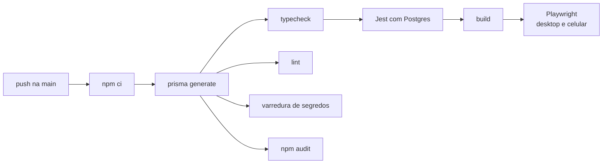

# 15 — Qualidade e Fluxo de Trabalho

Como o código chega do computador à produção: git, versões, integração contínua e testes.

---

## Git

### Fluxo: tudo por pull request, desde 06/10/2026

Com a v1.0.0 em produção, a `main` passou a ser protegida ([ADR 0032](adr/0032-main-protegida-e-fluxo-por-pull-request.md)).
Até lá, os commits iam direto nela.

- **Cada trabalho num branch** — `feat/…`, `fix/…`, `docs/…`, `chore/…` — e um **pull request** para a `main`
- **O PR só entra com o `verify` da CI verde** — typecheck, lint, testes, build, e2e e auditoria — e com o branch
  atualizado com a `main` (o botão "Update branch" faz isso)
- **Merge só por squash**: o **título do PR** vira o commit na `main`, então ele segue o padrão de mensagem abaixo, e a
  **descrição** vira o corpo — o porquê. O branch é apagado depois do merge
- **Sem aprovação obrigatória**: o projeto tem uma pessoa só, e o GitHub não deixa o autor aprovar o próprio PR. O
  portão é a CI
- **Ninguém envia direto à `main`**, nem o admin; push forçado e apagar a `main` são recusados. Numa emergência, o
  admin desliga a regra no painel, corrige e liga de novo — e isso fica no log de auditoria do GitHub
- **Um PR aberto por vez**: o pre-commit sobe a versão a cada commit, e dois PRs abertos juntos conflitam no número.
  O segundo resolve com "Update branch" e um commit novo
- Antes de abrir o PR, rodar localmente `npm run typecheck`, `npm run lint` e `npm run test`

**Os PRs do Dependabot passam pelo mesmo portão**: só entram com a CI verde, por squash.

Produção continua recebendo **só versões marcadas**, depois do merge: a tag é criada na `main` atualizada. Não há
homologação ([ADR 0019](adr/0019-sem-homologacao.md)). Versão com migration pede **dump manual** do banco antes do
deploy ([10](10-infra-deploy.md#antes-de-uma-versão-com-migration-dump-manual)).

### Proteções do repositório

O repositório é **público**, decisão de 06/10/2026: as proteções abaixo são gratuitas assim. Nenhum segredo entra
no git — o `.env` nunca, e a CI usa valores falsos.

| Proteção | O que faz |
|---|---|
| Ruleset da `main` | Só por PR, com o `verify` verde e o branch atualizado; histórico linear; sem push forçado nem apagar |
| Ruleset "só o admin cria" tags `v*` | Tag de versão publica a imagem de produção ([ADR 0030](adr/0030-compose-de-producao.md)): só o admin a cria |
| Ruleset "ninguém move nem apaga" tags `v*` | Uma tag publicada aponta para sempre para o mesmo commit — sem exceção, nem para o admin |
| Varredura de segredos e bloqueio de push | O GitHub recusa o push que contenha token ou chave conhecida, e varre o histórico |
| Dependabot: alertas e correções de segurança | Além das atualizações semanais, PR de correção quando sai uma vulnerabilidade conhecida |
| Relato privado de vulnerabilidade | Quem achar falha relata pela aba Security, sem expor publicamente — ver o `SECURITY.md` |
| Actions restritas | Só as do GitHub, as de criadores verificados e `docker/*`; fixadas por **hash de commit**, com a versão em comentário, e o Dependabot atualiza o hash |
| PR vindo de fork | A CI só roda depois da aprovação do admin |
| Permissão padrão das Actions | Só leitura; cada workflow pede o que precisa (`release.yml`: `packages: write`) |

### Mensagens de commit

Padrão de `hotclone`, `alivio-crm` e `vortex`: `tipo(escopo): resumo`, em português, no imperativo, com corpo
explicando o porquê.

```
fix(publicacao): reaproveita container filho ainda válido na retomada

Um carrossel que falhava no nono item recriava os oito anteriores a cada
tentativa, consumindo a cota diária de containers.
```

| Tipo | Quando |
|---|---|
| `feat` | Funcionalidade nova |
| `fix` | Correção |
| `docs` | Só documentação |
| `test` | Só testes |
| `refactor` | Mudança de código sem mudar comportamento |
| `chore` | Dependências, configuração, scripts |
| `sec` | Correção de segurança |

### O que nunca entra no repositório

`.env` (exceto `.env.example`), client gerado do Prisma, `node_modules`, arquivos de credencial, backups de
banco, mídias. O `.gitignore` inclui padrões como `*-credenciais.*`, `*.dump` e `backup*.sql`, seguindo
`hotclone` e `vortex`.

---

## Versões

Padrão do `nossobuncker`:

- **Uma versão única** no `package.json` da raiz
- `scripts/version.mjs` propaga a versão para os pacotes e para `packages/shared/src/version.ts`
- A versão aparece em `/health`, no rodapé das telas e nos logs — em qualquer lugar dá para saber qual código
  está rodando
- **Hook de pre-commit** sobe o PATCH automaticamente; pular com `SKIP_BUMP=1`. Instalado por `core.hooksPath`
  no `postinstall`, como no `hotclone`
- **MINOR e MAJOR** só manualmente: `npm run version:minor`, `npm run version:major`
- **Liberar para produção** é marcar uma tag na `main` atualizada, depois do merge:
  `git switch main && git pull && git tag -a v1.4.0 && git push origin v1.4.0`. Só o admin cria tag `v*`, e ela não
  se move depois. A tag dispara o `release.yml`, que publica a imagem no GHCR; depois, `POSTIT_TAG=v1.4.0` no serviço
  Compose do Easypanel e Deploy ([ADR 0030](adr/0030-compose-de-producao.md),
  [10](10-infra-deploy.md#etapa-1-easypanel-pelo-compose))
- **Subir MINOR ou MAJOR** é um PR como outro qualquer, com o commit do `npm run version:minor` feito com
  `SKIP_BUMP=1`

Decidido em 24/09/2026, antes da primeira tag:

- **A estreia em produção é a `v1.0.0`.** Até lá a versão fica em `0.x`, e o `npm run version:major` imediatamente
  antes da tag faz a passagem
- **Tag anotada** (`git tag -a`), com a mensagem listando o que entrou — o resumo dos commits desde a tag
  anterior, em português. A tag leve não guarda autor, data nem motivo
- **O PATCH salta entre tags**, e é esperado: o pre-commit sobe a cada commit, então de `v1.0.0` a próxima pode ser
  `v1.0.37`. O número diz qual código está rodando, não quantas versões saíram
- **Sem changelog à parte.** `git log v1.0.0..v1.0.37` é o registro, e o padrão das mensagens de commit, com
  corpo explicando o porquê, é o que o torna legível

---

## Integração contínua

GitHub Actions, rodando em cada pull request e a cada push na `main` (que só chega por merge). Referências: `security.yml` do `alivio-crm`, `concurrency` do
`hotclone`.


```mermaid
flowchart LR
    A[push na main] --> B[npm ci]
    B --> C[prisma generate]
    C --> D[typecheck]
    C --> E[lint]
    C --> F[varredura de segredos]
    C --> G[npm audit]
    D --> H[Jest com Postgres]
    H --> I[build]
    I --> J[Playwright<br/>desktop e celular]
```

| Etapa | O quê | Por quê |
|---|---|---|
| Instalação | `npm ci`, Node 22.12+, cache do npm | Instalação idêntica ao lockfile |
| Prisma | Gerado pelo Turborepo antes do typecheck | Client gerado antes de tudo |
| Typecheck | `tsc --noEmit` em todos os pacotes | — |
| Lint | ESLint 9 | — |
| Varredura de segredos | Busca por padrões de chave e token no código versionado, como no `alivio-crm` | Segredo commitado por engano é pego antes de ficar no histórico por muito tempo |
| Auditoria | `npm audit --omit=dev --audit-level=high` | Vulnerabilidade alta ou crítica em dependência de produção |
| Migrations | `npm run db:deploy` no Postgres vazio da CI | Migration quebrada aparece aqui, e não no deploy |
| Testes da API | Jest, com **Postgres em container** | Ver abaixo |
| Build | `turbo build` | — |
| Testes de tela | Playwright, com Postgres e MinIO em container | Ver abaixo |

- **`concurrency` com cancelamento:** um push novo cancela a execução anterior ainda em andamento
- **CodeQL** — análise de segurança do código — toda semana e a cada push, como no `alivio-crm`
- **Dependabot** — atualizações de dependências — toda semana, com correções pequenas agrupadas.
  **Versão principal nova não vem por ele:** cada uma é decisão registrada (NestJS 11, Prisma 7, Next 16,
  React 19, ESLint 9, TypeScript 5) e várias dependem umas das outras — subir só o `@nestjs/common` para a 12
  quebra o `@nestjs/platform-fastify` 11. Subir de versão principal é trabalho manual, com leitura das
  mudanças incompatíveis e atualização dos docs. Quem vigia falha de segurança é o `npm audit` da CI
- **Não há deploy pela CI.** O deploy é pelo Easypanel (etapa 1) ou pelo `scripts/deploy.sh`, no servidor (etapa 2)

---

## Estratégia de testes

| Camada | Ferramenta | O quê | Onde |
|---|---|---|---|
| **Domínio** | Jest | Máquina de estados, invariantes, fuso horário, especificações de mídia, `safeRedirect()`, política de senha | `apps/api/src/domain/`, `packages/shared` |
| **Integração da API** | Jest + Postgres real | As quatro camadas de idempotência, transações do despachante, trava otimista, bloqueio de tentativas, invariante do último super admin, conflito de edição | `apps/api/src/**/*.spec.ts` |
| **Políticas** | Jest | Nenhuma rota sem política; matriz de permissões; só o worker importa publicação | `apps/api/src/autorizacao/` |
| **Telas, ponta a ponta** | Playwright | Fluxos completos pelo navegador | `apps/web/e2e/` |
| **Publicação real** | Manual | Roteiro da Fase 1 | Computador local, pelo túnel, conta de testes |

### Por que Postgres real nos testes da API

As garantias mais importantes do sistema — não publicar duas vezes, não perder agendamento, não ficar sem super
admin — dependem de **transações e travas do banco**. Um banco falso não reproduz o comportamento de duas
transações concorrentes. Testar isso com o Postgres de verdade é o único teste que vale.

**Trava de segurança**, como no `hotclone`: o teste **recusa rodar** se o nome do banco não terminar em `_test`.
Impede apagar o banco errado por engano de configuração.

**Os testes da API rodam em série**, um arquivo por vez (`maxWorkers: 1`): todos dividem o banco `postit_test`, e em
paralelo um arquivo mudaria os dados de outro no meio do teste.

**Dependências indiretas com falha de segurança** são corrigidas por `overrides` no `package.json` da raiz, com o
motivo de cada uma no comentário ao lado, e retiradas quando a dependência de origem publicar a correção. Nada de
`npm audit fix --force`, que troca versão principal do Prisma e do NestJS.

#### Avisos conhecidos e aceitos

**Em produção, nenhum** desde 06/10/2026: `npm audit --omit=dev` dá zero.

De 25/09 a 06/10/2026 havia **4 avisos moderados**, todos dentro da biblioteca `minio` 8.0.7 do Node —
[GHSA-vcc3-ghjq-m6fr](https://github.com/advisories/GHSA-vcc3-ghjq-m6fr) (`query-string` 7 → `decode-uri-component`
0.2.2) e [GHSA-528h-pc64-c93x](https://github.com/advisories/GHSA-528h-pc64-c93x) (`stream-json` 1.9), só negação de
serviço. `overrides` não serviam: a correção de cada um estava em outra versão principal, e forçar arriscaria quebrar o
armazenamento. A saída foi **trocar a biblioteca pelo `@aws-sdk/client-s3`** ([06](06-stack.md#minio-para-as-mídias)),
e os alertas do Dependabot fecharam com ela.

**Em desenvolvimento, desde 05/10/2026**, o `npm audit` completo mostra um aviso **alto** que a CI não vê — ela
audita só produção (`--omit=dev`):

| Aviso | Caminho | O que permite |
|---|---|---|
| [GHSA-vfj7-8cjw-p6xm](https://github.com/advisories/GHSA-vfj7-8cjw-p6xm) | `eslint-config-next` → `@next/eslint-plugin-next` → `fast-glob` → `micromatch` → `braces` | Estourar a pilha com um padrão de glob muito aninhado |

O aviso marca **todas** as versões do `braces`, e o `--force` rebaixaria o `eslint-config-next` para a 14. Só roda no
lint, sobre os padrões de arquivo do próprio projeto: não há entrada de terceiro por onde chegar.

O Dependabot #6 (`sprintf-js`, via `jest` → `istanbul` → `js-yaml` → `argparse`) também é só de desenvolvimento e
sem versão corrigida: dispensado no GitHub em 06/10/2026 como risco tolerável.

### Playwright

Testes que abrem o navegador e usam o PostIt como uma pessoa usaria. Rodam com `npm run test:e2e`.

**Rodam em dois tamanhos de tela**, computador e celular, porque o sistema funciona por completo nos dois
([13](13-telas-e-navegacao.md)). O celular imita um Pixel, que usa o mesmo Chromium: um navegador só para instalar na CI.

**Rodam contra o build de produção** (`next start`), na porta 3100, e não contra o `npm run dev`: a CSP de produção é
mais estrita, e é ela que precisa passar. Antes de `npm run test:e2e`, rode `npm run build`. A Meta falsa sobe junto,
na porta 3199, e a API na 3111, contra o banco de teste.

**Rodam em série**, um arquivo por vez, pelo mesmo motivo do Jest: todos dividem o banco `postit_test`. Em paralelo,
um teste zera as contas enquanto o outro as insere — a lista sai duplicada e a falha aparece longe da causa.

**Entram no sistema uma vez.** Um projeto de preparação faz o primeiro acesso completo de dois usuários — um super
admin e um comum — e guarda a sessão; os demais testes começam logados. Refazer o cadastro das duas etapas em cada
teste custava uns 12 segundos por teste, e era o que estourava o tempo de forma aparentemente aleatória. Quem testa o
próprio fluxo de entrada continua fazendo tudo à mão, porque ele desloga.

**Nunca falam com a Meta real.** Na CI, uma **Meta falsa** — um pequeno servidor que imita as respostas da Graph
API, inclusive os erros — ocupa o lugar dela. O endereço da API da Meta só pode ser trocado quando
`NODE_ENV=test`; em qualquer outro ambiente, a variável é ignorada, para ninguém redirecionar tokens reais por
configuração.

Cenários obrigatórios:

| # | Cenário | Verifica |
|---|---|---|
| 1 | Primeiro acesso: link, senha, cadastro das duas etapas, códigos de recuperação | RF-H04, RF-H06 |
| 2 | Login com código gerado a partir do segredo de teste | RF-H04 |
| 3 | Senha certa sem código não entra; código reusado é recusado | RF-H04 |
| 4 | Onze senhas erradas bloqueiam a conta | RF-H05 |
| 5 | Editor não vê o botão de aprovar, e a chamada direta à API recebe 403 — `aprovacao.spec.ts`, com os usuários editor e aprovador da preparação | RF-I04 |
| 6 | Enviar PNG é convertido para JPEG e aceito, com aviso; GIF e arquivo que não é imagem são recusados com a mensagem certa | RF-B02, RF-B06 |
| 7 | Compor, aprovar, agendar e ver no calendário. Desde a 1e: compor, continuar para a revisão e **aprovar e agendar**; o calendário é da Fase 3 | RF-C01, RF-E02, RF-D01, RF-D06 |
| 8 | Publicação contra a Meta falsa, até `PUBLICADO` | RF-F01 a RF-F03 |
| 9 | Duas abas editando a mesma postagem: a segunda recebe o aviso de conflito | RF-C12 |
| 10 | Toda página tem CSP com nonce | RNF-14 |
| 11 | `/entrar?voltar=//site-externo.com` leva para a tela inicial | RF-H01 |
| 12 | Mover postagem pelo menu "Mover para…" no celular | RF-D07, RNF-15 |
| 13 | Trocar a conta ativa troca calendário e postagens; link de postagem de outra conta abre na conta certa; duas abas em contas diferentes não se afetam | RF-A09 |
| 14 | A revisão com papéis ([ADR 0026](adr/0026-postagem-em-duas-etapas.md)): o editor envia e não vê aprovar; quem aprova reprova com motivo obrigatório e o autor vê o motivo na composição; quem aprova sem agendar deixa "falta agendar"; cancelar o agendamento mantém a aprovação; editar uma agendada volta para a composição; quem só vê comenta; no celular, a decisão fica no rodapé no lugar da barra | RF-E01 a RF-E05 |

**O login com duas etapas nos testes** usa um usuário criado com um segredo TOTP conhecido só no ambiente de teste.
O teste calcula o código com a mesma biblioteca, como qualquer aplicativo autenticador faria.

---

## Documentos relacionados

- [14 — Ambientes e desenvolvimento](14-ambientes-e-desenvolvimento.md) — onde cada versão roda
- [10 — Infra e deploy](10-infra-deploy.md) — o deploy nas duas etapas
- [12 — Roadmap](12-roadmap.md) — o roteiro manual de publicação
