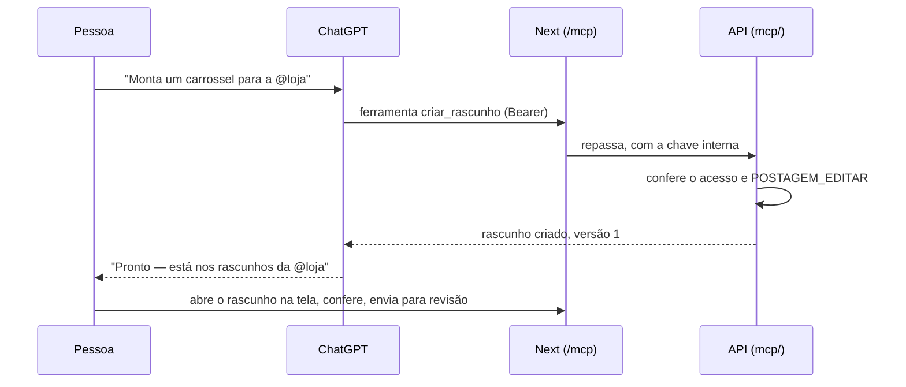

# 16 — Assistente por MCP

O assistente de IA — o ChatGPT, primeiro — compõe **rascunhos** no PostIt conversando com a pessoa, e uma pessoa os
valida pela tela. Este documento diz **o que** o assistente pode fazer, **como** ele se conecta e **o que ainda
precisa ser confirmado**. As decisões e o porquê estão no [ADR 0029](adr/0029-assistente-por-mcp.md); os requisitos,
no [Módulo K do 02](02-requisitos.md#módulo-k--assistente-mcp); a construção, na parte 1f do [12](12-roadmap.md).

**Estado: registrado em 25/09/2026, a construir na parte 1f.**

---

## Em uma frase

A pessoa pede ao ChatGPT "monta um carrossel para a @loja com estas três fotos"; o ChatGPT chama as ferramentas do
PostIt, e aparece um rascunho marcado **"Composta pelo assistente"** — que a pessoa abre, confere e envia para
revisão como qualquer outro.

---

## As ferramentas da primeira versão

Nomes e descrições em português, para o assistente; os nomes técnicos são genéricos, sem "Instagram" no meio
([ADR 0009](adr/0009-preparacao-multi-rede.md)). **Nenhuma** envia para revisão, aprova, agenda, publica, descarta
ou mexe em conta.

| Ferramenta | Entrada | Saída | Observação |
|---|---|---|---|
| `listar_contas` | — | contas ativas: `@usuario`, nome, fuso | Todo logado vê todas as contas ([ADR 0002](adr/0002-single-tenant.md)) |
| `ver_regras` | formato (opcional) | limites da legenda (2.200 caracteres, 30 hashtags, 20 menções), proporções aceitas, quantidade de imagens | As mesmas de `packages/shared` — o assistente não adivinha |
| `listar_acervo` | busca por data, paginação | imagens: id, medidas, formatos que aceitam, link de prévia | Só as originais; recortes não aparecem ([ADR 0025](adr/0025-ajustar-imagem-ao-formato.md)) |
| `enviar_imagem` | arquivo anexado no ChatGPT **ou** URL https | a imagem no acervo, ou o motivo da recusa | Só JPEG de até 8 MB, com 320 px de largura ou mais. A API baixa, com proteção contra SSRF |
| `criar_rascunho` | conta, formato (`FEED` ou `STORIES`), legenda, imagens com texto alternativo | id, versão, **o que falta para a revisão** | Imagem fora da proporção **entra marcada para ajuste** |
| `editar_rascunho` | id, **versão**, o que muda | nova versão, o que falta | **Só rascunho que o assistente criou**, e só o da própria pessoa. Versão velha → conflito (regra 20) |
| `ver_rascunho` | id | o rascunho inteiro, com o que falta | Mesma restrição de `editar_rascunho` |
| `listar_meus_rascunhos` | conta (opcional) | os rascunhos que o assistente compôs para esta pessoa | Os da tela não aparecem |
| `conferir_rascunho` | id | a lista do que impede ir para a revisão, com a mensagem de cada item | `postReadinessProblem`, `validateImageFormat`, `postMediaCountProblem` — as regras da tela |

Reels fica de fora até a Fase 2, junto com vídeo.

### Quando a imagem não serve ao formato

Uma arte 9:16 num rascunho de Feed **não é recusada**: entra no rascunho, e a tela mostra a tarja "Não serve ao Feed
— Ajustar". A ferramenta responde isso ao assistente ("a foto 2 precisa de ajuste na tela, entre 4:5 e 1.91:1"),
para ele avisar a pessoa. **Recortar é decisão de quem vê a foto** (AGENTS.md, regra 10), e a conferência de
prontidão barra o envio para revisão até lá.

---

## Como o ChatGPT se conecta: OAuth

O ChatGPT age em nome da pessoa sem nunca ver a senha dela. O PostIt é o **servidor de autorização**.

1. No ChatGPT, a pessoa adiciona o conector do PostIt pelo endereço `https://<app>/mcp`.
2. O ChatGPT lê `/.well-known/oauth-protected-resource` e descobre onde autorizar.
3. O ChatGPT se apresenta — por **documento de metadados do cliente** (CIMD, um endereço dele com a ficha "sou o
   ChatGPT, meus endereços de retorno são estes") ou por **registro dinâmico** (RFC 7591).
4. Abre a **tela de autorização do PostIt**: login com senha **e as duas etapas** (regra 11), e o consentimento
   *"Permitir que o ChatGPT componha rascunhos em seu nome?"*, com o que ele poderá e não poderá fazer.
5. O PostIt devolve um código temporário; o ChatGPT o troca por um **token de acesso** (1 hora) e um **token de
   renovação** (até 30 dias, com rotação; 7 dias sem uso vencem). A troca exige **PKCE**: o segredo que só o ChatGPT
   que começou o pedido conhece.
6. Cada chamada leva o token. A API confere que ele vale, que é para o PostIt (indicador de recurso), de quem é e se
   a pessoa ainda tem `POSTAGEM_EDITAR`.

**Revogar** é imediato: no Perfil, cartão **"Aplicativos conectados"** (o que está conectado, desde quando, último
uso); na Administração, o super admin vê e revoga os de todos. Desativar a pessoa derruba os acessos dela.

---

## Viabilidade — pesquisada em 25/09/2026

**Viável.** O que o ChatGPT pede está documentado e é implementável; **o custo maior é o servidor OAuth**, não o
MCP.

| Ponto | O que se sabe | Fonte |
|---|---|---|
| Transporte | MCP remoto por HTTP (Streamable HTTP); o servidor pode responder JSON, sem SSE e sem estado | [OpenAI — MCP](https://developers.openai.com/api/docs/mcp) |
| Autenticação | OAuth com descoberta por `/.well-known`; PKCE; CIMD (preferido) ou registro dinâmico; cliente pré-registrado também aceito | [OpenAI — Autenticação](https://developers.openai.com/plugins/build/auth), [Stytch](https://stytch.com/blog/guide-to-authentication-for-the-openai-apps-sdk/) |
| Arquivos anexados | A ferramenta que declara `openai/fileParams` recebe `{ download_url, file_id, mime_type, file_name }` | [Referência do Apps SDK](https://developers.openai.com/apps-sdk/reference) |
| Arquivos — ressalva | **Instável**: em cerca de 1 a cada 10 chamadas o arquivo não chega, e no app de celular chega incompleto. Por isso a URL existe como plano B | [#237](https://github.com/openai/openai-apps-sdk-examples/issues/237), [#185](https://github.com/openai/openai-apps-sdk-examples/issues/185) |
| Outros clientes | O Claude Code aceita token fixo no cabeçalho; os conectores do claude.ai e do Claude Desktop usam OAuth — o mesmo servidor serve | [MCP connector](https://platform.claude.com/docs/en/agents-and-tools/mcp-connector), [sunpeak](https://sunpeak.ai/blogs/claude-connector-oauth-authentication/) |

⚠️ **Nada disto foi testado ainda.** É leitura de documentação e de relatos, com a data. O spike do início da 1f
confirma na prática — e o resultado entra aqui, com a data, como o [08](08-integracao-instagram.md) faz com a Meta.

### A validar no spike

| # | Pergunta | Por que importa |
|---|---|---|
| **M-1** | Que planos do ChatGPT permitem conector MCP próprio **com ações de escrita** (modo desenvolvedor), e a conta do usuário tem acesso? | Sem isso, nada funciona — é a primeira coisa a conferir |
| **M-2** | O ChatGPT completa o OAuth com o PostIt pelo túnel local, por CIMD ou por registro dinâmico? | Decide quais dos dois o servidor precisa implementar |
| **M-3** | Com que frequência o `openai/fileParams` chega vazio, no computador e no celular? | Se for frequente, a URL vira o caminho principal |
| **M-4** | `oidc-provider` ou um servidor mínimo próprio? | A recomendação é a biblioteca certificada; o spike confere se ela convive com o login e as duas etapas do PostIt |

---

## Segurança, em resumo

O detalhe está no [11](11-seguranca.md); o essencial:

- **Só compor** contém o *prompt injection*: o pior que um assistente enganado faz é um rascunho ruim, e nenhum
  rascunho sai sem uma pessoa.
- **Os tokens são segredos** como a sessão: hash no banco, nunca em log, erro, resposta ou tela (regra 3).
- **O download de imagem por URL** é o ponto de SSRF: só https, nunca IP privado ou de loopback (inclusive depois de
  redirecionamento), teto de tamanho e de tempo.
- **Uma porta só**: `/mcp` e o OAuth passam pelo Next, que só repassa; a API segue sem nome público.

---

## Testar localmente

O ChatGPT precisa de um endereço https público: o **túnel** do desenvolvimento ([14](14-ambientes-e-desenvolvimento.md))
serve, com o endereço do app. O conector aponta para `https://<túnel>/mcp`, e cada `npm run tunnel` sorteia endereço
novo — o conector precisa ser refeito junto.

Os testes automáticos **não falam com o ChatGPT**: um cliente MCP de teste chama as ferramentas com um token emitido
pelo próprio servidor OAuth, como a Meta falsa faz com a publicação (regra 23).

---

## Depois da primeira versão

- **Definir o horário (RF-K07):** o assistente **sugere** dia e hora, que chegam preenchidos na Revisão; a pessoa com
  `POSTAGEM_AGENDAR` confirma.
- **Conectores do claude.ai e do Claude Desktop:** o mesmo servidor OAuth; falta só testar.
- **Reels e vídeo:** com a Fase 2.
