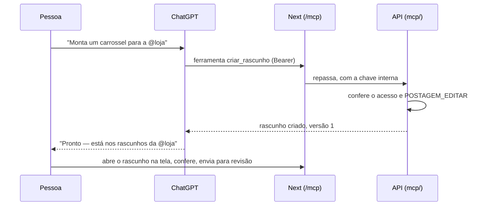

# 16 — Assistente por MCP

O assistente de IA — o ChatGPT, primeiro — compõe **rascunhos** no PostIt conversando com a pessoa, e uma pessoa os
valida pela tela. Este documento diz **o que** o assistente pode fazer, **como** ele se conecta e **o que ainda
precisa ser confirmado**. As decisões e o porquê estão no [ADR 0029](adr/0029-assistente-por-mcp.md); os requisitos,
no [Módulo K do 02](02-requisitos.md#módulo-k--assistente-mcp); a construção, na parte 1f do [12](12-roadmap.md).

**Estado (29/09/2026): em construção na parte 1f.** Prontas a parte A — o servidor OAuth, o `/mcp` e a tela de
permissão em `/oauth/autorizar` —, a B — compor rascunhos, com a marca na tela — e a C — imagem nova por
`enviar_imagem`. Falta revogar (D).

---

## Em uma frase

A pessoa pede ao ChatGPT "monta um carrossel para a @loja com estas três fotos"; o ChatGPT chama as ferramentas do
PostIt, e aparece um rascunho marcado **"Composta pelo assistente"** — que a pessoa abre, confere e envia para
revisão como qualquer outro.

```mermaid
sequenceDiagram
    participant P as Pessoa
    participant C as ChatGPT
    participant N as Next (/mcp)
    participant A as API (mcp/)
    P->>C: "Monta um carrossel para a @loja"
    C->>N: ferramenta criar_rascunho (Bearer)
    N->>A: repassa, com a chave interna
    A->>A: confere o acesso e POSTAGEM_EDITAR
    A-->>C: rascunho criado, versão 1
    C-->>P: "Pronto — está nos rascunhos da @loja"
    P->>N: abre o rascunho na tela, confere, envia para revisão
```

---

## As ferramentas da primeira versão

Nomes e descrições em português, para o assistente; os nomes técnicos são genéricos, sem "Instagram" no meio
([ADR 0009](adr/0009-preparacao-multi-rede.md)). **Nenhuma** envia para revisão, aprova, agenda, publica, descarta
ou mexe em conta.

| Ferramenta | Entrada | Saída | Observação |
|---|---|---|---|
| `listar_contas` | — | contas ativas: `@usuario`, nome, fuso | Todo logado vê todas as contas ([ADR 0002](adr/0002-single-tenant.md)) |
| `ver_regras` | formato (opcional) | limites da legenda (2.200 caracteres, 30 hashtags, 20 menções), proporções aceitas, quantidade de imagens | As mesmas de `packages/shared` — o assistente não adivinha |
| `listar_acervo` | — | imagens: id, medidas, formatos que aceitam sem ajuste, link de prévia, data | As 60 mais recentes, como a tela. Só as originais; recortes não aparecem ([ADR 0025](adr/0025-ajustar-imagem-ao-formato.md)) |
| `enviar_imagem` | `arquivo` anexado no ChatGPT (`_meta["openai/fileParams"]`, com `download_url` e `file_id`) **ou** `url` https — um dos dois | id, medidas, formatos que aceita, link de prévia — ou o motivo da recusa | Só JPEG de até 8 MB, com 320 px de largura ou mais. A API baixa pela busca segura — até 3 redirecionamentos, cada salto conferido de novo, 20 s — e a imagem entra pelo mesmo ingresso do envio da tela (`recebidos/` → conferência → `publicas/`), como original do acervo. PNG, WebP e HEIC: a recusa manda converter ou enviar pela tela, que converte. Uma linha de log por chamada, com a origem e o desfecho, nunca a URL |
| `criar_rascunho` | conta (`@` opcional), formato (`FEED` ou `STORIES`), legenda, imagens com texto alternativo | o rascunho, a versão, **o que falta para a revisão** e o link da tela | Imagem fora da proporção **entra marcada para ajuste**. Conta, imagens e quantidade são conferidas **antes** de criar: recusa não deixa rascunho vazio |
| `editar_rascunho` | id, **versão**, o que muda | o rascunho, a versão nova, o que falta | **Só rascunho que o assistente criou**, só o da própria pessoa, e **só em `RASCUNHO`**: depois de enviado, está com a pessoa, e editar o derrubaria de volta (I-2). Versão velha → a frase de conflito, pedindo para ler de novo (regra 20) |
| `ver_rascunho` | id | o rascunho inteiro, com o que falta | Mesma restrição de `editar_rascunho` |
| `listar_meus_rascunhos` | conta (opcional) | os que o assistente compôs para esta pessoa, **com o status** de cada um | Os da tela não aparecem; os descartados também não |
| `conferir_rascunho` | id | **todos** os itens que impedem a revisão, cada um com a foto a que se refere, e o aviso de foto sem texto alternativo | `postProblems`, ao lado de `postReadinessProblem`: as regras da tela, sem parar no primeiro |

Recusas — conta desconhecida, rascunho alheio, conflito de versão — voltam como **resultado** da ferramenta, com a
frase em português que o assistente repassa, e não como erro de protocolo.

Reels fica de fora até a Fase 2, junto com vídeo.

### Quando a imagem não serve ao formato

Uma arte 9:16 num rascunho de Feed **não é recusada**: entra no rascunho, e a tela mostra a tarja "Não serve ao Feed
— Ajustar". A ferramenta responde isso ao assistente ("a foto 2 precisa de ajuste na tela, entre 4:5 e 1.91:1"),
para ele avisar a pessoa. **Recortar é decisão de quem vê a foto** (AGENTS.md, regra 10), e a conferência de
prontidão barra o envio para revisão até lá.

A folga vale pela **origem da postagem** (`Postagem.origem = ASSISTENTE`), e não por quem grava: na tela, a pessoa
reordena e recorta o rascunho do assistente mesmo com a foto ainda fora da proporção. Quantidade, tipo, tamanho e
largura continuam barrando a gravação, dos dois lados.

---

## Como o ChatGPT se conecta: OAuth

O ChatGPT age em nome da pessoa sem nunca ver a senha dela. O PostIt é o **servidor de autorização**.

1. No ChatGPT, a pessoa adiciona o conector do PostIt pelo endereço `https://<app>/mcp`.
2. O ChatGPT lê `/.well-known/oauth-protected-resource` e descobre onde autorizar.
3. O ChatGPT se apresenta — por **documento de metadados do cliente** (CIMD, um endereço dele com a ficha "sou o
   ChatGPT, meus endereços de retorno são estes") ou por **registro dinâmico** (RFC 7591).
4. Abre a **tela de autorização do PostIt**: login com senha **e as duas etapas** (regra 11), e o consentimento
   *"Permitir que o ChatGPT componha rascunhos em seu nome?"*, com o que ele poderá e não poderá fazer.
5. O PostIt devolve um código temporário; o ChatGPT o troca por um **token de acesso** (1 hora) e um **token de
   renovação** (até 30 dias, com rotação; 7 dias sem uso vencem). A troca exige **PKCE**: o segredo que só o ChatGPT
   que começou o pedido conhece.
6. Cada chamada leva o token. A API confere que ele vale, que é para o PostIt (indicador de recurso), de quem é e se
   a pessoa ainda tem `POSTAGEM_EDITAR`.

**Revogar** é imediato: no Perfil, cartão **"Aplicativos conectados"** (o que está conectado, desde quando, último
uso); na Administração, o super admin vê e revoga os de todos. Desativar a pessoa derruba os acessos dela.

---

## Viabilidade — pesquisada em 25/09/2026

**Viável.** O que o ChatGPT pede está documentado e é implementável; **o custo maior é o servidor OAuth**, não o
MCP.

| Ponto | O que se sabe | Fonte |
|---|---|---|
| Transporte | MCP remoto por HTTP (Streamable HTTP); o servidor pode responder JSON, sem SSE e sem estado | [OpenAI — MCP](https://developers.openai.com/api/docs/mcp) |
| Autenticação | OAuth com descoberta por `/.well-known`; PKCE; CIMD (preferido) ou registro dinâmico; cliente pré-registrado também aceito | [OpenAI — Autenticação](https://developers.openai.com/plugins/build/auth), [Stytch](https://stytch.com/blog/guide-to-authentication-for-the-openai-apps-sdk/) |
| Arquivos anexados | A ferramenta que declara `openai/fileParams` recebe `{ download_url, file_id, mime_type, file_name }` | [Referência do Apps SDK](https://developers.openai.com/apps-sdk/reference) |
| Arquivos — ressalva | **Instável**: em cerca de 1 a cada 10 chamadas o arquivo não chega, e no app de celular chega incompleto. Por isso a URL existe como plano B | [#237](https://github.com/openai/openai-apps-sdk-examples/issues/237), [#185](https://github.com/openai/openai-apps-sdk-examples/issues/185) |
| Outros clientes | O Claude Code aceita token fixo no cabeçalho; os conectores do claude.ai e do Claude Desktop usam OAuth — o mesmo servidor serve | [MCP connector](https://platform.claude.com/docs/en/agents-and-tools/mcp-connector), [sunpeak](https://sunpeak.ai/blogs/claude-connector-oauth-authentication/) |

⚠️ **Nada disto foi testado ainda.** É leitura de documentação e de relatos, com a data. O spike do início da 1f
confirma na prática — e o resultado entra aqui, com a data, como o [08](08-integracao-instagram.md) faz com a Meta.

### A validar no spike

| # | Pergunta | Por que importa |
|---|---|---|
| **M-1** | Que planos do ChatGPT permitem conector MCP próprio **com ações de escrita** (modo desenvolvedor), e a conta do usuário tem acesso? | **Confirmado em 29/09/2026:** a conta do usuário cria o conector e usa ferramenta de escrita — o ChatGPT compôs um carrossel de 3 imagens do acervo com `criar_rascunho` |
| **M-2** | O ChatGPT completa o OAuth com o PostIt pelo túnel local, por CIMD ou por registro dinâmico? | **Confirmado em 29/09/2026, pelo túnel: por CIMD.** Detalhes logo abaixo |
| **M-3** | Com que frequência o `openai/fileParams` chega vazio, no computador e no celular? | **Computador, 29/09/2026: 4 anexos, 4 chegaram** — nenhum vazio, nenhum download falho. Celular ainda não conferido. Se lá for frequente, a URL vira o caminho principal |
| **M-4** | `oidc-provider` ou um servidor mínimo próprio? | **Decidido em 29/09/2026: servidor mínimo próprio** — o `oidc-provider` não convive com o login do PostIt sem repassar cookies pelo Next. O porquê está no acréscimo do [ADR 0029](adr/0029-assistente-por-mcp.md) |

### O que o spike mostrou — 29/09/2026

Conector do ChatGPT apontando para o túnel, login com as duas etapas, "Permitir", e `listar_contas` respondendo na
conversa. Três achados, todos já corrigidos e com teste:

- **O ChatGPT se apresenta por CIMD**, com `client_id` `https://chatgpt.com/oauth/client.json`. O registro dinâmico
  não foi usado. A ficha dele declara `token_endpoint_auth_method: private_key_jwt`, mas lista `none` em
  `token_endpoint_auth_methods_supported`; como o PostIt anuncia só `none`, é com ele que o ChatGPT troca o código.
  A regra passou a aceitar `none` na lista, e não só no campo principal.
- **O ChatGPT fala o protocolo de 2026-07-28**: começa por `server/discover`, com o envelope `_meta` no corpo e o
  método repetido no cabeçalho `Mcp-Method`. O repasse tinha lista fixa de cabeçalhos e descartava esse — o ChatGPT
  dizia "Authentication succeeded, discovery failed" e ficava sem ferramentas. Hoje todo `mcp-*` atravessa, no Next
  e na API.
- **Antes de tudo ele manda um `POST /mcp` vazio**, como `application/octet-stream`, para achar o 401 que aponta a
  descoberta. O repasse tira o tipo do corpo vazio, e a sondagem recebe o 401 em vez de um 415.

Ele também procura `/.well-known/openid-configuration` (404) e segue sem ele.

**Imagem nova, no mesmo dia (parte C, no computador):** o ChatGPT gerou as imagens e as mandou por `enviar_imagem`.
Com as regras de imagem nas descrições das ferramentas, **converteu para JPEG sozinho** — o único PNG que chegou foi
recusado, e a versão JPEG veio 27 s depois. A primeira imagem para o Feed veio 1536×2048 (3:4, fora da faixa); a
seguinte, 1536×1920 (4:5), serviu. Pelo assistente saíram de verdade um Stories (941×1672) e um Feed — o primeiro
Stories publicado pelo PostIt.

---

## Segurança, em resumo

O detalhe está no [11](11-seguranca.md); o essencial:

- **Só compor** contém o *prompt injection*: o pior que um assistente enganado faz é um rascunho ruim, e nenhum
  rascunho sai sem uma pessoa.
- **Os tokens são segredos** como a sessão: hash no banco, nunca em log, erro, resposta ou tela (regra 3).
- **O download de imagem por URL** é o ponto de SSRF: só https, nunca IP privado ou de loopback (inclusive depois de
  redirecionamento), teto de tamanho e de tempo.
- **Uma porta só**: `/mcp` e o OAuth passam pelo Next, que só repassa; a API segue sem nome público.

---

## Testar localmente

O ChatGPT precisa de um endereço https público: o **túnel** do desenvolvimento ([14](14-ambientes-e-desenvolvimento.md))
serve, com o endereço do app. O conector aponta para `https://<túnel>/mcp`, e cada `npm run tunnel` sorteia endereço
novo — o conector precisa ser refeito junto.

Os testes automáticos **não falam com o ChatGPT**: um cliente MCP de teste chama as ferramentas com um token emitido
pelo próprio servidor OAuth, como a Meta falsa faz com a publicação (regra 23).

---

## Depois da primeira versão

- **Definir o horário (RF-K07):** o assistente **sugere** dia e hora, que chegam preenchidos na Revisão; a pessoa com
  `POSTAGEM_AGENDAR` confirma.
- **Conectores do claude.ai e do Claude Desktop:** o mesmo servidor OAuth; falta só testar.
- **Reels e vídeo:** com a Fase 2.
