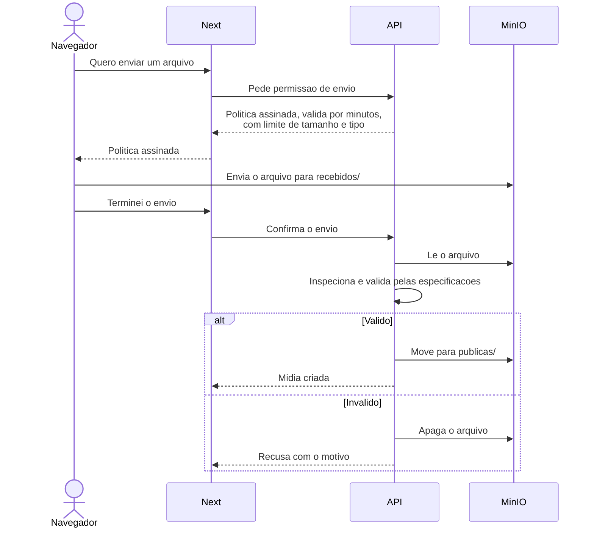

# ADR 0012 — Envio de mídia direto ao MinIO, com validação antes de publicar

**Data:** 2026-09-14 · **Status:** aceito · **Complementa:** [ADR 0005](0005-minio-midia-publica.md)

## Contexto

Com a arquitetura de [ADR 0010](0010-monorepo-next-nest-bff.md), um arquivo enviado pelo usuário
teria de atravessar dois servidores antes de chegar ao armazenamento: navegador → Next → API → MinIO.
Para uma foto isso é tolerável. Para um Reels de até 300 MB, é lento, ocupa memória nos dois processos
e obriga a abrir exceções de tamanho de requisição.

Havia também uma fraqueza no desenho anterior: pelo [ADR 0005](0005-minio-midia-publica.md), todo
arquivo enviado ficava imediatamente acessível pela URL pública — **inclusive os que seriam recusados
na validação**.

## Decisão

**O navegador envia o arquivo direto para o MinIO**, com permissão assinada pela API, e o arquivo só
fica público depois de validado.

### O fluxo

### Dois prefixos no bucket

| Prefixo | Leitura pública | Escrita |
|---|---|---|
| `recebidos/` | **Não** | Só com política assinada pela API |
| `publicas/` | Sim, somente GET | Só a API, depois de validar |

### A permissão assinada

É uma **política de envio (POST policy)**: um documento assinado pela API que autoriza um único envio,
por poucos minutos, para um nome de arquivo definido pela API, com **tamanho máximo e tipo de arquivo
limitados**. O MinIO confere a assinatura e os limites antes de aceitar o arquivo.

Os limites vêm das especificações de mídia de [08](../08-integracao-instagram.md#especificações-de-mídia),
guardadas em `packages/shared`.

### A validação

Depois do envio, a API lê o arquivo e extrai dimensões, duração, codecs e posição do átomo `moov`.
Valida contra as especificações do formato pretendido (RF-B02, RF-B03). Só então cria o registro
`Midia` e move o arquivo para `publicas/`. Arquivo recusado é apagado.

Uma tarefa de manutenção apaga arquivos esquecidos em `recebidos/` — envios abandonados no meio.

## Consequências

### Positivas

- **Arquivo grande não passa por Next nem API.** Nenhum dos dois precisa aceitar requisições grandes;
  o limite global de 1 MB da API vale sem exceções
- **Conteúdo não validado nunca fica público**, corrigindo a fraqueza do desenho anterior
- Progresso real de envio no navegador, sem intermediários
- A decisão central do [ADR 0005](0005-minio-midia-publica.md) continua valendo: mídia pública com
  nome imprevisível, porque a Meta precisa baixar sem credencial

### Negativas

- **Mais etapas no fluxo** de envio: pedir permissão, enviar, confirmar
- O navegador precisa alcançar o MinIO para enviar, então o proxy e o MinIO precisam aceitar o envio
  vindo do domínio do aplicativo — configuração a mais
- **A API lê o arquivo depois do envio.** Para vídeo grande, isso é trabalho de rede e processamento
  na API. Aceitável no volume previsto

## Pontos a validar na implementação

Registrados como item V-15 em [08](../08-integracao-instagram.md#a-validar-em-desenvolvimento):

- Se a assinatura da política continua válida com o MinIO atrás do proxy reverso
- A configuração de CORS necessária para o navegador enviar do domínio do aplicativo para o de mídia
- Se a leitura para inspeção deve baixar o arquivo inteiro ou só as partes necessárias

## Alternativas consideradas

**Enviar pelo Next e pela API.** Simples de entender, mas faz arquivos de centenas de megabytes
atravessarem dois processos e exige abrir o limite de tamanho da API.

**Enviar direto para a API, pulando o Next.** Obrigaria expor a API na internet, contrariando o
[ADR 0010](0010-monorepo-next-nest-bff.md).

**Um único prefixo público.** Mais simples, mas mantém arquivos ainda não validados acessíveis.

## Reversibilidade

**Alta.** O fluxo fica concentrado no módulo `armazenamento` da API e num componente de envio do Next.
Trocar por envio via servidor não afeta o modelo de dados.
