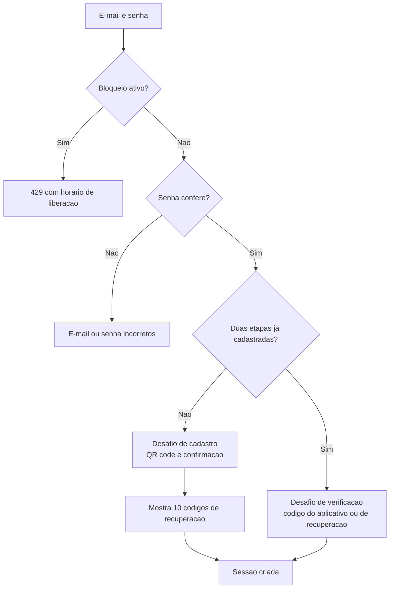

# ADR 0013 — Autenticação por sessão opaca com verificação em duas etapas obrigatória

**Data:** 2026-09-14 · **Status:** aceito · **Substitui:** [ADR 0011](0011-autenticacao-sessao-opaca.md) ·
**Complementado por:** [ADR 0015](0015-super-admin-e-permissoes.md)

> O ADR 0015 leva a administração para a tela, com super admin. Os comandos no servidor da seção 6 continuam
> existindo como **emergência**. A política `@AnyAuthenticated` ganha a companhia de `@RequirePermission` e
> `@SuperAdmin`.

> **Nota de implementação (16/09/2026).** Os prazos e limites deste ADR — 5 minutos de desafio, 5 tentativas,
> 10 falhas em 30 minutos, 15 e 30 minutos de bloqueio, 60 na reincidência, links de 7 dias e 24 horas, e os 15
> minutos de confirmação recente do [ADR 0015](0015-super-admin-e-permissoes.md) — passaram a ser **variáveis de
> ambiente**, com estes mesmos valores como padrão no código. Mexer num número vira ajuste de operação, sem
> publicar versão. Os nomes estão em [10](../10-infra-deploy.md#variáveis-de-ambiente). Continuam no código, por
> serem formato e não ajuste: 32 bytes de token, ±1 passo de tolerância, 10 códigos de recuperação e os
> parâmetros do argon2id.

## Contexto

O [ADR 0011](0011-autenticacao-sessao-opaca.md) definiu login por senha com sessão opaca em cookie. Uma
revisão de segurança, antes de qualquer código, encontrou lacunas nele:

- **Só senha protege uma ferramenta que publica em contas reais.** Senha vazada, reaproveitada de outro
  site ou adivinhada dá acesso total a todas as contas conectadas
- **O cookie `__Host-sessao` foi descrito como fixo**, mas esse prefixo só funciona com https — o login
  quebraria em desenvolvimento
- **A proteção contra tentativas repetidas estava vaga**, sem números
- **Não havia como recuperar senha**, e o sistema não envia e-mail
- **Trocar a senha não derrubava as outras sessões**
- **A sessão renovava para sempre com o uso** — um computador esquecido logado ficaria logado
  indefinidamente

Referências usadas: `nossobuncker` (sessão opaca, anti-força-bruta, hash isca, cookie por esquema de
URL) e `hotclone` (verificação em duas etapas, inatividade com teto absoluto). O levantamento também
encontrou falhas nesses dois projetos, que **não** são copiadas — listadas no fim.

## Decisão

### 1. Verificação em duas etapas obrigatória

Todo usuário, sem exceção, entra com **senha e código de 6 dígitos** de um aplicativo autenticador
(Google Authenticator, Microsoft Authenticator, 1Password e similares). É o padrão TOTP: o código muda
a cada 30 segundos e é calculado a partir de um segredo compartilhado entre o servidor e o aplicativo.

| Regra | Valor |
|---|---|
| Biblioteca | `otplib` 13, como no `hotclone` — API confirmada em 16/09/2026, ver [08](../08-integracao-instagram.md#a-validar-em-desenvolvimento) |
| Tolerância de relógio | ±1 passo (30 s para cada lado) |
| Reuso do mesmo código | **Recusado.** Guarda-se o último passo usado por usuário |
| Segredo no banco | **Cifrado** com `ENCRYPTION_KEY`, em envelope versionado `v1:` |
| Segredo mostrado ao usuário | Só no cadastro, como QR code gerado no servidor. Nunca mais depois |
| Códigos de recuperação | 10, aleatórios, mostrados uma vez, guardados como hash, uso único |
| Gerar novos códigos de recuperação | Exige código do aplicativo; invalida os anteriores |
| Perdeu aplicativo e códigos | Reset só por comando no servidor (`admin:reset-2fa`), que revoga todas as sessões |

### 2. O login acontece em etapas

**Senha certa sozinha não cria sessão.** Ela cria um **desafio**: um token opaco de uso único, com hash
sha256 no banco (tabela `DesafioLogin`), válido por **5 minutos** e por no máximo **5 tentativas**,
guardado num cookie `httpOnly` separado. Só completar o desafio cria a sessão.

### 3. Sessão

- Token aleatório de 32 bytes; no banco, só o hash sha256 (tabela `Sessao`). Novo token a cada login
- **Expira após 7 dias sem uso** — `ultimoUsoEm`, reescrito no máximo uma vez por hora
- **Expira de qualquer forma após 30 dias** — `expiraEm`, fixado na criação e nunca estendido
- O cookie dura até o teto de 30 dias; a inatividade é conferida no servidor
- **Revogação lógica com motivo**: `revogadaEm` e `motivoRevogacao` (saída, troca de senha, redefinição,
  reset da verificação em duas etapas, encerramento de outras sessões). Útil para investigar incidentes.
  A manutenção expurga depois de 90 dias
- Tela de sessões ativas, com "sair dos outros dispositivos"

### 4. Cookie

| Atributo | Valor |
|---|---|
| Nome | `__Host-sessao` quando `APP_URL` é https; `sessao` em desenvolvimento sem https |
| `httpOnly` | Sempre |
| `Secure` | Quando `APP_URL` é https — decidido pela URL, **não** por `NODE_ENV` |
| `SameSite` | `lax` |
| `Path` | `/` |

O desafio de login usa a mesma lógica de nome: `__Host-desafio` ou `desafio`.

**Por que `lax` e não `strict`:** com `strict`, o navegador não envia o cookie quando a pessoa chega ao
site vinda de outro endereço. O retorno do OAuth do Instagram é exatamente isso — uma navegação vinda do
Instagram — e chegaria sem sessão. `lax` envia o cookie nesse caso (navegação comum), mas não em
formulários ou requisições disparadas por outros sites.

### 5. Proteção contra tentativas repetidas

Registrada no Postgres (tabelas `TentativaAcesso` e `BloqueioAcesso`), em duas camadas:

| Camada | O que conta | Limite em 30 minutos | Bloqueio |
|---|---|---|---|
| **Conta** (e-mail) | Senha errada; código errado no desafio | 10 | 15 min; se reincidir em 24 h, 60 min |
| **IP** | E-mail inexistente e qualquer falha | 20 | 30 min; se reincidir em 24 h, 60 min |

- Nunca há bloqueio permanente. Um login bem-sucedido zera a contagem
- Ordem obrigatória: confere bloqueio → confere senha → confere código. Acertar a senha **não** fura um
  bloqueio ativo
- **Mesma resposta** para e-mail inexistente e senha errada: "E-mail ou senha incorretos"
- **Hash isca**: quando o e-mail não existe, a senha é conferida contra um hash falso, para a resposta
  demorar o mesmo tempo. Sem isso, a demora revelaria quais e-mails estão cadastrados
- Bloqueado: HTTP 429 com o horário de liberação
- Senhas tentadas e códigos **nunca** são registrados

**Consequência aceita:** alguém que conheça o e-mail de um usuário pode errar a senha de propósito e
travar o login dele por 15 minutos. Como a verificação em duas etapas é obrigatória, isso é incômodo, não
invasão.

### 6. Sem e-mail: links gerados no servidor

| Comando | Faz | Link |
|---|---|---|
| `npm run admin:create -- --email --nome` | Cria usuário **sem senha** | Cadastro: 7 dias, uso único |
| `npm run admin:reset-password -- --email` | Gera redefinição | 24 horas, uso único. Revoga **todas** as sessões; não mexe na verificação em duas etapas |
| `npm run admin:reset-2fa -- --email` | Apaga segredo e códigos de recuperação | Revoga todas as sessões; o próximo login pede novo cadastro |

Links guardados só como hash (tabela `LinkAcesso`). Quem roda os comandos precisa de acesso ao servidor
— é a forma de ter "administração" sem criar papéis de usuário ([ADR 0002](0002-single-tenant.md)).

### 7. Senha

- **argon2id**, parâmetros no pacote compartilhado para o comando de criação usar os mesmos
- Mínimo 12 caracteres, máximo 128, **sem regra de composição** (letra maiúscula, número, símbolo),
  seguindo a orientação NIST SP 800-63B: comprimento protege mais que complexidade forçada
- Não pode ser igual ao e-mail
- **Trocar a senha exige a senha atual e um código do aplicativo**, e revoga as outras sessões

### 8. Na API e no Next

Mantido do [ADR 0011](0011-autenticacao-sessao-opaca.md):

- Guardas globais: chave interna → sessão → autorização negar por padrão (`@Public`,
  `@AnyAuthenticated`)
- `proxy.ts` só confere se o cookie existe; a verificação real é `requireSession()` em cada página e
  Server Action

Acrescentado:

- `requireSession()` usa `cache()` do React: uma consulta à API por requisição, não por componente
- Rota `/sessao-expirada` confere com a API **antes** de apagar o cookie, para não servir de atalho de
  logout forçado por outro site
- O teste de política de rotas **descobre os controllers sozinho** pelo `DiscoveryService` do Nest, em
  vez de depender de lista escrita à mão

## Falhas encontradas nos projetos de referência, e não copiadas

| Projeto | Falha | Aqui |
|---|---|---|
| `hotclone` | Segredo da verificação em duas etapas **legível** no banco | Cifrado |
| `hotclone` | Mesmo código aceito duas vezes | Reuso recusado |
| `hotclone` | Sem tolerância de relógio | ±1 passo |
| `hotclone` | Sem códigos de recuperação | 10 códigos de uso único |
| `nossobuncker` | Sessão de 30 dias fixos, sem expirar por inatividade | 7 dias sem uso, teto de 30 |
| `nossobuncker` | `requireSession()` sem `cache()`, várias consultas por página | Uma consulta por requisição |
| `nossobuncker` | Teste de rotas com lista manual | Descoberta automática |
| `nossobuncker` | IP do visitante lido de cabeçalho que ele próprio controla | Ver [11](../11-seguranca.md#o-ip-real-do-visitante) |

## Consequências

### Positivas

- Senha vazada, sozinha, não dá acesso
- Sessões antigas morrem sozinhas; sessões comprometidas morrem na hora
- Recuperação de acesso sem depender de e-mail
- Tentativas repetidas são contidas sem bloquear ninguém para sempre

### Negativas

- **Login mais demorado**: um passo a mais em cada entrada
- **Mais código próprio**: desafios, códigos de recuperação, bloqueios, comandos de administração
- **Recuperação depende de acesso ao servidor** quando o usuário perde aplicativo e códigos
- **Mais tabelas no banco**: `DesafioLogin`, `CodigoRecuperacao`, `LinkAcesso`, `TentativaAcesso`,
  `BloqueioAcesso`

## Alternativas consideradas

**Verificação em duas etapas opcional.** A proteção dependeria de cada pessoa lembrar de ativar.

**Código por e-mail em vez de aplicativo.** Exigiria serviço de e-mail, e o e-mail costuma ser
justamente a conta invadida junto com a senha.

**Chaves de acesso (passkeys, WebAuthn).** Mais seguras e mais confortáveis, mas mais complexas de
implementar e de recuperar. Boa evolução futura.

**JWT com refresh token.** Não pode ser revogado antes de expirar. Ver [ADR 0011](0011-autenticacao-sessao-opaca.md).

## Reversibilidade

**Alta.** A autenticação fica concentrada no módulo `auth` da API e em `lib/auth` do Next. Adicionar
chaves de acesso no futuro convive com o TOTP.
